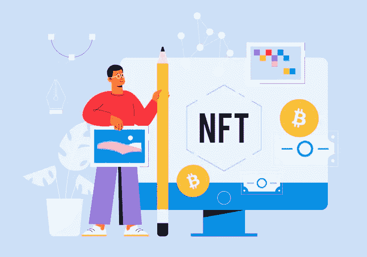

# 白色标签 NFT 市场—立即启动 NFT 市场的指南

> 原文：<https://medium.com/codex/white-label-nft-marketplace-guide-to-launch-an-nft-marketplace-right-away-e771d35461ab?source=collection_archive---------14----------------------->

NFT 趋势正在发生！城市角落里的企业家正利用这一优势，在 NFT 创业。为什么你不能尽早利用它在 2022 年统治 NFT 世界呢？采用包含独家功能的[白标 NFT 市场](https://www.inoru.com/white-label-nft-marketplace)解决方案，拥有可观的收益。利用它，在多个区块链的基础上推出你的 NFT 交易平台，更快进入 NFT 市场。

## **了解什么是 NFT 白标市场**

白标 NFT 市场是一个预制的解决方案，复制了 NFT 交易平台的典型功能。它配备了基本功能，确保以 NFTs 的形式无缝地买卖数字资产，这些数字资产可能是图像、艺术或任何其他数字收藏品。不可否认，它是企业家的首选，因为它有好处。

## **NFT 的白色标签市场有什么特别的？—了解它的好处**

当谈到雇佣一个白色标签的 NFT 市场而不是从头开始创建 NFT 市场时，有很多额外的好处。让我们来看看 NFT 白标市场的好处，它将使像你这样的企业家有资格使用它。

*   **性价比**

最大的好处是你可以节省很多钱。也就是说，你会意识到从零开始建立 NFT 市场需要更多的时间和金钱。

*   **端到端定制**

白标 NFT 市场的属性带有端到端定制，这将为您的 NFT 交易平台拥有一套独特的功能奠定基础。确保你的平台给目标受众更多的价值。

*   **瞬间上市**

与选择白标 NFT 市场解决方案相比，NFT 市场的启动需要时间。由于只需要定制，很有可能会更快上市。最有可能的是，在几周/几个月内。

## **白牌 NFT 市场开发过程中需要考虑的基本方面**

经营者拥有对 NFT 交易平台的控制权，因为他们可以决定如何希望 [**白标 NFT 市场**](https://www.inoru.com/white-label-nft-marketplace) 成为符合功能&特征的。以下是在进行实际开发之前需要考虑的方面。看看这个。

*   **定义你的定位**

你要考虑的第一件事是知道你的定位。缩小范围是必须的，因为它会让你特别针对你的利基受众。考虑以下任何一个利基市场的 NFT 市场。

➜艺术
➜音乐
➜体育
➜交易纸牌
➜博彩
➜摄影
➜视频
➜收藏品等。

*   **选择区块链框架**

区块链技术是要事先选择的。必须通过考虑交易速度、可靠的智能合同、安全性等重要因素来做出选择。以太坊是安全的区块链网络，是企业家的首选。其他最佳区块链包括以下。

➔比纳斯智能链
➔卡尔达诺
➔索拉纳
➔流
➔雪崩
➔泰佐斯
➔ EOS
➔恒星等。

## **选择要整合到您的白牌 NFT 市场中的功能**

根据 NFT 交易平台的功能，必须选择功能。除了基本功能之外，选择附加功能将会给你带来竞争优势。以下是应该考虑的白牌 NFT 市场的主要特征。

⮞商店橱窗/店面是用户展示他们的非功能性物品的地方，包括价格、支付方式、所有者、名称和描述。这将最大限度地刺激销售。

⮞的加密钱包是最突出的功能，在交易中发挥了相当大的作用。用户可以选择将 Metamask、WalletConnect 和比特币基地等加密钱包与创建的帐户关联起来。

⮞强大的搜索选项将让用户轻松方便地找到想要的 NFT。由于这些收藏被分为艺术、迷因、摄影和许多其他类别，在过滤器的帮助下，搜索 NFT 并不需要花费太多时间。

⮞白标 NFT 市场具有内置的用户历史功能，允许用户检查他们的详细信息，包括他们在平台上的活动。也就是说，用户的历史记录包括以下内容:交易数据、交易历史以及列出的、购买的和出售的 NFT。

⮞用户可以直接销售或拍卖(荷兰拍卖或英国拍卖)他们的 NFT 列表。对方以固定价格购买数字作品(直销)或参与拍卖，并开始竞标 NFT 的所有权。

*   **智能合同创建**

NFTs 运行在一个智能合约上，这个合约掌握着 NFT 市场的商业逻辑。开发智能合同用于创建和列出 NFT，然后在满足销售条件时以自动方式触发购买交易。

*   **开发一款 NFT 钱包**

NFT 钱包扮演着重要的角色。它的功能与加密钱包非常相似。NFT 钱包是一个存放非功能性金融工具和加密货币的地方。这将有助于用户发送和接收数字资产。

*   **设计 UI/UX**

UI/UX 设计应该被赋予最重要的地位，它给用户留下第一印象。即用户如何与平台交互，是否有直观的体验。如果用户界面/UX 设计不当，数字资产的价值就无法正确表达。

*   **IPFS 仓储**

众所周知，用户的数据将被存储在区块链账本上，而数字资产的细节则存在 IPFS 的存储中。在创建你的 NFT 市场时，想出 IPFS 存储系统。

## **NFT 白色标签市场的盈利方式**

虽然可以实施多种创收流来实现白牌 NFT 市场的货币化，但以下三种主要方法将带来可观的利润。看看这个。

**佣金或汽油费—** 这是 NFT 交易平台非常常见的创收模式。市场上发生的每一笔交易都可能产生费用。也就是说，当用户购买、出售或交易不可替换的代币时，将征收佣金或汽油费。例如，OpenSea 从用户在其平台上进行的每笔交易中抽取 2.5%的佣金。

**上市费—** 除了收取一定比例的上市费之外，当用户在 NFT 市场上创建和上市他们的非专利产品时，还要收取上市费。费用百分比因平台而异。你可以选择设定刊登费的百分比。

**广告费—** 创建独立的广告空间，让品牌在您的 NFT 交易平台上做广告。因此，你将有机会从你的平台赚取可观的收入。

## **NFT 市场发展的步骤**

最初，你必须决定与哪家公司合作或雇佣自由职业者开发 NFT 市场。

❖:此外，你可以选择从头开始开发非功能性测试市场，或者使用白标非功能性测试市场解决方案。

❖:如果选择现成的解决方案，请根据自己的意愿定制平台。在从一开始就进行开发的情况下，必须设计和开发平台。

❖此后，非功能性测试市场必须经历各种测试水平。这是为了确保不会发现任何 bug、错误或技术故障。

❖:最后一个阶段是毫无问题地推出强大、功能丰富的 NFT 交易平台，确保用户能够轻松地通过各种选项进行数字资产交易。

## **总结一下，**

不可替代代币的价值正在上升。这已经在 2021 年的前几个月开始发生，这是关于 NFTs 炒作如此之高的一年。从字面上看，它是镇上谈论最多的话题。

你认为炒作平息了吗？不，预计不会。到 2028 年，全球 NFT 市场规模预计将达到 1224.3 亿美元，复合年增长率(CAGR)为 34.10%。