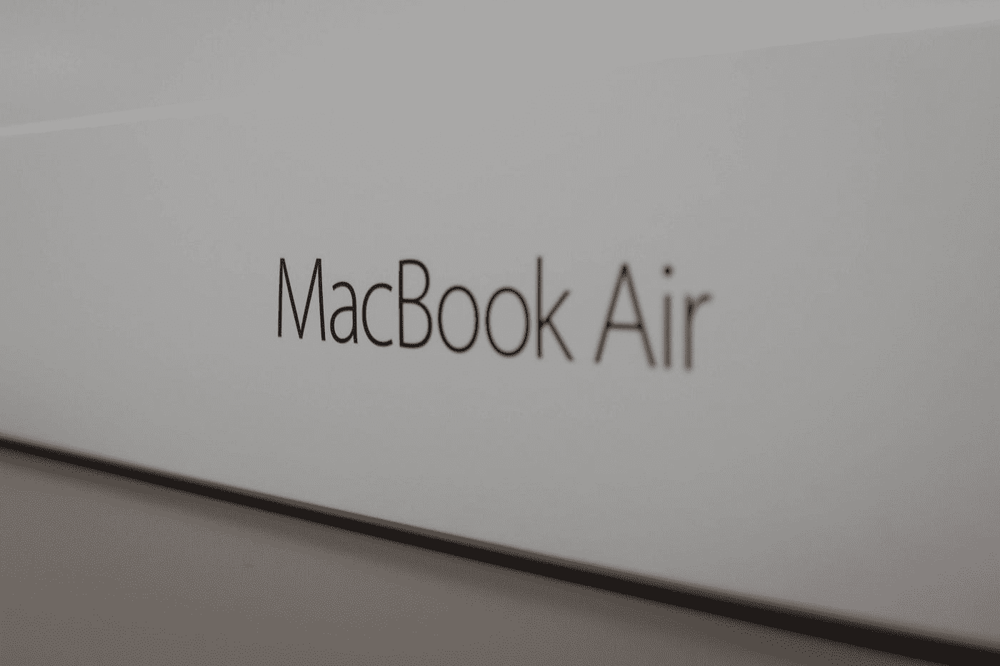

# M2 MacBook Air 是给谁的？

> 原文：<https://medium.com/codex/who-is-the-m2-macbook-air-for-d9f67e3fd540?source=collection_archive---------0----------------------->

## 苹果

## 一个勒德分子写道…

在 [Unsplash](https://unsplash.com?utm_source=medium&utm_medium=referral) 上 [NeONBRAND](https://unsplash.com/@neonbrand?utm_source=medium&utm_medium=referral) 拍摄的照片

对大多数人来说， [M1 MacBook Air](/codex/after-2-months-using-the-m1-macbook-air-do-i-have-buyers-remorse-b80dd070cbb0) 可以说是完美的笔记本电脑。它拥有一流的芯片组、经典且易于识别的设计，可以轻松执行大多数任务。在咖啡店里和在董事会上一样舒服。它是计算机领域的金发女郎。