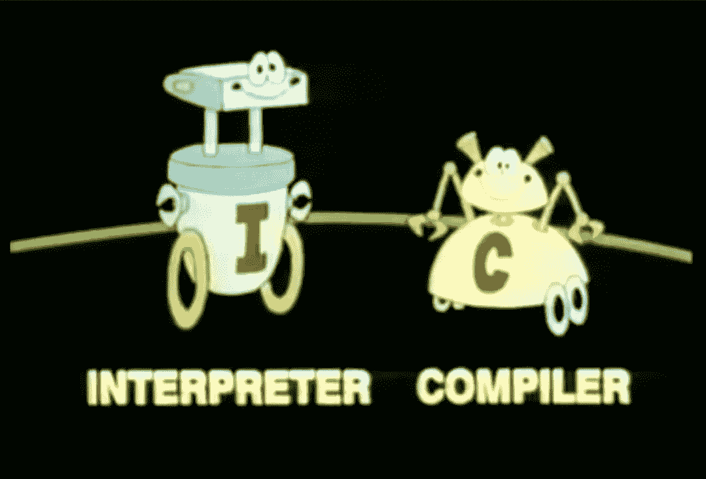
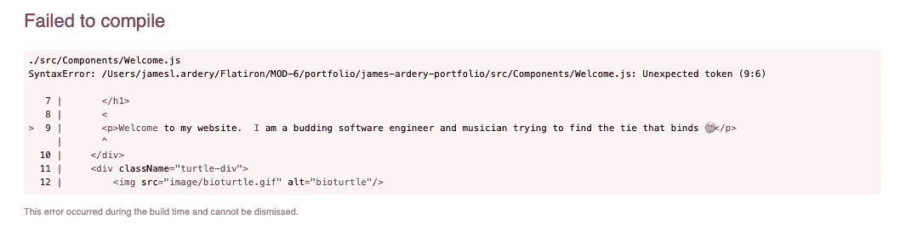
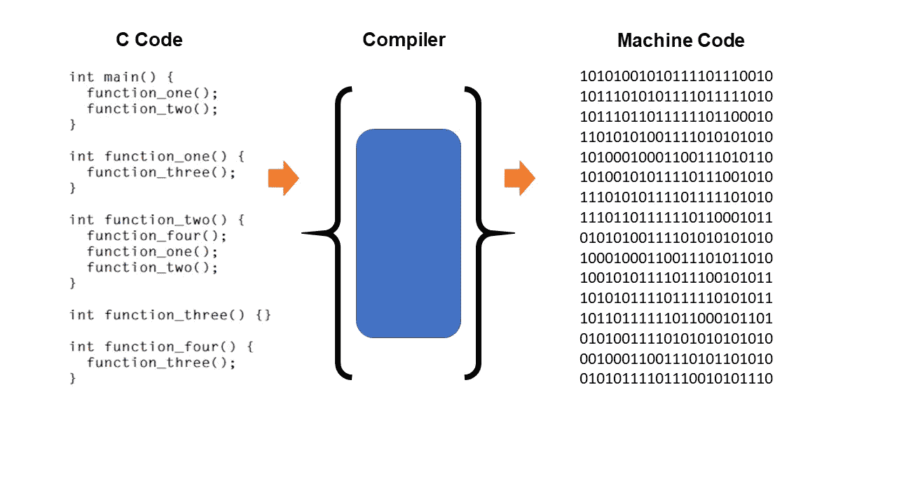
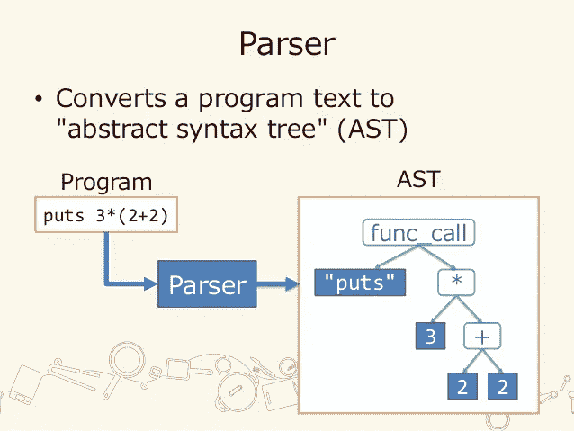
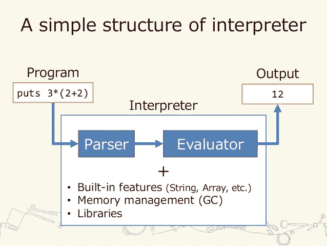

# 谁在中间？编译与解释

> 原文：<https://medium.com/codex/whos-in-between-compilation-vs-interpretation-b4c5e1dd808a?source=collection_archive---------11----------------------->

本周，在学习更多关于代码的内容时，我将把重点放在语言上。作为一名新的训练营毕业生，我担心我应该学习什么新的语言！？Typescript 还是 Python？围棋还是 Java？这是一个我们都会陷入的陷阱，而我试图避免这种情况的方法是从总体上学习更多的语言。当我后退一步，从更广阔的角度来看待所有语言时，一个属性开始显现。有问题的语言是编译的还是解释的？在 Flatiron，教授的内容是 Ruby on Rails、Javascript 和 React。所有这三种语言，以及许多其他语言，经常被编译。作为开发人员的一部分就是不断地查看错误信息，虽然错误各不相同，但对我来说有一点是不变的。

编译失败

虽然我可以很容易地修复上面的语法错误，但我很好奇我的计算机用“compile”这个词告诉我什么。

所有的编程语言都可以被解释或编译。这两种方法各有利弊。编译或解释就是选择应用程序如何从编写语言(Python、React、Go)翻译成计算机硬件可以运行的机器代码(二进制 0 和 1)。

编译就是把你所有的应用程序代码一次堆在一起，然后把整个过程作为一个可执行文件交给计算机来运行。现在编译器是你正在使用的语言的专利。最常被编译的语言是 C、C++和 Objective C。编译器是一个程序，它将检查整个应用程序并将所有源代码转换成二进制。

解释就是一次一行地把你的源代码转换成二进制。Inter 的定义意味着介于之间，因此解释器总是在你的源代码和它生成的机器码之间。通常解释的语言有 PHP、Javascript、Java 和 Python。解释器由两部分组成。First 是一个解析器，它首先处理代码，将程序的一行分解成语言组件，形成代码行的抽象语法树(AST)。

第二个是使用 AST 执行程序的评估器。树是任何解释器核心的重要数据结构。根据使用的树结构，解析器可以有更大或更小的调用栈，这将影响解析器= >解释器= >您的程序的运行时间。这些非常“低级”的决定会产生更大的影响，这取决于您正在运行的程序的类型。要了解更多关于 ASTs 和解析树的知识，请查看这个密集但令人敬畏的[博客](https://ruslanspivak.com/lsbasi-part7/)。

退一步来看更广阔的图景，编译器和解释器之间的利弊是什么？在我的研究中，出现了三个因素。速度、代码隐私和跨平台兼容性。编译器总是会更快，因为即使它需要额外的准备时间来将你的应用程序语言转换成机器语言(二进制)，一旦完成，机器就可以带着你所有的代码运行，而不是一次处理一行。编译器还会保护您的原始源代码，因为它会在您的设备上编译，并向运行您的应用程序的其他设备发送可执行的机器代码文件。解释器对于跨平台兼容性更好，因为它不必为每种类型的平台和 CPU 创建不同的可执行文件。

**编译器:**

缺点:

*   开始前的额外准备时间
*   如果你的代码中有一个错误，它会使整个应用程序崩溃(编译失败),所以当你需要调试你的程序时，有一个额外的重新编译的步骤(这是一个安全加分！)
*   必须为特定的平台(Windows、Mac、Linux)创建特定的编译(二进制机器码),然后在这些平台构建中创建 CPU 特定的二进制代码

优点:

*   初始编译后运行速度非常快
*   原始源代码是保密的，因为编译器在你的计算机上，你的计算机生成一个机器码文件，发送给运行你的程序的其它设备

**翻译:**

缺点:

-解释器运行缓慢，因为它逐行解释和运行程序

-您的原始源代码是公开的，因为它被逐行发送到运行您的程序的设备，然后该设备解释它以在该设备上呈现应用程序(考虑发送 javascript、img、脚本标签等)

优点:

*   马上开始
*   让您实时看到您的结果，因为一次执行一个任务(更容易调试)
*   跨平台，所以解释程序为不同的平台做了繁重的编译工作

这使得编译器只能从三个类别中选择两个，但是竞赛还没有结束。今天，许多工程师正在努力加快解释过程。C#和 Java 使用中间语言(IL)，字节码是最常见的例子，还有一个实时编译器(JiT)。这实际上允许程序员将他们的原始源代码保持私有，因为它只是被翻译成一个(IL ),后者被转换成二进制机器代码。然后，机器码在(JiT)中被编译，这可以在 IL/字节码作为二进制代码在计算机上运行之前加速和优化它。

就编码语言而言，谁知道未来会怎样，但我只能看到事情从这里开始变得更加高效和复杂:)