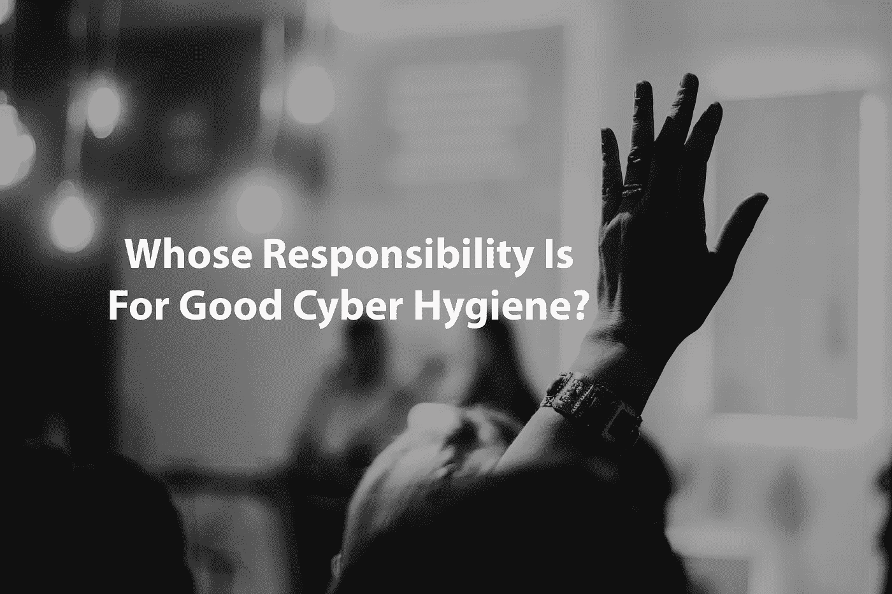
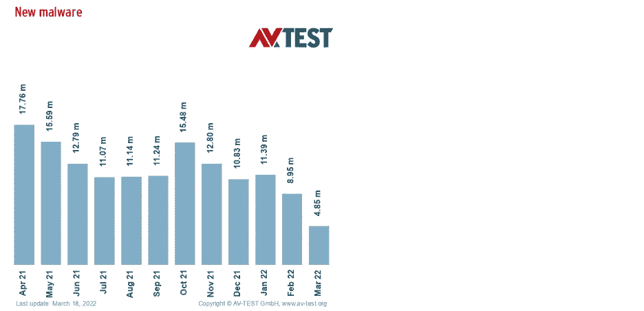
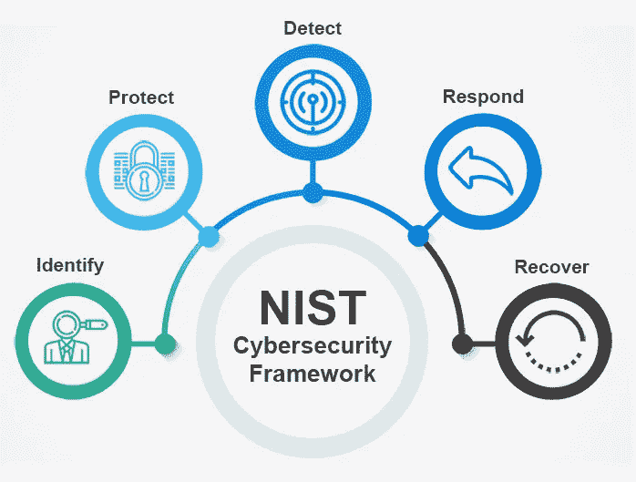
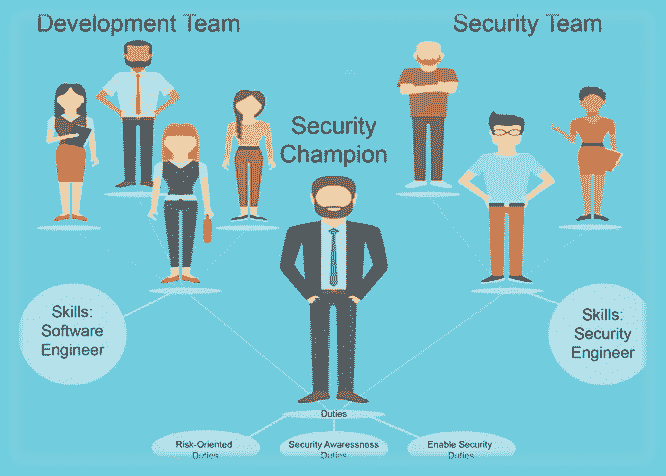

# 谁对良好的网络卫生负责？

> 原文：<https://medium.com/codex/whose-responsibility-is-for-good-cyber-hygiene-cd4e706fd864?source=collection_archive---------15----------------------->

三十多年后，蒂姆·伯纳斯·李在欧洲粒子物理研究所的研究成果产生了万维网，也就是我们今天所知的互联网。包括蒂姆在内，谁会想到互联网会变成今天这样？这个网络的网络影响着地球上和地球以外的生活的方方面面。人们从来没有联系过。互联网已经让位于新的商业模式，并帮助传统企业找到新的和创新的方式来营销他们的产品。

不幸的是，像所有其他事情一样，我们在互联网上有邪恶的力量，他们试图利用技术的弱点来实现他们的既得利益。作为互联网的第一代用户，对我们来说一切都是新的。无论是网上娱乐还是网上购物，我们都是最早使用的。我们伴随着互联网成长。在生活中的某个时刻，我们都曾是互联网或网络犯罪的受害者。这创造了一个全新的行业，现在被称为“网络安全”，被视为网络犯罪的保护者。然而，确定谁负责安全、业务或网络安全团队一直是一个巨大的挑战。

# 有什么必要固定责任？

全球化以及最近的疫情，增加了远程工作的人数。它已经成为公司越来越头疼的问题。因此，安全事故的数量成倍增加，包括每次事故的成本。网络事故的成本逐年增加。

> 根据 IBM 的《2021 年数据泄露成本》报告，安全泄露的平均成本高达 420 万美元。

政府规定了网络安全合规要求，在某些司法管辖区，不遵守这些要求会受到严厉处罚。例如，不遵守欧洲一般数据保护规则(GDPR)的公司可能会被罚款高达 2000 万€，相当于其全球年营业额的 4%。

传统上将安全性视为成本中心的公司现在正以不同的方式看待它，因为它们因违规和处罚而遭受损失。由于上述原因，我们看到这些组织的态度发生了变化。如今，公司将安全视为**每个人的**责任，而不是 IT 问题。

# 网络卫生:一个不好的挑战和影响。

与个人卫生一样，网络卫生是组织为确保数据和网络安全而采取的一系列措施。维护基本的网络卫生是被入侵或在不对业务造成巨大影响的情况下快速恢复的区别。

网络卫生通过减少环境中的漏洞，增加了网络罪犯攻击的机会成本。通过实践网络卫生，组织改善了他们的安全态势。他们可以更有效地防御持续的毁灭性网络攻击。良好的网络卫生已经通过降低被黑客攻击或被罚款、法律费用和降低客户信心的可能性而受到激励。

实施良好的网络卫生实践的最大挑战是需要知道我们需要保护什么。首先要有一份良好的资产清单。在混合工作环境中，清楚地了解您的资产非常重要。你不能保护你不知道的东西。因此，必须知道您的信息资产位于网络上的什么位置，以及谁在使用它们。了解数据位于何处以及谁可以访问数据也非常重要。

另一个重大挑战是长期保持纪律性和连续性。偶尔扫描您的网络不会有助于阻止无情的网络攻击。因此，必须实施自动化监控来持续检测和修复威胁，这需要在技术资源上进行投资，而许多企业并不具备这种能力。

由于上述挑战，我们经常看到糟糕的网络卫生导致安全漏洞和潜在的攻击媒介。以下是由于卫生条件差而导致的一些漏洞:

*   **未分类数据:**数据分类不当会导致数据放错地方，并因此存储在可能未得到充分保护的地方。
*   **数据丢失:**不良和不充分的数据分类可能会因缺乏足够的保护控制而导致数据丢失。如果没有定期备份和测试数据是否损坏，数据可能会因为数据泄露、硬件故障或数据处理不当而无法恢复。
*   **软件漏洞:**所有软件都包含软件漏洞。开发人员定期发布补丁来修复这些漏洞。缺少补丁程序管理流程或管理流程不完善会使软件易受攻击，黑客可能会利用这些漏洞来访问网络和数据。
*   **较差的端点保护:**根据 AV-TEST Institute 的数据，他们每天都会注册超过 450，000 个新的恶意应用程序(恶意软件)和潜在的不需要的应用程序。由于端点保护网络卫生实践(包括恶意软件保护工具)不足，黑客可以使用各种黑客工具和技术进入您的网络，破坏公司的环境，窃取数据。

*   **供应商风险管理不足**:随着供应链攻击的不断增加，必须实施全面的供应商风险管理，考虑第三方供应商和服务提供商带来的潜在安全风险，尤其是那些能够访问和处理敏感数据的供应商和服务提供商。未能实施这样的流程将进一步暴露服务中断和安全漏洞。
*   **合规性差**:糟糕的网络卫生经常导致各种法律法规要求不符合。

# 在您的网络安全组织内建立问责制

随着越来越多的违规及其影响，我们将开始考虑作为一个行业和社会来激励组织使网络安全成为一种生活方式。必须要求持有、处理和使用您的数据的组织遵守网络卫生。

既然我们了解了良好网络卫生的挑战，我们还必须了解我们一直在做什么来解决这些问题。到目前为止，我们已经尝试了很多方法。一些公司有内部开发的控制措施，而其他公司则有外部规定的规则和条例。然而，我们未能解决责任和问责问题。我们未能平衡业务需求和网络安全所需的严格性。例如，政府制定了具有惩罚性后果的法律和法规，而没有考虑一个小组织如何能够实施控制来遵守这些法律和法规。

这个复杂的问题没有简单的解决方法。拥有法律法规无疑提高了组织保持良好网络安全态势的门槛，但这不会永远将黑客拒之门外。组织需要更加积极主动地在其安全组织中引入更多的责任。网络安全专业人员需要在预防和挫败网络攻击方面承担责任和义务。与此同时，企业领导人需要了解问题所在，并从一开始就为这项工作带来合适的人选。开发和实施与您的业务风险相符的正确的网络安全框架。将网络安全作为商业战略的战略支柱之一，将会铭刻在一个组织的 DNA 中。

我们有很多方法可以开始这段旅程。首先，组织需要胶水，一个网络安全框架。支持国家标准与技术研究所 [(NIST)](https://www.nist.gov/cyberframework) 网络安全框架(CSF)等框架

NIST-CSF 是开始基线化你的网络安全功能的一个好方法。它提供了实现良好网络卫生的结构化路线图和指南。此外，CSF 还提供了补丁、身份和访问管理、最小特权原则等方面的指导。，这有助于保护您的组织。如果您掌握了自动化的基础知识，您的组织将有更多时间专注于关键职能。此外，设置基本卫生程序将改善用户体验、可预测的网络行为，从而减少服务罚单。

> 研究表明，最佳安全结果与员工参与度成正比。组织可以在企业中确定能够在各自团队中推广安全实践的“**安全卫士**”。在建立责任时，安全卫士可以起到力量倍增器的作用。他们可以作为您的变革推动者，快速发现问题并推动解决方案的实施。

# 结论

没有开始的好时机。然而，你越早开始解决和优化你的网络卫生和网络安全的方法，你就能越快地获得抵御网络攻击的保证。这将带来内心的平静，知道控制正在工作，正在做他们应该做的事情。在出现漏洞时，您不会手忙脚乱地寻找问题的解决方案，而是准备好应对任何可能发生的情况。

除了糟糕的网络卫生之外，如果你的组织设法避免了任何严重的违规行为，那么你的运气耗尽只是时间问题。