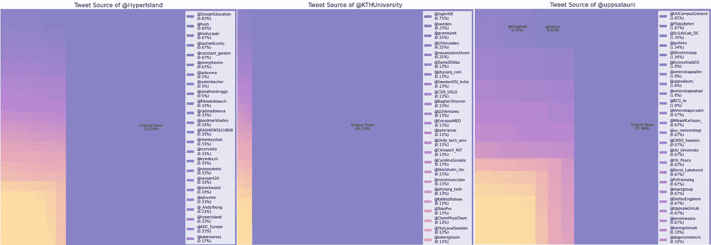

# 最初是谁的推文？

> 原文：<https://medium.com/codex/whose-tweet-was-it-originally-f746d4058e6f?source=collection_archive---------5----------------------->

## 使用 Tweepy (Twitter API v2)分析原始推文和转发，并使用 Squarify 可视化它们


Souvik Banerjee 在 [Unsplash](https://unsplash.com?utm_source=medium&utm_medium=referral) 上拍摄的照片

Twitter，这个名字你应该很熟悉。拥有超过 [3 亿总用户](https://backlinko.com/twitter-users)和超过 2 亿日活跃用户，是世界上最大的社交媒体平台之一。Twitter 的功能之一是 Retweet(RT)——用户可以在自己的 feed 上分享他人的推文，同时保留原始来源的信用。

但是，一个 Twitter 账户上原创推文和转发推文的实际比例是多少呢？我最初的猜测是，一个账户应该有更多的原创推文，而不是转发。说实话，我以前从来没有真正想过。但是有一天一个我很亲近的人来找我，说乌普萨拉大学的媒体和通信系( [@uu_media_comms](https://twitter.com/uu_media_comms) )的转发量可能比原始推文还多。这次谈话让我想到了 Tweepy 的推特分析。

根据其[文档](https://www.tweepy.org/)，Tweepy 是一个易于使用的 Python 库，用于访问 Twitter API。要开始使用 Tweepy，我们首先必须创建一个 Twitter 开发人员帐户来访问它的 API。幸运的是，这很容易在 Twitter 开发者页面上完成，并且有可能免费获得。免费选项为每个项目提供 1 个环境，每个项目每月提供 50 万条 tweets，这在这种情况下已经足够了。

一旦我们可以访问 Twitter API，让我们从安装 Tweepy 开始。

```
pip install tweepy
```

安装完成后，我们可以导入它并创建一个客户机对象。创建对象的所有参数都可以从您的 Twitter 开发人员帐户获得。

```
import tweepy# create Client objectclient = tweepy.Client(bearer_token, consumer_key, consumer_secret, access_token, access_token_secret)
```

然后我们使用这个函数从一个 Twitter 帐户获取所有的 tweets。

我将解释这个函数的主要操作。首先，我们需要获取用户 ID(数字)作为获取推文的输入。因为我们知道用户名，所以我们可以使用这行代码获取用户 id。

```
user_id = client.get_user(username=username)[0].id
```

然后，我们可以用这行代码获取推文。

```
tweets = client.get_users_tweets(user_id, max_results=100, pagination_token=tweets.meta.get('next_token'))
```

请注意，Twitter API 只允许我们一次获取 100 条推文。为了获取下面的页面，定义 *pagination_token* 参数很重要。

然后，我们把它放在一个 pandas dataframe 中，用 *tweets.data 中的 *id* 属性作为 tweet ID，用 *text* 属性作为 tweet 内容。*

这是函数的结果。我们已经看到一些即时战略，但我们还不能确定。


从@uu_media_comms 获取推文(图片由作者提供)

为了进一步分析它是否是一个转发，我们使用这个函数。

在这个函数中，我们在数据帧中添加了 2 列。第一列 *isRT* 将显示该推文是否被转发。第二列 *RT_from* 将显示发布该推文的原始帐户。

这是函数的结果。我还检查了这个账户的转发次数，现在我们可以得出结论，这个账户的转发次数比原来的多。


展示来自@uu_media_comms 的 RTs(图片由作者提供)

虽然我们已经知道了第一个问题的答案，但如果我们挖掘得更深，可能会有更多有趣的见解。让我们来看看这个账户是谁使用这个功能转发的。

在这个函数中，我们使用这行代码显示了 tweet 的原始来源。

```
df_plot = df['RT_from'].value_counts(dropna=False).rename_axis('username').reset_index(name='counts')
```

我们使用 *dropna=False* 来计算 None 值。这很重要，因为没有值意味着这是一条原创推文。

这是函数的结果。


显示来自@uu_media_comms 的 RT 计数(图片由作者提供)

看起来@mwkrzyzanowski 占据了所有推文中高达 56%的份额。从表面上看，这个人一定是@uu_media_comms 的重要人物，因为超过一半的推文是他们转发的。在 Twitter 上快速浏览一下，显示此人是该部门的主席。我们也看到原创推文只占所有推文的不到四分之一。我还发现了一个小细节，这个账号转发了 3 次。

我们已经发现了一个有趣的见解，但是将它可视化可能会让它更加引人注目。这一次，我将用 [Squarify](https://github.com/laserson/squarify) 将数据绘制成树形图。像往常一样，首先我们需要安装 Squarify。

```
pip install squarify
```

然后我们用这个函数来绘制数据。

我用各种 Twitter 账户测试了很多，这意味着我找到了我修复的各种边缘情况。但这里是主要部分。就像 Seaborn 一样，Squarify 构建在 Matplotlib 之上，所以我们有通常的 *plt* 语法。为了使用 Squarify 绘图，我们使用下面的代码。我还在 *color* 参数上为原创推文多于转发推文的账户设置了不同的调色板。

```
ax = squarify.plot(sizes=df['counts'], label=ax_label, alpha=0.5, color=ax_color, text_kwargs={'size': 9})
```

由于我还没有找到使标签的字体大小与矩形大小成比例的方法，所以我决定试验一下图例。当 *auto_legend* 参数设置为 *True* 时，我们只显示转发率超过 2%的矩形上的标签。如果 *auto_legend* 被设置为 *False* ，那么我们使用 *num_show* 参数来手动决定我们将要显示多少个带标签的矩形。

事不宜迟，下面是@uu_media_comms 的树形图。


@uu_media_comms 的树形图(图片由作者提供)

正如你从树形图中看到的，这是非常有趣的观察。我想知道它在其他账户上看起来如何，所以我把它与其他几个教育机构进行了比较(@HyperIsland、@KTHUniversity、@UppsalaUni)。



教育机构的树形图(图片由作者提供)

好吧，好像其他教育机构的推文大多是原创。再来找一些不相关的账号比如乐队@酷玩，演员@RobertDowneyJr，美国总统@POTUS。


各种 Twitter 账户的树形图(图片由作者提供)

好吧，正如我最初怀疑的那样，看起来更多的账户拥有原创推文而不是转发推文。虽然，有一组推特账号的转发量比原始推文还多。是的，那就是推特机器人。


bot 帐户的树形图(图片由作者提供)

我喜欢 Tweepy 让访问 Twitter 数据变得容易。这一次，我只掌握了 Tweepy 所能做的很小一部分。希望以后能深入挖掘 Tweepy 的其他功能。不过，你可以在我的 GitHub 上找到完整的代码。

干杯！