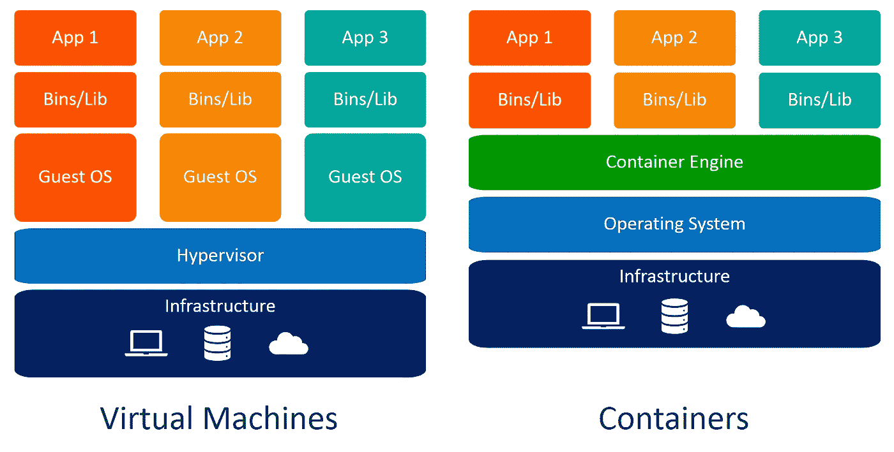
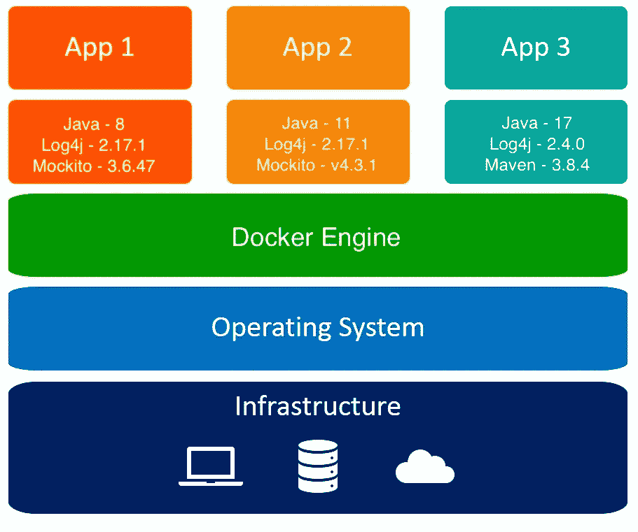

# 如何简单地学习和练习 Docker

> 原文：<https://medium.com/codex/why-and-how-to-start-to-learn-docker-f17ffb70b695?source=collection_archive---------4----------------------->

[伊恩·泰勒](https://unsplash.com/@carrier_lost?utm_source=medium&utm_medium=referral)在 [Unsplash](https://unsplash.com?utm_source=medium&utm_medium=referral) 上拍照

## 内容

在这个故事中，我将简短地谈谈 Docker，并为想学习 Docker 的初学者分享一些资源。我也准备了练习部分，在这个故事的最后一部分有描述。快乐阅读！

## Docker 是什么？

Docker 是一套[平台即服务](https://en.wikipedia.org/wiki/Platform_as_a_service) (PaaS)产品，使用[操作系统级虚拟化](https://en.wikipedia.org/wiki/OS-level_virtualization)来交付被称为*容器的软件包中的软件。该服务分为免费和高级两个等级。托管容器的软件被称为 **Docker 引擎**。它于 2013 年首次启动，由 [Docker 公司](https://en.wikipedia.org/wiki/Docker,_Inc.)开发*

简单地说，Docker 是一个软件平台，它简化了构建、运行、管理和分发应用程序的过程。它通过对安装和运行它的计算机的操作系统进行虚拟化来实现这一点。

Img。1 个虚拟机与容器

## Docker 解决的关键问题

Docker 的主要特点是应用程序的隔离。假设您有三个不同的基于 Java 的应用程序，需要托管在一台服务器上。每个应用程序都使用不同版本的 Java，以及相关的库和依赖项。由于我们不能在一台服务器上安装不同版本的 Java，这使得我们无法在同一台计算机上托管所有三个应用程序。下图可见。

Img。2 三个不同的 Java 应用程序作为 Docker 容器运行

## 从零开始学习 Docker 的资源

如你所知，互联网上有很多资源可以让你开始学习 Docker，例如 Docker 的官方文档，YouTube 教程，甚至是付费课程。在我看来，没有必要从提到的选项开始学习。代替他们，我建议从 KodeKloud 为绝对初学者提供的名为 [**Docker 的课程开始学习**](https://kodekloud.com/courses/docker-for-the-absolute-beginner/) 。该课程完全免费，简单解释，包含每次讲座的演示和实验。要启动课程，您需要在此注册[。](https://kodekloud.com/login/?redirect_to=https://kodekloud.com/courses/docker-for-the-absolute-beginner)

## 和码头工人一起练习

显然，实践在学习过程中很重要，所以我想分享一个由我创建的开源项目，名为 [**交通灯码头挑战**](https://github.com/hayk96/trafficlight-docker-challenge#vertical_traffic_light-traffic-light-docker-challenge) 。这是针对 Docker 新手的一系列练习任务。项目的练习很有趣，包括 Docker 的主要概念。通过完成这些练习，您也将熟悉 Nginx web 服务器。

## 结论

感谢阅读。我希望这个故事是有帮助的。如果你有兴趣，可以看看[我的其他媒体文章](https://hayk96.medium.com/)。