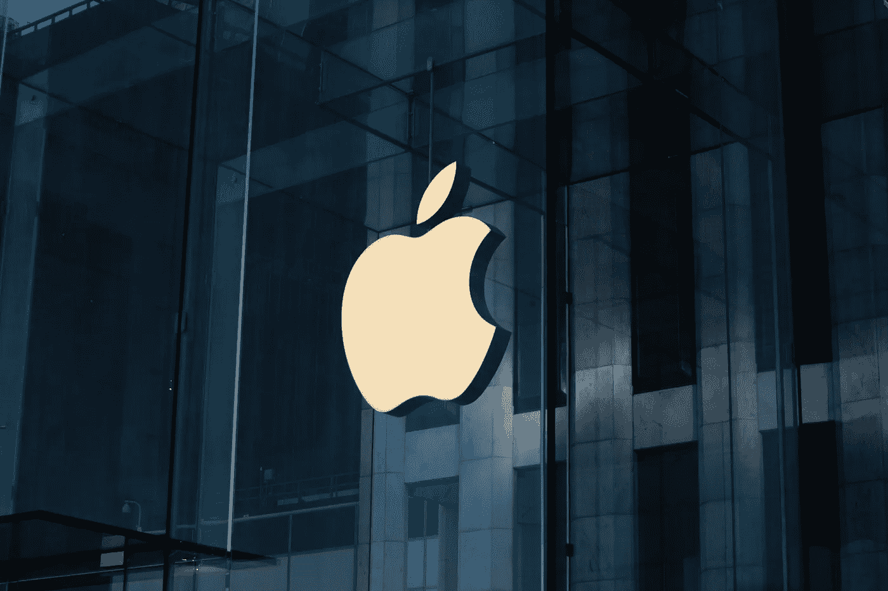

# 为什么苹果失去了著名的 ML 董事

> 原文：<https://medium.com/codex/why-apple-loses-well-known-ml-director-d49d6aac3622?source=collection_archive---------6----------------------->

## 数据科学专家需求量很大

## 其他公司能从这场人才争夺战中学到什么

劳伦茨·海曼在 [Unsplash](https://unsplash.com/s/photos/apple?utm_source=unsplash&utm_medium=referral&utm_content=creditCopyText) 上拍摄的照片

IT 人才，尤其是来自数据科学、机器学习等领域的人才，在市场上稀缺而需求旺盛。即使是大型科技公司，比如苹果，也不得不感受到这一点。