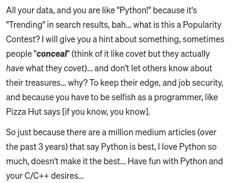
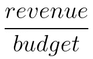
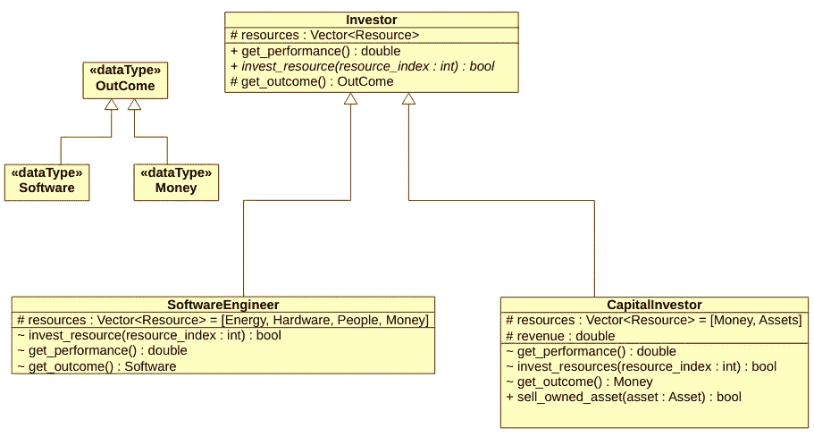

# 为什么比尔·盖茨雇佣懒人是错误的？

> 原文：<https://medium.com/codex/why-are-all-good-software-engineers-successful-investors-why-was-bill-gates-wrong-8ff8a5b90a01?source=collection_archive---------6----------------------->

比尔·盖茨有一句非常著名的名言:*“我选择一个懒惰的人去做一件艰苦的工作。因为一个懒惰的人会找到一个简单的方法去做。”*这是一句非常好的谚语，当我第一次听到这句话时，我有点震惊，这对我来说很有意义。然而，随着时间的推移，在通过工作获得经验的同时，我注意到这是错误的。在这篇文章中，首先，我将尝试解释为什么它是错误的，然后我们将尝试修复它。

 [## 未来的编程语言

### 哪种编程语言将主导未来市场？哪种编程语言成为最常用的语言…

blog.devgenius.io](https://blog.devgenius.io/the-programming-language-s-of-the-future-24af5cfa8479) 

我想和你分享最近发生的一件事:在我的一篇文章*——上面给出了链接——*有人在下面留下了评论:

如果你读了这篇文章，*——如果你至少读了结论部分—* 你会很容易理解这篇文章不是关于 Python 的。这是非常明显的。那么，这个人为什么会留下这样的评论呢？她/他傻吗？我不这么认为。根据这个人写的内容，我们可以看到她/他快速浏览了一遍，并根据她/他之前听到或读到的内容得出了结论。那么，为什么要留下这样的评论呢？

原因是这是一个懒惰的人。在文章中间，当我分享关于编程语言搜索引擎的统计数据时，她/他认定她/他明白了整件事，过于自信的她/他就下去写了这个评论。这很危险。因为懒惰和过度自信结合在一起，造成了一个危险的结果。这不是我见过的唯一一个因懒惰而犯的错误，而是最近的一个相对无害的错误。

不幸的是，懒惰会在工作场所造成有害的错误。在我之前工作的公司，就在生产部署之前，我们在系统中检测到一个分段错误和一个内存泄漏。我们通知了相应的团队，他们说他们会在批准负载后进行处理。我和我的同事聊过，他们告诉我其他车队的包也出现了同样的问题。同样，它们被认为是没问题的，从未被修复过。因为他们懒惰，认为最简单的解决方案是批准部署。是的，这是最简单的解决方案，但也是错误的。这将在不久的将来导致许多问题和资源浪费。

因为这种情况，在我看来，比尔盖茨说的是错的。应该是这样的:*“我选择一个懒惰的人，他不会牺牲工作的质量，并且总是做正确的事情。”*但这句话并没有那么酷。因此，我想提出一个完全不同的建议。

# 什么是投资人？

当我们说投资者时，通常每个人都会想到购买资产以增加预算价值的人。这是正确的，但我认为它的覆盖率低。

让我从面向对象编程概念的角度来解释一下。我们上面谈到的投资者类型不是父类而是子类，它是一个子类型。这种类型更正确的名称是资本投资者，因为他们投资的是他们拥有的资本。他们购买资产，通过使用这些资本来增加他们投资组合的价值，为了比较这些投资者的成功，我们需要了解他们的表现。资本投资者的业绩指标可能是收入与资本的比率:

资本投资者的绩效指标

那么父类型应该是什么呢？投资人的定义是什么？在我看来，投资者主要有三点:

*   他们应该有资源。该资源可能属于该投资者，也可能是从其他人那里借来的。他们会投入这些资源来获得一些成果。
*   一个结果是投资资源后的回报价值。这些资源被投资到哪里或如何投资？
*   衡量投资成功的绩效指标。

在这种情况下，资本投资者的资源是金钱，回报价值是投资组合价值，其类型是金钱，绩效指标可能是上面给出的指标。

在这种背景下，我们应该考虑软件工程师作为投资者。—事实上，所有类型的工程师都可以归类为投资者。—他们使用几种类型的资源:能源、硬件、资金和人员(其他开发人员和员工),产出的价值是软件。性能值可能是软件的有用性、有效性或质量。这些类型的 UML 图的草图如下所示:

投资者、资本投资者和软件工程师类型的 UML 图草图

# 优秀的软件工程师是成功的投资者

如果软件工程师也是投资人，那么根据上面给出的 UML 图，好的、成功的也一定是成功的投资人。我相信最好的开发人员不是能找到最简单的方法的人，因为最简单的方法从长远来看可能是不好的，并且可能在将来引起其他问题。这可能会让公司赔钱，或者更糟，如果这发生在像制造飞机、火车-铁路信号等关键行业。然后因为这样一个简单的解决方案，因为一个错误，人们可能会死于这个懒惰的人。

真正优秀的软件开发人员是了解真实情况，分析真实情况，并利用他们拥有的资源以最佳方式解决问题的人。如果一个工程师从这个角度来处理事件，那么这个人就可以决定什么时候该偷懒，而不会牺牲软件的必要质量，考虑未来的可能性。

我希望，你会成为这样一个伟大的投资者。

感谢您的时间，并致以亲切的问候。