# 为什么我们没有更好地准备处理不对称数据？

> 原文：<https://medium.com/codex/why-arent-we-better-prepared-to-deal-with-asymmetric-data-1bca9b4c186b?source=collection_archive---------4----------------------->

## 峰度不能衡量峰值。中心极限定理不会(总是)救你。战争中的不对称意味着什么？肤浅的知识不等于专业知识。

统计学可以说是应用数学中最重要的分支，因为数据在决策中的使用非常普遍。由于数据在许多领域的普遍性和必要性，许多非 STEM 专业的本科生和研究生需要一门统计学课程(这让那些宁愿写论文或审查令人作呕的无关紧要的理论的人感到绝对恐惧)。很明显，统计推断是职业和学术生活不可或缺的一部分。那么，为什么没有人教我们处理不对称数据，更好地理解它们的后果呢？

当这个想法真正打动我的时候，我正在为一个班级做一个可视化项目。任务的目标是获取一个数据集并可视化其中变量的分布。我找到了一个符合作业标准的数据集，这看起来很简单。当时，当我绘制变量的分布图时，我期望看到类似这样的东西:

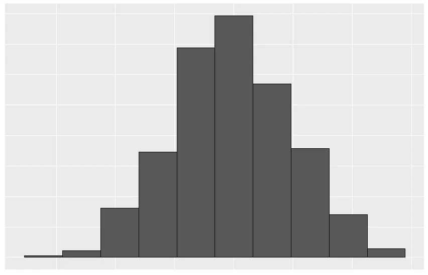

嗯，也许我并没有期望一个完全对称的分布…但是你明白的

这是我得到的结果:

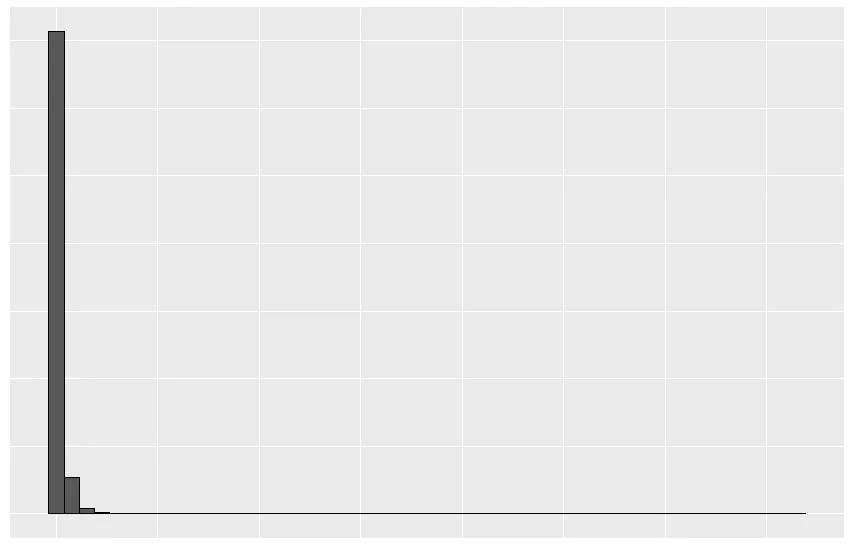

谷歌一下“lol what pear ”,看看我画出这个图后的感受

在试图“修正”数据时，我求助于当时我的统计工具包中唯一的求助工具——对数变换。转换后的数据如下所示:

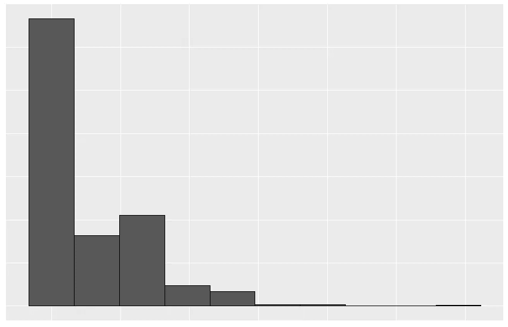

数据被重新调整了，但离符合正态分布还差得很远。我意识到我不太理解分布形状的含义。到目前为止，我所学的统计学课程中没有一门花了大量时间来讲述非对称分布。这种情况促使我重新评估我是如何进行统计推断的。

# 第三和第四时刻

衡量分布是否符合正态分布的标准是偏度和峰度。我曾被介绍过偏斜度，并(在一定程度上)理解它的后果，但从未被教授过峰度。我在最新的统计学教科书中搜索了“峰度”这个词，这本教科书是我在研究生阶段教授的课程中使用的。什么都没有。公平地说,“偏斜度”在文中被提到了五次，而且课程的目的集中在应用上而不是理论上。我想到了我在本科学习期间学过的其他统计学课程，比如统计学入门课程或计量经济学课程。涵盖了非正态分布，但重点是用于假设正态分布的方法(大数定律和中心极限定理总是可以解决问题)。

## 峰度的更技术性的评论

我将把重点放在峰度上，因为它实际测量的东西似乎存在混乱。在他的书《市场的(错误)行为》中，伯努瓦·曼德尔布罗说峰度衡量真实数据符合理想钟形曲线的程度，峰度是统计肉汤中的“调味品”(我更喜欢称之为统计肉丸)。在他的书的注释中，Mandelbrot 写道:

*“峰度”是分布曲线形状的标准度量的创始人之一，它基于前四个“矩”。“第一个矩是平均值:第二个是方差；第三是偏斜度——衡量数据围绕平均值分布的不对称程度；第四个是峰度，衡量曲线有多高或多低。钟形曲线的峰度为 3。较大的值意味着曲线中间较高，尾部较粗。*

最后一句很重要，因为它实际上有点误导。正如 Peter H. Westfall 在他的文章*1905-2014 中解释的那样，曲线的高度(其“峰值”)不是由峰度决定的。韦斯特福尔说，峰度可能与峰值合并在一起，因为重尾分布有时比轻尾分布有更高的峰值，他使用 n = 1000 个柯西随机变量的直方图来说明这一点:*

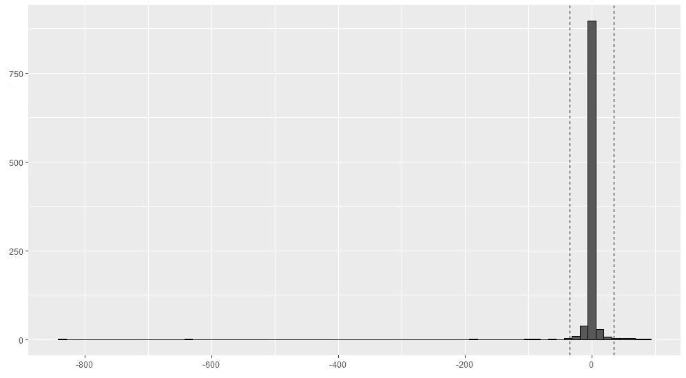

虚线是+/-一个标准偏差

峰度的计算公式为:

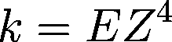

其中 Z 是:

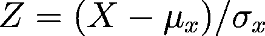

其中 m 和 s 是上述柯西分布的样本均值和样本标准差，设:

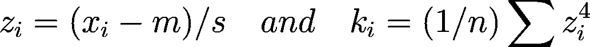

现在让我们用 R 写我们自己的函数来计算柯西分布的峰度。

```
# cauchy distribution
set.seed(12344)
cauchy = rcauchy(1000)#---------------------------
# create a kurtosis function 
#---------------------------
k = function(x){
  z = (x - mean(x))/ sd(x)
  k = (1/length(x) * sum(z^4))
  return(k)
}
#---------------------------# calculate kurtosis for the cauchy distribution
k_cauchy = k(cauchy)
k_cauchy[1] 436.5128
```

如果你还记得 Mandelbrot 的笔记， *k* = 3 表示正态分布。对于柯西分布， *k =* 436.5128。那是一个辣肉丸。这证实了我们从直方图中已经知道的，我们正在处理不对称数据。但是现在，让我们关注由平均值的标准偏差内的数据确定的峰度统计的比例。另一种思考方式是，我们将确定由图中峰值位置与非峰值位置的数据决定的统计数据的比例。为此，我们需要将 z 的计算分离到它自己的函数中，并手动计算 k。

```
# isolate Z in its own function
Z = function(x){(x - mean(x))/ sd(x)}# calculate z for the cauchy distribution
z_cauchy = Z(cauchy)# calculate kurtosis within one standard deviation
z_in = z_cauchy[z_cauchy %>% abs() <= 1]
k_in = 1/1000 * sum(z_in^4)# calculate kurtosis outside one standard deviation
z_out = z_cauchy[z_cauchy %>% abs() > 1]
k_out = 1/1000 * sum(z_out^4)# add the k values and compare to original calculation
k_in + k_out
[1] 436.5128k_cauchy 
[1] 436.5128# determine the proportion of k within one standard deviation
k_in / k_cauchy
[1] 1.670914e-05# determine the proportion of k outside one standard deviation
k_out / k_cauchy
[1] 0.9999833
```

一个标准差之外的值约占峰度统计的 99%。值得注意的是，1000 个柯西随机变量中只有 17 个在单个标准差之外。这意味着 1.7%的数据代表了约 99%的峰度。引用威斯特福尔的话，“……峰度统计与峰值附近的数据有任何关系的想法对于这些数据来说简直是愚蠢的。”分布可以具有相同的峰度但不同的峰值。峰度是关于离群值，而不是峰值。

# україні(光荣属于乌克兰)

我之前绘制的非常不对称的数据(我告诉你谷歌一下“lol what pear”)是乌克兰政府军在与俄罗斯政府及其代理人的持续战争中遭受的死亡分布。这是带标签的分布图:

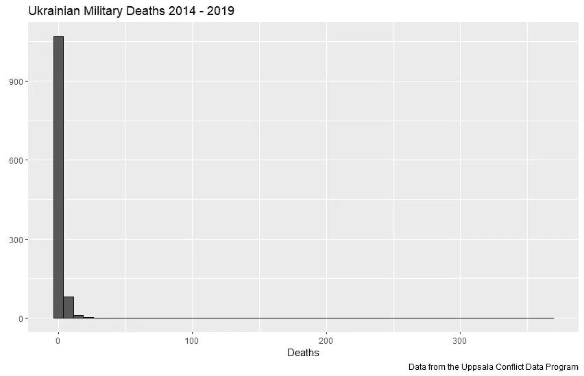

分布的峰度是 962.2642，那真是一个辣肉丸(гострафрикаделька).我发现数据中的一个观察值负责 0.9935008%的峰度。我绘制了每次观察的死亡人数与其各自的 z 值，并根据每次观察的 k 值调整了点的大小。图表如下:

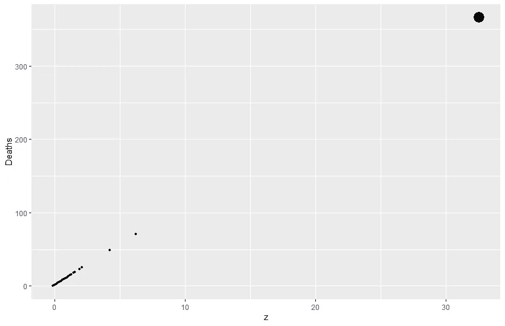

看到右上方的点了吗？那是肉丸。这个观察代表了伊洛瓦伊斯克战役(бояаіловайськ).)这标志着俄罗斯正规军卷入冲突，乌克兰政府军因此遭受重大损失。这一事件产生了巨大的影响，并严重影响了冲突的进程，因为它逆转了乌克兰军队在对抗俄罗斯代理军队时取得的进展。


一张我在基辅战争纪念馆拍的照片。大量阵亡者在[伊洛维斯克](https://en.wikipedia.org/wiki/Battle_of_Ilovaisk)死去，他们的照片被纪念在那面墙上。

## 有什么含义？

似乎考虑到我们分析的乌克兰死亡分布的特性，平均值几乎变成了一个无意义的统计数字(m = ~1.56)。在伊洛瓦伊斯克战役中，乌克兰军队有 366 人死亡(根据[乌普萨拉](https://ucdp.uu.se/)的数据)。当你有一个不对称的分布，这是极端的问题。它们决定了统计特性。战争中的极端事件可能意味着巨大的生命损失或国家主权的丧失。从经济角度来看，极端事件可能引发严重的衰退。用金融术语来说，这可能意味着马上破产。

# 中心极限定理不会(总是)拯救你

当我在统计学和计量经济学课程中讲述非对称分布时，求助对象总是中心极限定理(CLT)和大数定律(LLN)。LLN 粗略地指出，如果一个分布有一个有限的均值，你添加从中抽取的独立随机变量(样本量增加)，你最终会收敛到均值。CLT 指出，具有有限二阶矩(方差)的 n 个相加的独立随机变量最终看起来像正态分布(Taleb 28)。这在线性回归中非常重要，因为一致的估计量以概率收敛于被估计的量(Taleb 128)。

## 分布收敛的速度有多快？

因此，根据我们对 LLN 和 CLT 的定义，我们需要更多的数据。我刚开始理解这些概念的时候也是这么想的。更多的数据总会解决问题。然而，我从来没有想过在实践中需要多少数据，或者数据的底层分布如何影响收敛。为了形象化这些概念，让我们看看支持[0，1]的均匀分布，然后在原始变量上添加两个、三个和四个同分布的独立变量。

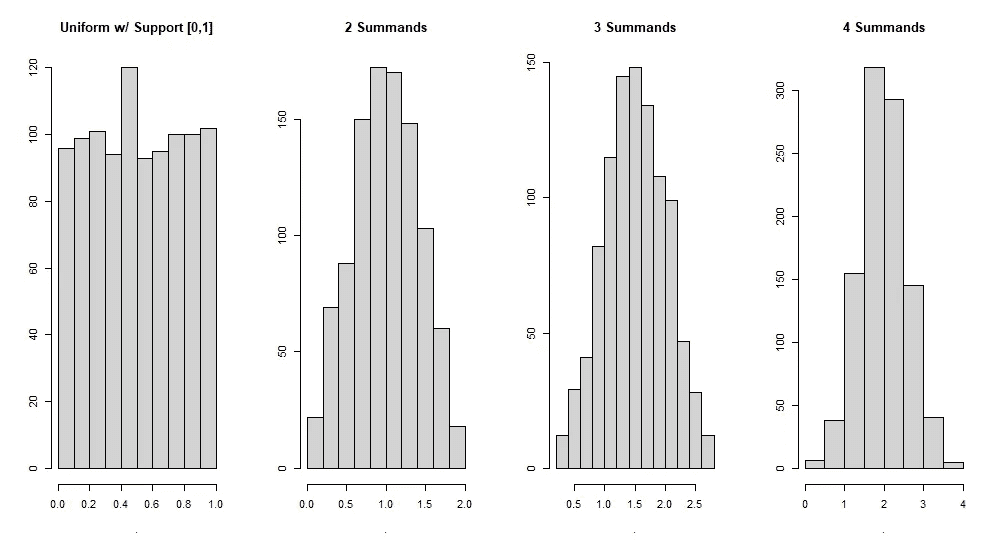

快速收敛:均匀分布

从上图可以看出，分布立刻变成了钟形。现在让我们探索一种不同的分布，帕累托分布。看看下面的直方图:

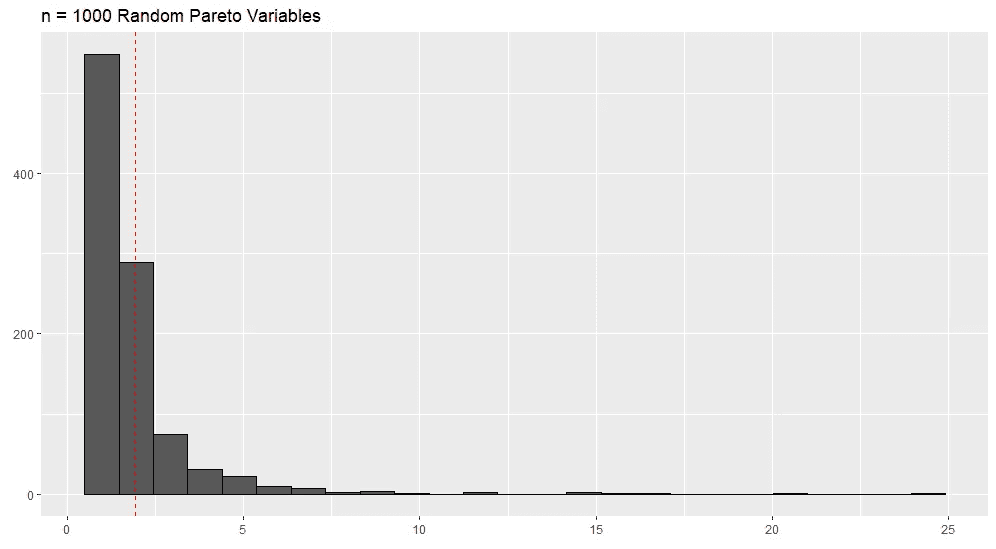

帕累托分布是独特的，因为大约 80%的观察值低于平均值。该分布是使用 r 中的 *Pareto* 包随机创建的。当我第一次绘制该分布时，我惊讶地发现它与我根据乌克兰冲突数据绘制的分布如此相似。我计算了乌克兰死亡数据中有多少低于平均值，是 80%(准确地说是 80.003428%)。并排看两个发行版:

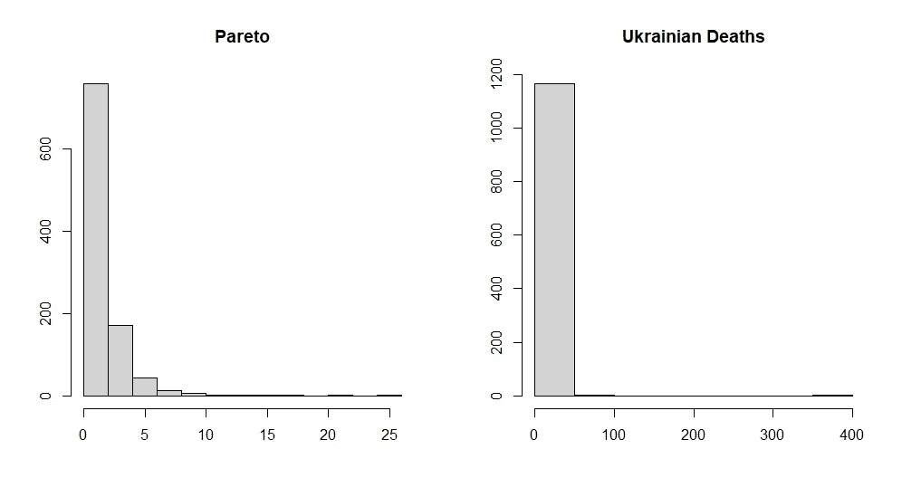

死亡数据甚至更加厚尾

我们之前看到了四个被加数的一致收敛速度。让我们看看有 100 个被加数的帕累托分布的收敛情况:

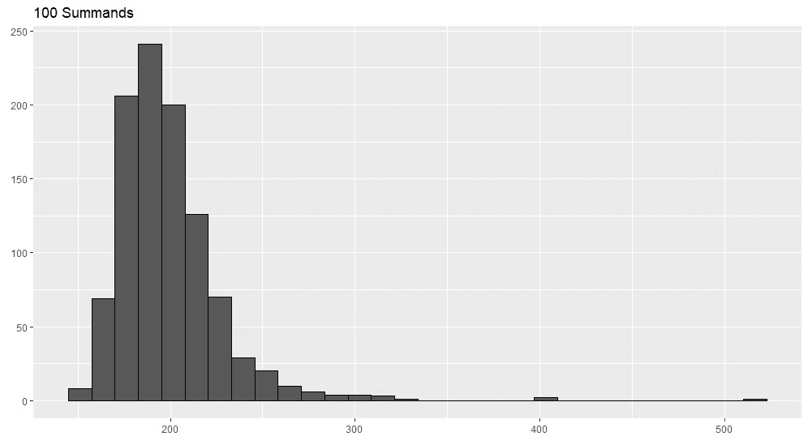

现在 1000:

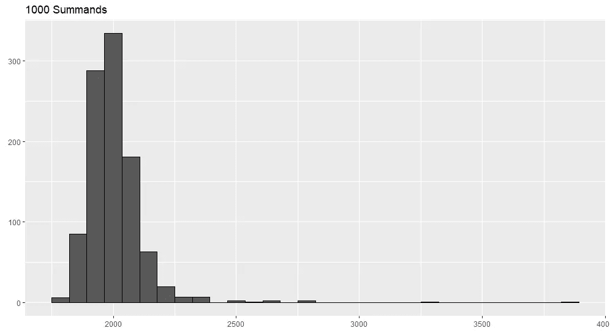

现在是 10，000:

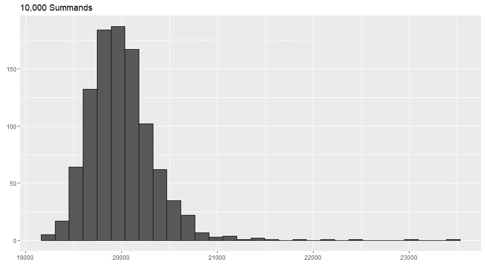

最终你会到达那里，但是这个分布非常顽固地失去它的偏斜度。理论上，我们知道当 n 接近无穷大时，分布会收敛。但实际上，我们从来没有无限的数据。如果回归方程中估计量的基本分布是厚尾的，该怎么办？这难道不意味着我们的预测有缺陷吗？我仍在试图更好地理解这个问题

# 最后的想法

我绝不是我在本文中所写的任何方面的专家(我实际上不喜欢“专家”这个词，因为我觉得太多人把肤浅的知识当作专业知识)。我发现和探索不同类型的数据越多，我观察到的不对称就越多。我观察到的不对称越多，我就越想知道为什么我所受的正规教育在处理这些不对称方面如此匮乏(答案通常是对数变换)。即使在我主要处理分类数据的职业生涯中，我也经常观察到不对称现象，它们会产生非常重要的后果。为什么我们没有准备好更好地应对不对称？

## 笔记

峰度的技术综述来自韦斯特福尔的论文，我用了他的例子。收敛速度的例子来自塔勒布的书。我也用了他的例子。

关于涵盖线性回归的渐近性和一致性的非常棒的幻灯片，[请看我以前的教授 Ed Rubin 制作的幻灯片](https://raw.githack.com/edrubin/EC421S19/master/LectureNotes/06Consistency/06_consistency_NoPause.pdf)。

如果你想回顾我为这个博客写的所有代码，[你可以在这里查看](https://gist.github.com/BatonVatrushka/714dd69ca866c31caae912e8a15ba035)。

## 参考

Mandelbrot，b .和 Hudson，r .，2008 年。*市场的(错误)行为*。纽约:基础书籍。

威斯佛，p . 2014。峰度作为峰值，1905–2014 . r . I . p .*美国统计学家*，68(3)，第 191–195 页。

肥胖尾部的统计结果。第 28、131、133 页。([这里免费下载](https://www.academia.edu/37221402/TECHNICAL_INCERTO_VOL_1_THE_STATISTICAL_CONSEQUENCES_OF_FAT_TAILS))