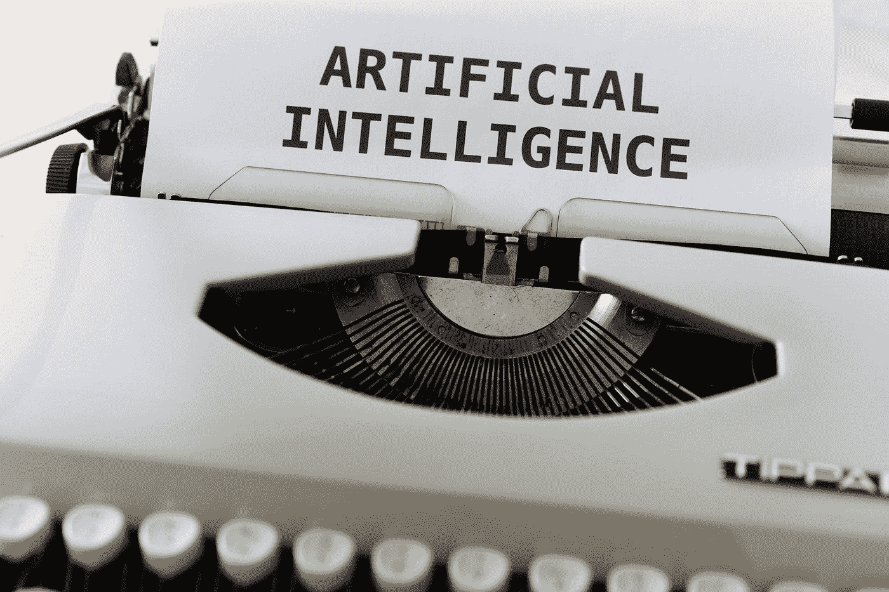

# 为什么做数据科学家比踩乐高还痛苦？

> 原文：<https://medium.com/codex/why-being-a-data-scientist-is-more-painful-than-stepping-on-a-lego-5f5957913ffb?source=collection_archive---------14----------------------->

每次你赤脚踩在乐高积木上，都会觉得脖子痛，你应该希望至少有一双凉鞋。

如果我告诉你，光着脚踩乐高和现在做数据科学家是一样的，会怎么样？

让我以这句话开始:

> *大数据就像青少年性行为:每个人都在谈论它，没有人真正知道如何去做，每个人都认为其他人都在做，所以每个人都声称自己在做——丹·艾瑞里*

这个人没有明确提到数据科学，但是这个好像很符合！

每个人都在谈论数据科学。大家都在尽自己最大的努力，给一些教程。每个人都在添加更多的技巧来更快地成为数据科学家。在谈论这个的时候，每个人都变成了某种大师。

(其实我写了一个[成为数据科学家的个人路线图](https://valdezdata.com/five-secret-ingredients-to-become-a-data-scientist)，哈哈哈！)

到底发生了什么？到底是怎么回事？又为什么痛苦？

在对数据科学做了大量研究并于几年前在博彩市场部门工作后，我认为数据科学在某种程度上存在“泡沫”

# 请解释“气泡”

遗憾的是，我所知道的是，大多数教程、文章、播客和一切似乎都非常关注机器学习。

简而言之，要创建花哨的深度学习解决方案，就要创建应用于小数据集的奢侈算法，在小数据集中对数据进行清理。

专注于我说的最后一件事:

> *已经清理数据的小数据集*

这就是为什么我认为现在存在泡沫。

数据科学家不是把大部分时间都花在清理数据上了吗？

嗯……如果一个数据科学家把 70%以上的精力都花在数据清洗上，为什么大家都专注于模型？

因为它没有创建模型有吸引力。

因为很痛苦。

人们真正感兴趣的是制造解决复杂问题的算法。但是，不幸的是，数据预处理是“无聊”和细致的。事实上，在一个格式良好的数据集背后有很多工作要做。

数据预处理是可变的；您总是有不同的问题要解决，因为您必须处理的数据是唯一且相关的。

因此，未来的数据科学家似乎只关心建模，但情况不应该是这样，因为:

*   SQL 是一项被低估的技能，但却是最重要的工作要求。
*   他们不会浪费时间研究如何操纵数据。
*   不了解数据来源。

假设你想成为一名数据科学家。在这种情况下，你可能知道你需要有编程、数学、可视化、机器学习等方面的知识。然而，出于某种原因，花时间在数据争论上不如建模重要。

数据是数据科学的基础。所以你输入到机器学习模型中的数据和模型本身一样必要，对吗？

没有足够的数据，数据科学家将无法创造出有用的产品。

# 好了，现在我知道了数据争论是必不可少的，接下来呢？

我们应该着眼于未来。数据科学家多少有点贵，大公司都在想办法尽可能的把这些成本降到最低。

你知道自动机器学习已经到来了吗？

数据科学工作流程变得越来越自动化。奇怪的是，一种自动化技术正在被另一种取代。

许多云提供商和工具实际上可以做数据科学家做的事情。那是 20 多个机器学习库的模型选择。

我试图说，公司正在自动化工作流，大多数有抱负的数据科学家都非常重视理解 ML 和深度学习算法。

工具在未来将变得更加高效，在更短的时间内提供更高的精度。

此外，在未来，将有一个更好的方法来处理数据科学专业。

我的意思是，数据科学家涵盖很多方面，但也许角色会定义得更好。

一些人可以做自然语言处理，其他人可以做部署，其他人做统计，等等。

您是否发现跟上所有最新的数据科学趋势和发展很有挑战性？

如果你问我，我觉得这是一场永无止境的战斗。

另一方面，从长远来看，专注于任何事情都应该总是获胜，不仅仅是在数据科学方面，而是在你生活的所有方面！

让我问你一个问题……如果你生了病，比如说新冠肺炎，你愿意让一个能处理很多问题的医生来照顾你，还是愿意让一个专门的新冠肺炎医生来照顾你？

你应该成为一个技能专家还是成为一个万事通？

在我看来，知识经济比以往任何时候都更加奖励技能。

# 如果我想成为数据科学相关领域的专家，我该怎么做？

当然可以成就著名的“独角兽数据科学家”；那个在机器学习、统计和分析方面能力超群的人。

此外，你可以建立一个机器学习模型，然后**正确地部署**。构建模型一定不是数据科学工作流程的最后一步，对吗？

或者，你可能是技术和商业之间的桥梁。

我指的是某个对某个特定主题有着坚定把握的人。

但我会进一步说数据科学中的无角英雄:**数据工程师。**

这是大多数有抱负的数据科学家拒绝的工作，因为这是无聊的部分。然而，我知道大多数公司都在招聘数据科学家、数据分析师或机器学习工程师，即使没有数据管道或 ETL 流程。

数据是数据科学中一切的基础。事实上，提供给你的机器学习模型的数据和模型本身一样重要。

因此，数据工程师应该执行数据工程的事情。另一方面，数据科学家应该能够同时完成数据科学家和数据工程师的任务。

说到底，如果你是一个有抱负的数据科学家，如果你继续做像 ETL 操作这样的数据工程师工作，你不应该感到震惊。这是因为公司仍在想办法做什么，以及对数据科学家有什么期望。

换句话说，如果你期望只是用现成的数据运行机器学习算法，你会失望的。

# 结论

正如我在本文开头提到的，您 70%以上的时间都在进行数据清理/处理/争论。

优秀数据科学的基础是数据质量。在创建模型之前，数据科学家必须首先验证数据是干净的、相关的和完整的。

由于数据工程师和其他技术/趋势，数据科学家的职责正在演变。

数据工程专业已经从加载和存储数据发展到使用正确的工具和技术计算和提取数据。

从长远来看，你将从事数据工程师的工作。这是作为一名数据科学家最痛苦的部分，我希望你不会更喜欢踏进一个乐高积木。