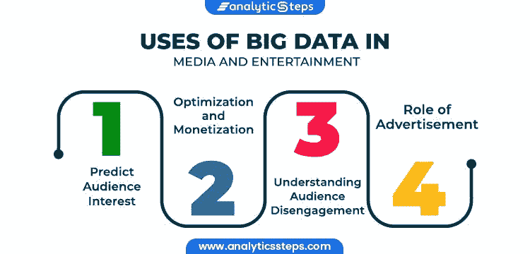
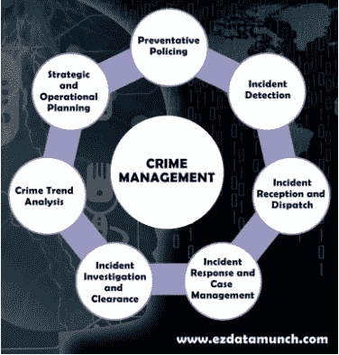

# 大数据有多庞大？

> 原文：<https://medium.com/codex/why-big-data-is-called-big-345d565402c9?source=collection_archive---------4----------------------->

## 知识广博的新兴领域。

在过去 3 到 4 年间，当数据科学和先进的人工智能概念被引入时，听到大数据这个名字似乎很熟悉。与人工智能和高级计算机领域相关的许多领域包括神经网络、大数据、机器学习、深度学习、道德黑客、网络安全以及在实际日常生活中的大量实施。在我们继续之前，我们应该知道**什么是大数据？**

简单来说，大数据最简单的定义是

一个非常大且复杂的数据集，需要分析大量数据，并建议提取信息的方法，通过分析或使用传统应用软件提供更好的解决方案。

# 现实生活中的大数据？

[真正的数据来了——不飞溅的图像](https://images.unsplash.com/photo-1488229297570-58520851e868?ixid=MnwxMjA3fDB8MHxzZWFyY2h8NHx8dmlzdWFsaXphdGlvbnxlbnwwfHwwfHw%3D&ixlib=rb-1.2.1&auto=format&fit=crop&w=500&q=60)

顾名思义，这个领域是巨大的！我们都知道，这个世界上的数据是无限的，几乎在所有领域都可以找到无限量的数据:

# 1)媒体和娱乐

[想看什么就看什么](https://cdn-images-1.medium.com/max/1200/1*B8CSDj_h4LBKn8h4_S_agQ.jpeg)

因此，不仅仅是银行、医疗或任何其他领域，所有相关领域都被数据占据，主要是需要谨慎处理的“大数据”。大数据分析也广泛应用于媒体和娱乐领域。媒体和娱乐已经成为人们生活中必不可少的一部分，提供了各种各样的内容，并使人们在观看和选择新内容方面充满热情。

## 数据是如何收集的？

数据收集通过多种方式进行，包括社交媒体应用、cookies、在线调查、反馈、基于特定标准提供奖励的忠诚度计划，以确保根据观众的兴趣提供最佳内容。

## 大数据在媒体和娱乐领域的应用

分析步骤以最简单和最精细的方式描述了媒体行业的实际应用。

[分析步骤](https://lh6.googleusercontent.com/m-bHR6VjawuBDiZxE4GVQlgr4_H_x_lfYRD7H0wxVAEGNeI6deace3oYGwKpQXgrP_xOviIgF--4WBHlxX1RvRT3naHZ9BDI13jEoq1orFillMUU5-zn5NdGa9nUcHT-T9RVql0-)

*   **观众参与度**

数据无处不在，提供数据并不困难。然而，提供让客户满意的内容是最重要的。为了获得大量的观众，内容应该加载高质量的东西，并应高度参与。因此，大数据再次为这些媒体和娱乐巨头提供了大量分类数据。搜索历史、每种类型的评级、社交媒体趋势、年龄、语言等是这些数据的关键因素，可以帮助公司预测特定观众的兴趣，并了解观众最喜欢和最喜爱的内容。

除此之外， **T** witter &社交应用使用的一个货币化系统是**标签**允许人们参与某个特定主题，这有助于调节内容、个性等。董事会成员。

*   **货币化**

下一个阶段是最有趣的，因为这允许几个账户和渠道货币化并产生收入，以保持大量观众参与内容并吸引新用户寻找内容。

创收可以是在社交媒体账户中拥有大量粉丝，提供订阅和专业付费功能，让用户拥有最终的优质用户体验。

许多娱乐公司，如[网飞科技博客](https://medium.com/u/c3aeaf49d8a4?source=post_page-----345d565402c9--------------------------------)、[博客明星](https://medium.com/u/e2fdc040235d?source=post_page-----345d565402c9--------------------------------)、[团队迪士尼乐园](https://medium.com/u/85ae0b3699b6?source=post_page-----345d565402c9--------------------------------)和@亚马逊 Prime video 都为会员和非会员观众提供内容。

*   **观众脱离**

会员期限与其价格当然是任何公司的一个主观问题，他们定期修订和更新。大数据还提供了对回头客和忠实粉丝群的洞察。在某些情况下，尽管有多个俯卧撑通知和要求他们选择退出会员计划的行动，但仍有会员不续订其会员资格。

*   **营销&广告**

最后一个阶段需要让观众增长到小康马克排名是通过做广告和营销来促进品牌。有了营销，有许多可能的流量来源访问您的渠道，并可能喜欢帮助您更快增长的内容。如前所述，了解了观众的兴趣，内容就更容易根据他们的口味传播，从而在全球范围内创造了难以想象的粉丝基础。

# 2)网络安全和情报

网络安全和大数据，一个融合的组合！嗯，网络安全有超负荷的内容需要探索，事实上它有大量的大数据集、大数据和数据科学。有了这一点，对于大多数企业以及生活中许多其他未列出的领域来说，既有许多机会，也有许多风险。因此，为了确保数据安全传输，公司和企业可以考虑:

*   与其他行业同行合作，维护安全标准。
*   使用高级加密方法保护大数据
*   软件的使用(Hadoop 等。)

根据圣地亚哥大学的**；**大数据提供了增强网络安全本身的能力。然而，为了从大数据带来的众多机遇中获益，公司必须承担保护这些数据的责任和风险。

# 3)犯罪学

[如果可以的话跟踪我——Unsplash Images](https://cdn-images-1.medium.com/max/800/0*so1v2yHz751l0j7H)

让大数据引人入胜的有趣事实是可以从不同场景中识别的隐藏模式，包括谋杀、抢劫、犯罪等等。CCTV 系统生成的数据带有高级分析功能，可确保公共安全通信。但是，分析和评估这些报告可能需要相当长的时间，甚至一周或更长时间。

为了最大限度地提高安全性，犯罪预测和预防管理如下所示:

[犯罪调查是如何工作的](https://cdn-images-1.medium.com/max/800/1*_kDrhvsRyxWnvdXkkNgGNA.png)

不幸的是，随着城镇和城市的大量增加，识别犯罪模式、寻找线索之间的联系以及假设犯罪是如何发生的，这是一项非常具有挑战性、耗时且密集的劳动。为了克服这些障碍，使用了包括**系列探测器**在内的许多检测算法，这些算法从数据库&中捕捉所有犯罪细节，结合模式的一般特征，并包含每个模式的所有主要/次要细节，以提供最佳和期望的结果。

**大数据给刑事调查带来的好处**

在大数据分析的帮助下， **(1)** 细节变得更加简化和相关规定。公司发现，通过帮助统计数据来了解机构过去面临的低效和缺陷，更容易提高他们的组织成果**(2)***。此外，魅力还在继续，因为通过 **(4)** 分析异常，欺诈&滥用可以被消除。除此之外， **(5)** 安全&犯罪威胁可以在很大程度上最小化，同时 **(6)** 在服务中提供透明性。*

# *4)制药行业*

**

*[美国国家癌症研究所— Unsplash 图像](https://images.unsplash.com/photo-1580281657529-557a6abb6387?ixid=MnwxMjA3fDB8MHxzZWFyY2h8MTJ8fHBoYXJtYWNldXRpY2FsJTIwZHJ1ZyUyMGV2YWx1YXRpb258ZW58MHx8MHx8&ixlib=rb-1.2.1&auto=format&fit=crop&w=500&q=60)*

*制药业是医药制造、销售和贸易的主要部门。随着行业的大量发展和突破，技术具有独特的特征，尤其是在制药行业处理大数据时。*

*这包括检查药物的成分添加到一定的百分比，以及药物的成分与症状和副作用——所有这些都是为了给患者提供安全的药物。*

*随着大数据的推出，大数据已经成功征服了生活的所有领域，使其能够大量利用数据并找出最佳解决方案。大数据的真正努力将会彻底爆发。只要看看药房是如何借助大数据的影响一飞冲天的就知道了。*

**

*[药物成分](https://cdn-images-1.medium.com/max/800/0*gSc9CFqyTuxVTz82.jpg)*

*   ***药物发现:***

*医疗药物的发现是大数据的一次革命性行动，涉及不同的分子和物质，导致了许多药物的形成。然后获取数据并加以利用，以提供没有生命危险的适当治疗，消除致命疾病。*

*   ***模式分析***

*制药行业需要预测分析，因为药品生产是一项极其精确和完美的任务。为此，需要积累和分析大量数据，以便成功的模式可以导致战略决策。由于成分众多，一种药物可能会有许多反应，为了进行特定的试验或过程，需要事先确定这些反应。*

*   ***临床试验&测试***

*大数据在制药行业的另一个非常有用的应用是持续高效的临床试验。在临床试验的帮助下，可以手动解释数据，甚至根据传统技术，大数据已经彻底改变了制药行业的临床试验工作。随着数据成分的分析，药物得到试验测试，这有助于通过大量数据的可用性了解可能的反应。*

*此外，Wipro 进行了一项案例研究，解释了:*

> ***“Wipro 使用 Hadoop (EMR)和 Redshift 技术在亚马逊网络服务(AWS)上部署和运营了一个大数据平台。该平台充当所有业务线(lob)的单一真实来源，是整个客户组织中所有商业分析的基石，包括营销、运营和销售业绩。”***

*因此，从药物发现到潜在的 R&D 研究，大数据似乎已经涉足与行业及其事务相关的几乎所有方面。*

# *5)天气预报*

**

*[天气警报](https://cdn-images-1.medium.com/max/800/1*Uy91ttdYbFYDdxp9emiL8w.jpeg)*

*科学取得的一项重大成就是利用大数据了解天气状况，并预测未来几天可预测的气候条件。理解天气数据具有挑战性，因为识别天气状况模式包括降雨，中暑，雷暴，飓风，洪水，沙尘暴和暴风雪都有不同迹象可看。*

**

*[恶劣天气](https://cdn-images-1.medium.com/max/800/0*gFl0O_O_sUtzTe9N)——雨雪*

*大数据在天气预报中的一个主要应用是 IBM 的 Deep Thunder。与许多天气预报系统提供广泛地理区域的一般信息不同，Deep Thunder 提供极其特定位置的预测，如单个机场，以便地方当局可以实时获得至关重要的信息。*

*流行的**人工神经网络**、组神经网络、反向传播网络、径向基网络、一般回归神经网络、遗传算法、多层感知器和模糊聚类是一些预测准确和正确天气预报的人工智能方法。*

# *6)银行和金融*

**

*[面向业务的大数据分析工具](https://cdn-images-1.medium.com/max/800/0*l_O3cnY0DX4RlK9u)*

*啊，银行业是你能看到的先进的现代人工智能分析的最常见的实际实现。我们都知道，随着无数的交易，大量无止境的数据不断出现，需要强大的分析来维护整体统计数据。大型技术公司和其他受欢迎的公司，包括英特尔、脸书、亚马逊、谷歌，都有需要组织和分析的超负荷数据，并且正在使用数据分析工具，如 Hadoop、spark 等等。*

*据 **BBC 新闻报道，萨姆·库马尔将其表述为:***

> ****数据提供情报，确保银行向客户提供的服务对他们的选择具有价值和相关性。****

**

*参考: [BBC 博客](https://ychef.files.bbci.co.uk/960_540/p053ctj0.jpg)*

*银行分支机构的角色正在发生变化。现在他们可以专注于其他重要任务。反过来，客户使用移动应用程序，可以持续在线访问他们的账户，并可以通过智能手机执行任何操作。*

*同样重要的是，在现代社会，人们更愿意分享自己的信息。他们留下评论，标记自己的位置，在社交网络上创建账户，这意味着**大数据**的角色正在演变。*

*随着最近脸书和 Whatsapp 的网络瘫痪，数百万客户和股票购买者出售他们的股票，数百万客户给马克扎克伯格的品牌打了 0 到 14 分。在大数据处理的帮助下，7 个小时后幸运地找到了治愈方法，但根据 2021 年 10 月 4 日星期一的分析统计，马克·扎克伯格损失了**70 亿美元**，使他的身价降至**1209 亿美元**。股价下跌还将这位脸书首席执行官推上了彭博亿万富翁指数的第五位，位列比尔盖茨之后。*

*随着市场的起伏，大数据有助于了解流量的主要来源。*

*   *交通优化*
*   *通信*

# *7)科学研究*

**

*[数据造就研究——不可思议](https://cdn-images-1.medium.com/max/800/0*c7GqmuyHLoRrfK0C)*

*根据《斯坦福哲学百科全书》的说法，大数据有望通过新颖、高效的方式来规划、实施、传播和评估研究，彻底改变科学内外的知识生产。*

*大数据通常与*数据驱动*研究的理念联系在一起，即通过积累数据和应用方法从这些数据中提取有意义的模式来进行学习。在数据驱动的研究中，研究人员被期望使用数据作为归纳推理的起点，不依赖于理论上的先入之见，而是通过假设的测试，并根据发现进行评估。*

***数据是如何整合的？***

*科学研究人员定期收集非常大的数据集，主要用于 HPC 系统的计算分析。这些数据集也可以使用大数据工具进行分析，以通过数据可视化工具或高级分析算法寻找有价值的见解。*

***Hadoop** 分布式计算架构越来越多地被部署到需要大数据功能的科学应用中，特别是管理、收集和分析数据。Dell Apache Hadoop 大数据解决方案提供开源的端到端可扩展基础架构，使您能够:*

*   *在分布式环境中跨服务器和存储同时存储和处理大型数据集，以进行广泛的结构化和非结构化统计学习和分析*
*   *适应广泛的分析、探索、查询和转换工作负载*
*   *定制和部署经验证的参考体系结构*
*   *降低项目成本*
*   *从科学数据中获得重要见解*

*消除分析研究数据集的复杂性。借助戴尔丰富的 Hadoop 就绪型分析解决方案库，您可以轻松创建“假设”情景仪表盘，生成关系分析图表，并对传统系统进行创新。戴尔与 Cloudera 和英特尔合作，为研究应用提供市场上最全面、最易于实施的大数据解决方案。*

*其他流行的系统包括 **Apache Spark** 是另一个分布式处理环境，在科学界引起了很大的兴趣，它是开源的，每个人都可以使用。*

# *8)教育*

**

*[不飞溅图像](https://cdn-images-1.medium.com/max/800/0*SznncQZEHxKFvAYk)*

*教育是进步的关键基础，但如何识别学校、学院和教育机构的表现以及它们在社会中的声誉。考虑到冠状病毒在全球范围内影响整个世界的现状，学术是从根源上受到严重影响的一个领域。教育遥不可及。在线课程的流量呈指数级增长。人们用谷歌搜索电子学习程序，学生安装软件做作业，并在网上检查。学校使用视频流软件远程授课。*

*随后，数据科学家将检查所有关于该软件使用方式的信息，用户面临的问题，他们的偏好，他们出席的频率或频率，他们成功通过的测试以及输入的信息可以告诉他们什么。*

*据 IBM 估计，2020 年对数据科学家的需求为 28%。大数据分析仍然是教育领域的愿望清单。怎么会？让我们深入调查一下。*

*   ***学生数据***

**

*[在新冠肺炎学习的学生](https://cdn-images-1.medium.com/max/800/0*PFgbmDEiVdNgvMLC)*

*一所学校或学院招收了数千名学生，每个学生都有自己唯一的身份，并有不同的 ID、注册号、姓名、个人简历、班级、成绩，还有自己的进度报告。一次性处理所有这些数据是非常累人的，这就是数据分析发挥作用的地方，它可以了解学生的学习模式、他们的信息以及他们的其他能力，以了解他们的日常活动、兴趣和迄今为止的学习进度。*

*   ***考试***

**

*[明天是考试伙计们——Pexels](https://cdn-images-1.medium.com/max/800/0*J-o1YC2DXp1TQgf4)*

*分析学生表现的最常见的方法是通过他们在考试、项目和作业中获得的分数。借助大数据，可以监控他们的行动，例如:*

*   *考试问题的响应时间*
*   *他们选择自学的资源*
*   *他们跳过的问题*
*   *他们成功回答的问题*

*实时分析将有助于为学生提供更多关于其表现的增强反馈。反馈可以显著改善结果。这是因为学生将能够了解他们已经取得成功的领域和他们落后的领域。*

*   ***评分标准***

**

*学生成绩统计*

*大数据有助于教育工作者跟踪学生的表现。这种分析有助于理解个人和集体的表现。该系统还将允许教师向学生提供有价值的反馈，并帮助他们选择正确的职业道路。例如，英国的阿什福德学校已经实施了大数据工具，如 Socrative、Nearpod 和 Classroom Monitor，用于分析他们的学生。这些应用程序帮助他们实时观察学生的表现和行为。*

***要点:**大数据在教育领域的应用彻底改变了这个领域。教育机构正在使用大数据来筛选申请人，决定谁适合该机构，谁可能不适合。这有助于世界各地的机构减少选择过程所花费的时间。招聘教师时也在使用大数据。*

# *有什么限制吗？*

**

*[图片地点:Pexels](https://cdn-images-1.medium.com/max/800/0*vc4bPtn4Rwisv8nS)*

*在处理大量数据时，可能会在数据关联和识别复杂关系方面出现一些问题。此外，可能会出现一些安全问题，以确保没有数据泄漏，并使私人数据独占和其他间谍/恶意软件活动。除此之外，存储也是一个主要关注点，因为无论是将数据存储在超大型存储设备上，还是存储在基于云的设备上(后者更受欢迎),都可能会给数据科学家和分析师带来麻烦。*

# *结论*

**

*人工智能世界*

*根据这份报告，随着需求的增长，2018 年全球大数据即服务市场的价值为 49.9 亿美元，预计到 2026 年将达到 614.2 亿美元，2019 年至 2026 年的 CAGR 为 36.9%。*

*总的来说，技术领域有无限的机会，并提供多种好处，但也有一些需要注意的主要问题。随着无限的机会和数据在各个领域的利用，大数据将在未来两年创造**440 万个工作岗位***

*IDC 对大数据和分析未来范围的预测是:1 .视觉数据发现工具的增长速度将是商业智能市场的 2.5 倍。到 2018 年，投资终端用户自助服务将成为所有企业的一项要求。*

> *“进化从这里开始”*

*希望能有另一个信息丰富的博客。在那之前，*

*敬请关注。*