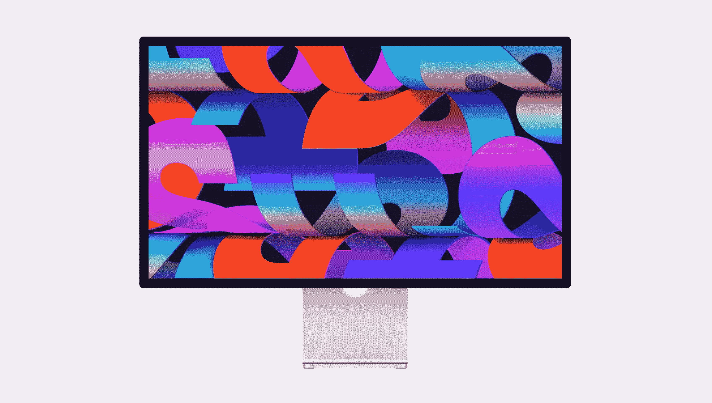
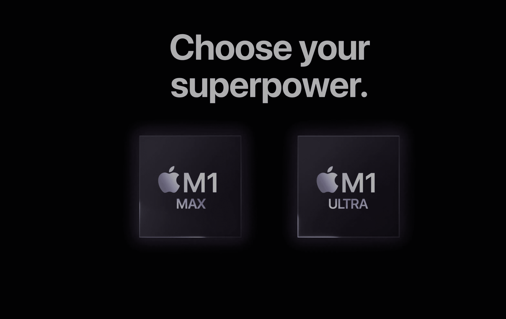

# 为什么我们就不能满足呢？

> 原文：<https://medium.com/codex/why-cant-we-just-be-satisfied-f70e6490095b?source=collection_archive---------13----------------------->

## 苹果工作室的展示才刚刚开始两周，但我们似乎已经不满足了。

大约两周前，当我在现场观看巅峰性能活动时，有一个非常突出的公告。不要误解我的意思，采用 M1 芯片的 iPad Air 令人印象深刻。iPhone SE 第三代是苹果全球营销战略中非常重要的产品。配备 M1 Ultra 芯片的 Mac Studio 是开创性的。

但是，尽管所有这些物品都令人印象深刻，但真正吸引我注意力的一件产品是全新的工作室展示。多年来，像许多人一样，我渴望有一个精神上的继承者，取代五年前停止的霹雳影院。我的阵容包括 5K 27 英寸显示器，显然不需要外接显示器，但我也用 2019 年的 15 英寸 MacBook Pro 运行。可以说，这很快就要结束了，M1 Max 16 英寸即将面世。但是笔记本电脑确实受益于更大的显示器。

 [## 廉价的 iPhones、糟糕的网络摄像头和色彩缤纷的 MacBook Airs

### 苹果视图综述

medium.com](/codex/cheap-iphones-bad-webcams-colourful-macbook-airs-2a14a842bd7e) 

## 只是我吗？

现在，请原谅我对自己的年龄有点敏感和保护欲，但假设我已经过了*几个生日，*我们走吧！我是那一代人，视力正常，不喜欢在小屏幕上工作的想法。在我的脑海中，我脑海中浮现出年轻创意人员坐在咖啡店里，在触控板上轻弹鼠标，在小型便携式笔记本电脑上创作杰作的画面。我希望，我的意思是，我真的希望，那是我，但可悲的是，它不是。天啊，我需要所有我能找到的运气、好运和助手来接近创意！在过去的两年里，我越来越多地使用我的 MacBook，在那段时间里，它一直连接着一台惠普显示器。我拒绝也不喜欢将 MacBook 设置为翻盖模式，因为它的显示屏实在太漂亮了，但同样，市面上的显示器也不是最好的。当然，直到现在，也就是这样。

现在，当我耐心地等待我的小组到来时，我注意到 YouTube 和 Twitter 上关于苹果交付了什么越来越多的不和谐。这让我想起了被宠坏的孩子，真的。

我们想要一台中等价位的苹果显示器有多久了？最后，他们几乎满足了我们对他们的所有要求，但这还不够。

## 这就够了吗？

坐在玻璃房子里一定是一个观察生活的可爱姿势。我什么意思？简单来说，回想起来，苹果公司总是无所遁形。自从去年发布 MacBook Pro 以来，我相信苹果已经表明他们已经听取了意见。用户抱怨的所有点、端口和像素，苹果都做出了回应，并还给我们。无论是 SD 卡插槽、HDMI 端口、120 Hz 迷你 LED 屏幕还是经济实惠的显示器，它们都再次回归到提供高性能和为专业人士工作。苹果公司是目前非常重要的一家公司。这也不仅仅是苹果粉丝的言论。他们在苹果芯片上取得的成就，或者实际上仍在取得的成就，已经颠覆了市场。所以，当失望的声音越来越大时，让我们暂时退后一步…深呼吸。让我们欣赏他们所传递的东西。两周前，如果你设计了这个显示器，你会被指责为异想天开。这几乎是我们一直渴望得到的一切。所以，这让我们想知道，我们的胃口能被满足吗？

## 我们想要更多的 K！

为什么不呢，6K 是最早投诉的之一。嗯，价格是这里主要考虑的因素。让我们不要忘记，大众的声音要求一个中等价位的价格适中的面板。苹果公司正在努力满足这一需求。他们已经为超严肃的专业人士提供了高端的 6K 32 英寸面板。但不是我们所有人都有 6k 换 6K！最简单的选择是给我们一个“拉伸面板”。27 英寸的 4K 肯定会减轻体重，但像素警察会大批出动。我认为该公司在 5120×2880 的分辨率下增加 1470 万像素，每英寸 218 像素的决定是明智之举。

这款面板拥有 P3 宽色域，支持 10 亿*种*颜色。不应低估或忽视这一点。工厂的细致校准确保他们所有的设备出厂时都有相同的颜色预设。这只是创意专业人士喜欢它们的一个原因。你可以相信，你在 iPhone 或 iPad 上创建的图像会在你的笔记本电脑或台式机上如实再现。

亮度也增加了，使在这些面板上工作更加舒适。从 iMac 24 英寸面板上的 500 尼特增加到工作室显示器上的 600 尼特，都是在预算范围内进行的。

多年来，苹果一直致力于在我们的显示器上带给我们非常接近 HDR 的体验。我们已经习惯了 True Tone 技术，让我们的 pixel 创作体验一天比一天舒适。但是，这几乎是重点——我们期待那种程度的工程，而不是给予它荣誉。通过所有这些小而巧妙的开发，他们采用了实际上是 EDR(扩展动态范围)面板，让我们的眼睛和大脑几乎相信我们正在观看的是 HDR。好吧，所以这是*唯一的*背光 LED 显示屏，而不是迷你 LED。不过，我相信，这种奢侈将会到来。如果你真的渴望一个迷你 LED 工作室显示器，那么我相信，在今年结束之前，你的愿望很可能会实现。

 [## iPhone 怎么了？

### 在上周发布了另一款 iPhone 之后，让我们来看看今年晚些时候会有什么

medium.com](/codex/whats-up-with-iphone-307a15caac26) 

## 给你带来恐惧的两个字母——LG

多年来，苹果的面板合作伙伴一直是 LG。超细系列的显示器已经有了。然而，对比我们现在所拥有的，才是真正的号角。由于持续的构建问题、糟糕的完成、端口不可靠性和 wi-fi 问题，LG 从未真正达到目标。

就像苹果和这款显示器一样，以一种近乎保时捷的方式，让我感到惊讶的是附加部件。纳米纹理，是一个奇怪的。它做了防反射的工作，但保持清洁是一件痛苦的事情。然后我们有看台。它附带的支架和你在 24 英寸 iMac 上看到的一样。所以，它倾斜了，但仅此而已。但是，如果你想要一个高度可调的支架，你必须在你的后口袋里挖得更深，找到另一个 400。现在，在我看来，这家公司在早期的 iMacs 上预示了支架的灵活性，这似乎有点丰富(没有双关语的意思)。别忘了，如果你*真的*想要那个选项，请在购买时勾选额外服务清单。这完全是 ***而不是*** 的一个改装选项。然而，具有讽刺意味的是，这种购买后不更换的情况，来自于让苹果手表更换表带变得如此简单和几乎必要的同一家公司，这一点没有让我感到震惊。

## 可以做得更好？

总的来说，我确实认为苹果应该为工作室的展示受到称赞。他们能在某些方面改进它吗？有可能，是的，我已经覆盖了展台，但也许他们可以将 M1 芯片放在*而不是*而不是 A13 仿生芯片中。据我所知，处理器，只是在那里运行中心阶段。这在 iPad 上看起来好多了，即使是同样的摄像头，我也只能认为这与芯片组有关。我不知道这对成本会有什么影响，但几乎可以肯定的是，它会改善网络摄像头的体验。我敢肯定，到现在为止，你已经看到了这款相机收到的有些褒贬不一的评论。奇怪的是，苹果让质量控制溜走了。毫无疑问，在所有的问题中，这个问题几乎就摆在他们面前！苹果已经意识到这个问题，目前正在进行固件或软件更新。确实有点尴尬，但至少某种程度上的解决办法正在路上。

同样，不要忘了我们扔进这个显示器的其他零碎东西；三个降噪麦克风和相当合理的扬声器。这款显示器造型美观、结构坚固、装备精良，不仅仅是一台显示器，它几乎是半台电脑。

## 让他们休息一下

我有个想法。与其大喊他们没做什么，或者忽视了什么，不如为他们*做的事情鼓掌。我们吵着要一个高质量的苹果风格的展示。在这一点上，他们已经提供了一个相当实惠的价格点。如果这是一份学校报告，我认为他们应该得到 A+。*

## 在你走之前

## *你订阅《灵媒》了吗？*

我只是高端博客网站 Medium 的众多作者之一。它是如此物有所值，你可以在这里加入[https://medium.com/membership](https://medium.com/membership)

[**加入我的幕后邮件列表**](https://www.talkingtechandaudio.com)

**原载于 2022 年 3 月 21 日 https://www.talkingtechandaudio.com/blog******。****