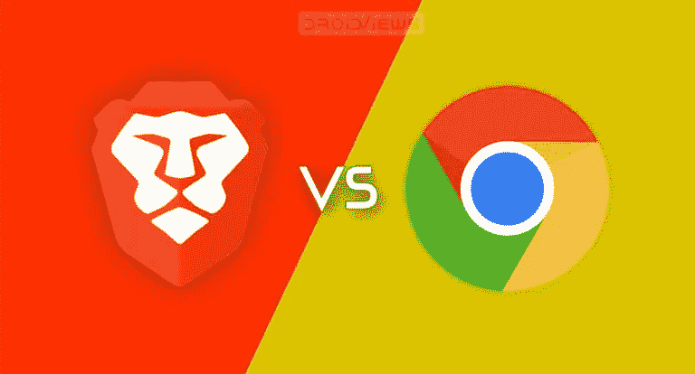
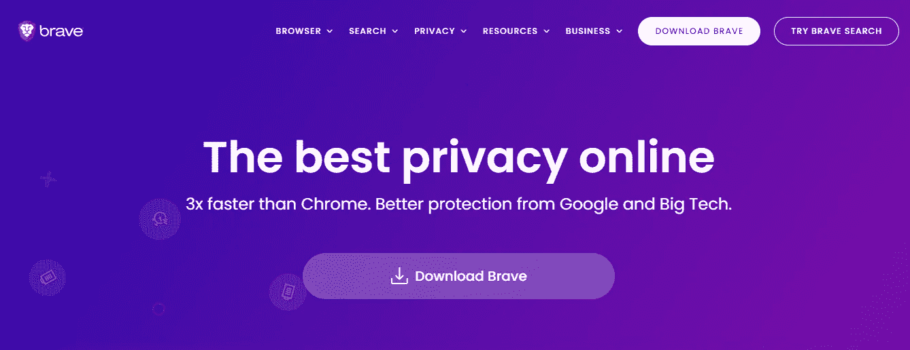
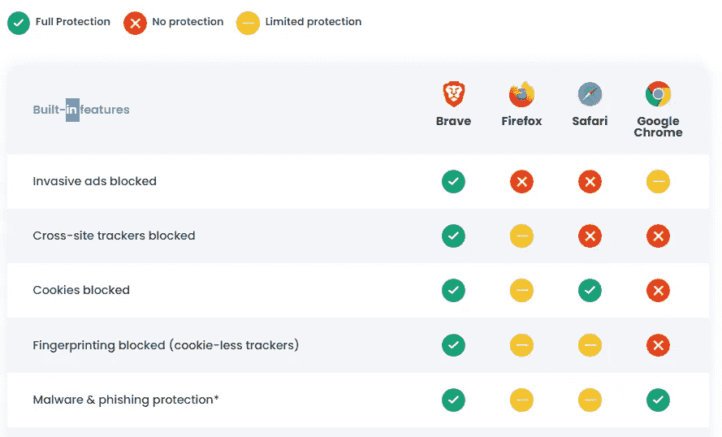
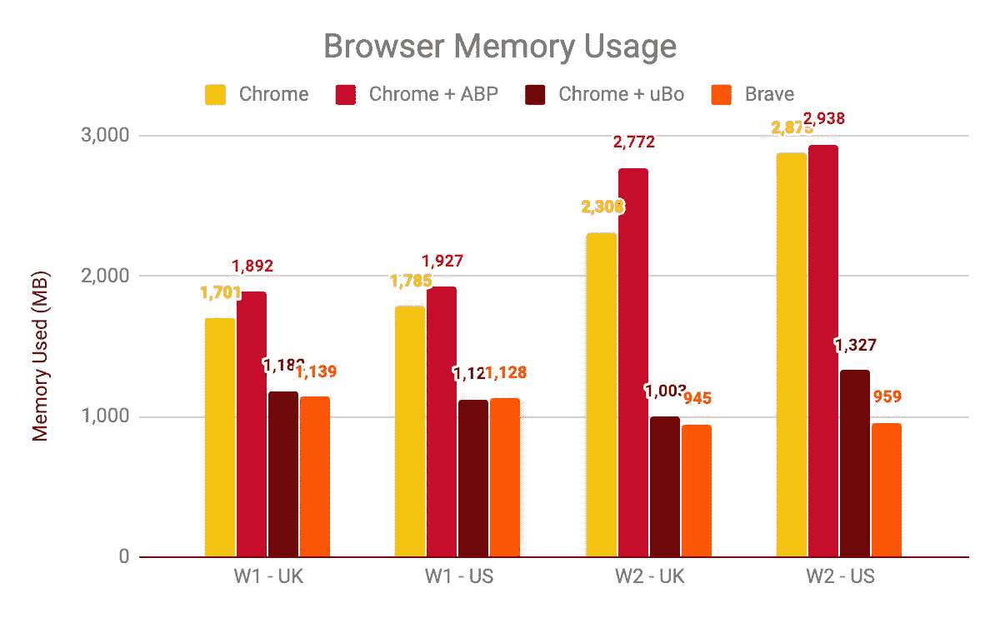
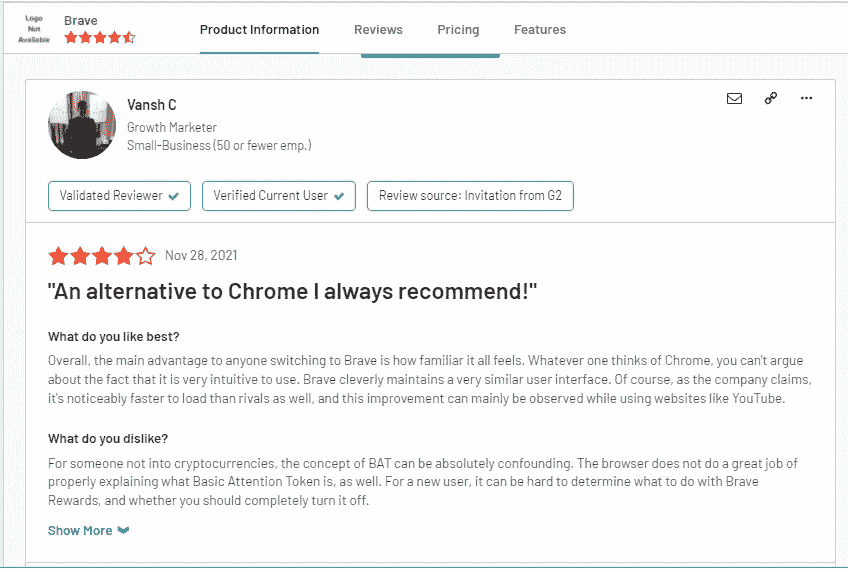

# 为什么选择 Brave 而不是 Chrome？

> 原文：<https://medium.com/codex/why-choose-brave-over-chrome-cb5b151b772a?source=collection_archive---------1----------------------->

## 谁能提供更多。

[勇者 vs chrome——tech-blogs.com](https://www.google.com/url?sa=i&url=https%3A%2F%2Ftech-blogs.com%2Fbrave-browser-vs-google-chrome-full-comparison%2F&psig=AOvVaw2AtRlireG1mZqRfKz8zW_X&ust=1638334587961000&source=images&cd=vfe&ved=0CAsQjRxqFwoTCICIy42mv_QCFQAAAAAdAAAAABAO)

无论是 PC、笔记本电脑、手机还是手表，浏览都是设备上可用的关键工具之一。我们搜索不同的东西，以便完成我们的查询和细节。目前，有许多可用的浏览器，包括大亨 Chrome，微软 Edge，Firefox，Safari & Opera 以及许多其他浏览器。我有个问题要问你:

# 网络浏览器历史

我们大多数人都知道的最后一个浏览器是现在已经过时的**ie 浏览器**，在拥有 Chrome、Firefox 或 **Brave** (新)等浏览器时几乎没人使用，但 ie 浏览器真的是第一个进入互联网世界的浏览器吗？以下是迄今为止浏览器历史上的革命性变化，现在看起来如下:

*   **1990**——万维网(不要与万维网混淆)是 W3C 主管蒂姆·伯纳斯·李创造的第一个浏览器，后来被重新命名为 Nexus，以区别于真正的万维网。不像今天，这是唯一的浏览器，也是访问网络的唯一方式。
*   **1992**—***Lynx***是一款基于文本的浏览器，不能显示任何图形内容。
*   **1993**—***Mosaic***是第一款允许在文本中嵌入图像的浏览器，使其成为“世界上第一款最受欢迎的浏览器”。
*   **1994 年**——马赛克出现了一个明显的改进 ***网景导航*** 。
*   **1995 年**—***ie 浏览器*** 作为微软第一款网络浏览器首次亮相。
*   **1996** — ***歌剧*** 于 1994 年作为一个研究项目开始，两年后终于上市。这也可以说是浏览器战争的开始，主要是 IE 3 和 Navigator 3 之间的战争，因为 Internet Explorer 不断推出新功能。
*   **2003** — ***苹果的 Safari*** 浏览器是专门为麦金塔电脑发布的，而不是 Navigator。
*   **2004**—***Mozilla***随着网景浏览器淡出推出火狐。
*   **2007**—***Mobile Safari***作为苹果的移动网络浏览器推出，并继续主导 iOS 市场。
*   2008 年 — ***谷歌 Chrome*** 似乎即将占领浏览器市场。
*   **2011 年** — ***Opera Mini*** 发布，聚焦快速增长的手机浏览器市场。
*   **2015** — ***微软 Edge*** 诞生是为了对抗谷歌。

这就是为什么越来越多的功能被添加了扩展、cookies、书签、历史、匿名等概念，现在甚至还有一组标签和其他功能。

# 不知从哪里冒出来的勇敢

[勇敢行动起来](https://cdn-images-1.medium.com/max/800/0*pCm_r2nMVjeIYAll.jpg)

幸运的是，随着所有浏览器都来挑战谷歌， **Brave** 在 chrome 成功 11 年后，分析了使 Chrome 成为用户默认浏览器的关键事实和突出特点，因此，在 2019 年 11 月 13 日，Brave 提出了所有内置功能，创造了几乎与 Chrome 相同的用户灵活性。它几乎是一个 Chrome 的复制版本，因为所有的功能都是一样的。

然而，Brave 拥有一些专业工具和功能，可以超越 chrome。[目前，brave 的活跃用户已经超过 200 万，他们信任并使用 Brave 作为默认的网络浏览器。](https://brave.com/#:~:text=Join%20the%20more,bookmarks%20and%20extensions.)

这就是为什么 BRAVE 似乎是一个比坚持使用 Chrome 更好的选择。

# 勇敢 VS CHROME 你应该知道的一切

Brave 和 Chrome 有很多使它们彼此不同的功能。

# 1)浏览速度

使用 Brave 的最大优势是超快的浏览速度，比 chrome 快 3 倍。如果你访问 Brave 官方网站，他们是这样宣称的:

[截图来自勇敢者官方网站](https://brave.com/)

# 2)没有广告

哦，太好了！谷歌在这方面很糟糕，因为它在浏览、观看 youtube 上的视频或只是玩游戏时确实会产生大量的广告流量。你摆脱不了广告；至少不是免费的！你要么必须下载一些 Adblock 扩展来避免广告，要么可能必须付费。然而，Brave 理解用户的担忧，因此为了说服用户，Brave 是 100%无广告的！是的，但是为什么呢？因为它已经有一个内置的 Adblock，所以不需要下载扩展。相信我，体验非常流畅，流畅，用户友好。

[像素图像](https://www.istockphoto.com/photo/golden-free-text-on-the-wall-gm1286880480-383250325?utm_source=unsplash&utm_medium=affiliate&utm_campaign=srp_photos_top&utm_content=https%3A%2F%2Funsplash.com%2Fs%2Fphotos%2Fads-free&utm_term=ads%20free%3A%3A%3A)

# 3.隐私

这两种浏览器都有自己的方式来提供安全性，但不幸的是，chrome 确实使用了大量的 cookies 和第三方追踪器，使我们的设备可以被易受攻击的网站和黑客访问，从而违反了隐私条款。此外，我们中的许多人没有阅读条款和条件，这些条款和条件应该真正被彻底阅读，因为通过承认，我们给了他们这些权利。

Brave 赢得了这一轮，并阻止了所有可能以任何方式影响用户隐私的第三方追踪器和广告。it Brave 最大的好处是保护你免受恶意网站的攻击，让你享受一次奇妙的冲浪体验。

[勇敢一点](https://brave.com/)

# 4.Ram 和功耗

由于为每个实验室创建可重复流程时的缓存流量，Chrome 中的 Ram 消耗几乎翻了一番。另一方面，Brave 基于 chromium，比谷歌 Chrome 消耗的内存相对较少，这使它变得轻巧高效。

【brave.com 图片来自

由于 ram 的低消耗，Brave 允许我们节省 1 小时的电池，让您不间断地工作，而 chrome 及其烦人的广告浪费了 8%的电池，更快地耗尽您的电池。

# 5.赚钱

是的，Chrome 实际上是一个广告市场，你仅仅通过张贴广告就能赚到一大笔钱。勇敢，也认为它是主要目标，不妥协的收入。是的，在 Brave 中，您可以通过选择保护隐私、保留第一方广告来获得加密令牌作为奖励。作为一个勇敢的浏览器用户，你可以通过简单地选择查看广告来获得 **BAT(基本注意力令牌)**形式的收入。BAT 是 Brave 自己的加密货币，用户可以在选择查看匿名和隐私保护广告时获得它。Brave 还向其用户提供了一个加密钱包，这对许多用户来说是一个额外的奖励。

[非飞溅图像上的执行图像](https://unsplash.com/photos/GnWfl_nnZro)

# 用户评论:

截图来自

以下是这两种浏览器的摘要:

# 简单介绍一下

凭借勇敢，享受数百万人的心，勇敢很可能会成为对抗谷歌浏览器的首选。你喜欢用哪一个做进一步的用途？

请在评论中告诉我们，因为我们很想知道你的想法和反应。

从现在开始我要换成勇敢，让我们看看你们会选择哪一个！

在那之前，

请继续关注更多，