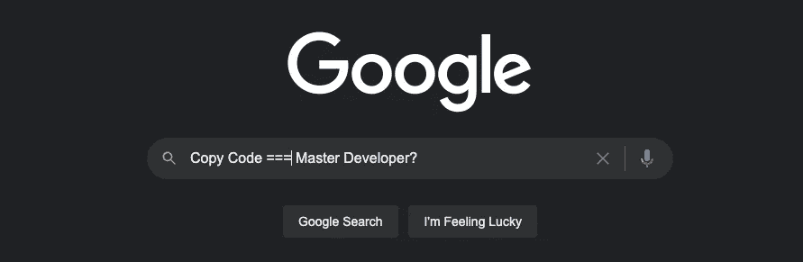

# 为什么复制代码是学习如何编码的大师课

> 原文：<https://medium.com/codex/why-copying-code-is-the-masterclass-of-learning-how-to-code-85083c7a136d?source=collection_archive---------5----------------------->

## 学习如何阅读别人的想法，真实故事兄弟

学习阅读和理解外国代码是一项主要技能。编写自己的代码是非常简单的。这让我想到了**代码复制**和**为什么如果你做得对就完全没问题**。