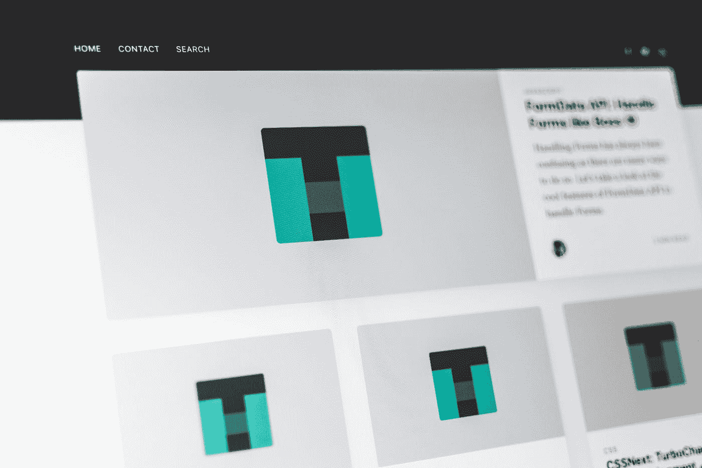

# 为什么自定义设计比模板更好

> 原文：<https://medium.com/codex/why-custom-design-is-better-than-a-template-a81c3d6db839?source=collection_archive---------23----------------------->

## 在使用预先设计好的网站模板之前做好你的研究！

潘卡杰·帕特尔在 [Unsplash](https://unsplash.com?utm_source=medium&utm_medium=referral) 上的照片

如果你是第一次网站所有者，购买预先设计的网站模板可能很有诱惑力，但在这样做之前，你需要考虑几个基本问题。这些包括成本、定制和便利性。让我们检查一下这些问题，以帮助您决定哪种方法是…