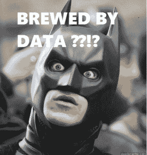

# 为什么是数据科学？

> 原文：<https://medium.com/codex/why-data-science-806c8bd1ae5b?source=collection_archive---------18----------------------->

不可否认，这些数据越来越多地塑造了我们生活的世界——从帮助我们选择下一部我们可能喜欢的电视剧，到影响选举进程。引用经济学家的话——“数据对于本世纪就像石油对于上个世纪一样:是增长和变化的驱动力”。因此，了解推动这一变化的领域—数据科学非常重要。数据科学或数据驱动的科学结合了统计学、算法和技术来解决复杂的问题，尤其是在商业领域。考虑这些例子

*   亚马逊的产品推荐引擎建立在数据科学的基础上，它们不仅可以预测你可能喜欢什么，还可以预测你购买某种产品的概率。如果概率足够高，他们会把它转移到离你更近的配送中心，这样当你购买时，它就能在当天送到你手中。
*   2018 年 7 月 29 日，Windows 10 发布，Windows 8.1 的用户被允许获得免费升级。但是为什么呢？微软为什么要免费赠送旗舰产品？Windows 10 推出了广告商 ID 协议，通过该协议可以匿名收集每个用户的数据。默认情况下，该设置允许所有数据—访问的网页、使用的软件、崩溃频率、响应时间等。进行收集，以了解用户需要什么，以及他们可以缩减操作系统的哪些功能。微软希望借此建立一个一站式软件来满足任何用户的需求。

但是数据科学仅限于传统的商业决策吗？考虑这些例子

*   [Havas Helia](https://www.designweek.co.uk/inspiration/new-year-beer-0101-design-by-havas-helia/) 与 IBM 合作了一个有趣的项目。他们分析了社交媒体上的新年信息，并将其与情绪状态进行了匹配。然后，该机构使用沃森个性洞察将 2800 种啤酒配方与基于语言和成分的人类特征进行匹配。选出了最符合共享新年情绪的前十种啤酒，并将它们的成分组合在一起，制成了“新年啤酒 0101——由数据酿造”

*   在 T4，洛杉矶的“预测警务”已经部署了 20 多年。数据科学算法使用数年(有时是数十年)的犯罪报告分析数据，以确定某些类型犯罪的高概率区域，在城市地图上放置小红框，并传输到巡逻车。“窃贼往往有地盘意识，所以一旦他们发现附近有好东西，他们就会一次又一次地回来，”—约翰·罗梅洛队长

不仅仅是企业，任何领域都可以受益于做出明智的决策，受益于“数据驱动的决策”。 [UN Global Pulse](https://www.unglobalpulse.org/projects) 是一群利用大数据开展人道主义行动的专业人士，例如使用社交媒体了解移民和难民的看法，跟踪气候异常的影响，挖掘推文以了解食品价格危机等。

数据科学已经在多个领域产生了重大影响，并将继续存在。不仅仅是公司或数据专家能够利用数据产生影响。任何人都可以从数据驱动的决策中受益。因此，对于好奇的灵魂和严肃的数据科学家，[跟随](/@selfStarter)并保持关注，我将讲述更多关于如何做出数据驱动的决策。

如果你想看到更多这样的内容，请留下一些掌声(没有上限😁).

如果你正在寻找免费的一对一指导，请在 Medium 和 [LinkedIn](https://www.linkedin.com/in/karunt/) 上关注我，并在 LinkedIn 上留言。