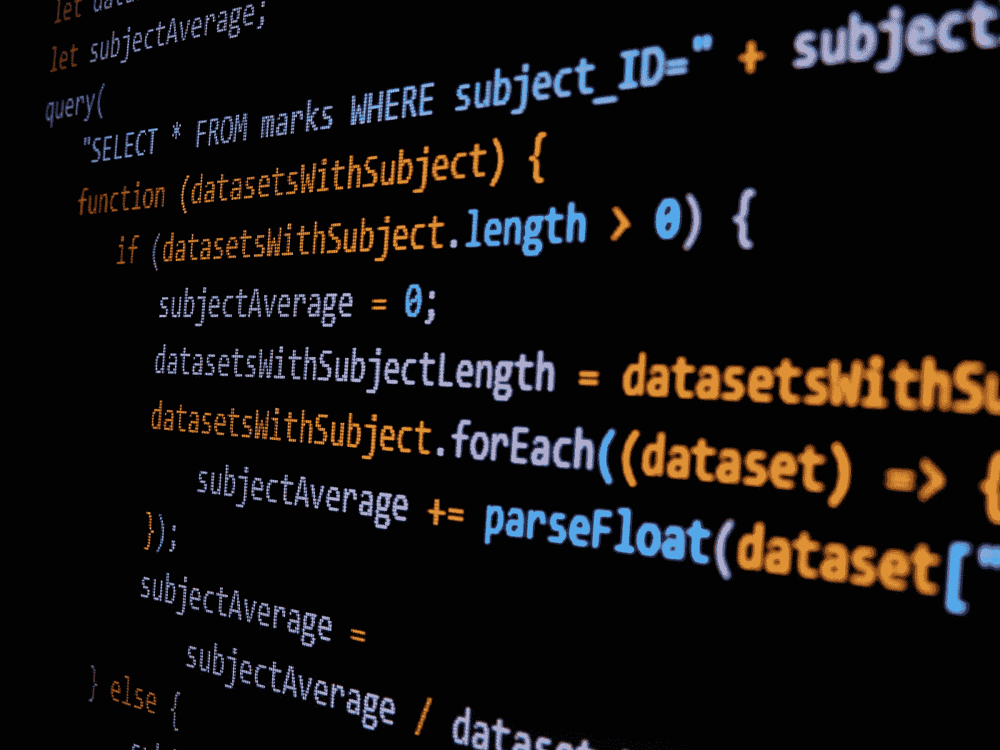

# 为什么调试 JavaScript 很烂？

> 原文：<https://medium.com/codex/why-debugging-javascript-sucks-189b86d64ef1?source=collection_archive---------22----------------------->

如果不使用 alert()、Postman、Raygun 和 Chrome 控制台等工具，就无法调试 JavaScript。但是这些工具也会带来问题。调试 JavaScript 最方便的方法是使用 Alert()方法。但是你怎么知道它什么时候会崩溃或者失败呢？请继续阅读，寻找答案！这里有一些让你开始的建议。首先，了解 alert()的工作原理。

加布里埃尔·海因策在 [Unsplash](https://unsplash.com?utm_source=medium&utm_medium=referral) 上的照片