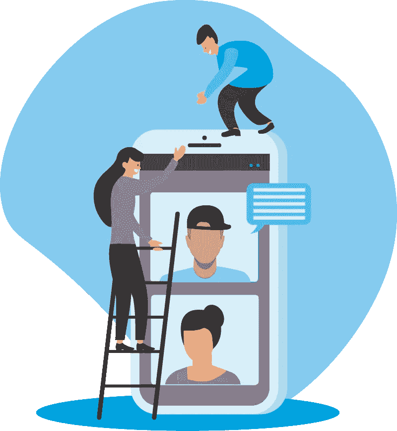

# 为什么传送超低延迟媒体将彻底改变直播

> 原文：<https://medium.com/codex/why-delivering-ultra-low-latency-media-will-completely-change-live-broadcasting-b2be0e1072e9?source=collection_archive---------3----------------------->

对点播内容的需求正在飙升。像 YouTube、Vimeo 和网飞这样的高流量网站每天都有数十亿预先录制的视频流。一代“插队者”远离昂贵的电视订阅服务，再加上互联网速度的指数级增长和直播互动的新机会，促使许多直播内容制作人在线分发内容。

**如何减少延迟**

随着交互驱动力的增加，减少实时内容生成和分发延迟的需求也在增加。使用 HTTP 流式传输的传统技术已经适用于实况广播，通常涉及超过在实况交互式广播中驱动良好用户体验的合理延迟。一个更好的方法是使用 WebRTC。

基于 WebRTC 的流具有高效的服务器可扩展性，能够将延迟降至亚秒级。现在，桌面和移动设备上的每个主要浏览器供应商都提供无插件支持，结合智能设计的媒体服务器群，有可能扩展到数百万并发用户，同时保持几毫秒的延迟。在进入 RTC 流的细节之前，让我们解开 HTTP 流和它是如何工作的。

**HTTP 流媒体**

HTTP 流的工作原理是将媒体记录分割成许多“小的”(以秒为单位)块，并将每个块转换成一定范围的比特率。然后，客户端可以通过 HTTP 下载这些单独的块，并根据可用内容和本地网络的保持情况为每个块选择不同的比特率。

*挑战*

用于直播的 HTTP 流的主要问题是，它引入了几秒钟的延迟，通常多达 30 秒，因为块由回放设备缓冲。虽然这对于预先录制或点播的内容来说是可以接受的，但对于直播内容来说却是极具破坏性的。对于实时应用程序，尤其是交互式或时间敏感的应用程序，这种额外的延迟会严重降低用户体验。

对于低延迟的直播内容广播，没有什么比 WebRTC 流更好的用户体验了。虽然客户端仍然需要缓冲一点点以应对网络抖动(变化的延迟)，但缓冲时间是以毫秒而不是以秒来计算的。

**WebRTC 流媒体**

*可扩展性*

[扩展 WebRTC 流](https://www.liveswitch.io/features)需要一个媒体服务器网络，能够从接收和处理入站流的主媒体服务器转发单个媒体包。如果我们知道一个给定的服务器可以处理多少个流，我们就可以推断出需要多少个服务器(或服务器层)来支持给定的客户端负载。我们可以通过使用一系列服务器来实现大规模(以及相关的成本)，这些服务器的唯一任务是在内部服务器网络中广播数据。

*可用性*

使 WebRTC 流高度可用需要至少一个额外的“上传”媒体服务器来为入站流提供冗余。上传者负责将内容发送到两台服务器，或者至少通过故障转移到另一台服务器来快速响应网络问题。在内部，除了最后一层之外，每一层都需要额外的转发媒体服务器用于冗余，在最后一层中，连接故障通过客户端应用中的简单重新连接/再水合逻辑来解决。

*挑战*

RTC 流的主要挑战是其技术复杂性。持久连接不像无状态 HTTP 请求那样容易实现负载平衡，因此故障转移必须内置于软件本身。服务器的最后一层负责与客户端协商功能(如前向纠错)，并确定如何尽可能可靠地将最高质量的内容提供给客户端。媒体服务器软件必须非常小心地保护上游服务器免受下游服务器生成的数据的影响。在高度并发的用例中，即使是很少的信息也会变成一群狂奔的羊群。

**总结**

[直播](https://www.liveswitch.io/)用 WebRTC 总比 HTTP 流媒体好。用户体验更好，为参与者的互动打开了新的大门，而且非常划算。虽然有些人仍然试图从 HTTP 流技术中挤出一点点性能，但使用一种名为实时的成熟技术更有意义。像 NBA 这样的公司(在全明星赛中使用 WebRTC)开始流行起来——下一个将 WebRTC 加入他们阵容的是谁？