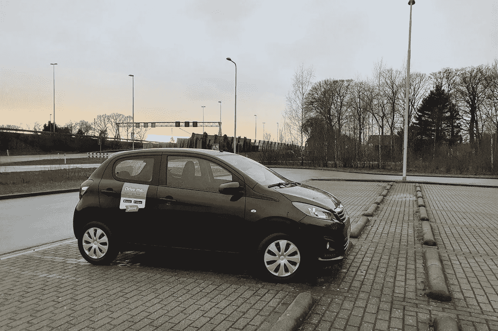
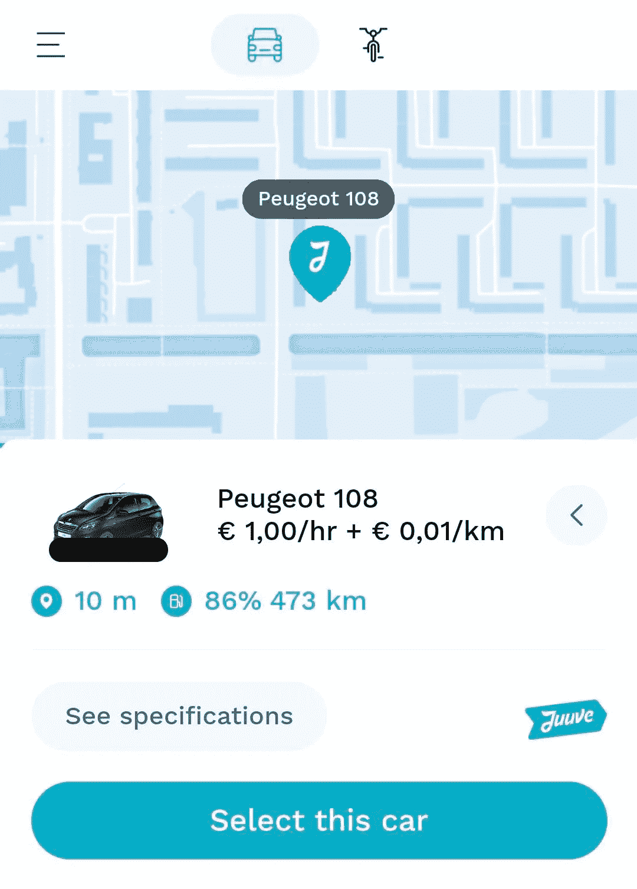

# 为什么我可以开这辆车去€每公里 0.01？

> 原文：<https://medium.com/codex/why-did-i-get-to-drive-this-car-for-0-01-euro-per-kilometer-6801de1faf99?source=collection_archive---------14----------------------->

## 我不确定，但是我有一个主意。

我为€开的车每公里 0.01 英镑，外加每小时€1 英镑的费用。

免责声明:我与本文中提到的任何公司都没有任何关系。

我几个月没见的一个朋友邀请我去他家吃饭。我们俩都有一段时间没有和其他人见面了，所以这样做似乎很安全。我唯一要做的事就是到达那里。

住在荷兰，我大部分时间骑自行车在城市里逛。住在荷兰，我也经常遇到恶劣的天气。有时这太多了，例如，在这种情况下，我不想在疯狂的倾盆大雨中骑 20 分钟。

我没有车，但幸运的是，一个名为 [Juuve](https://juuve.nl/) 的汽车共享应用程序在我家附近运营:我可以在任何时候租一辆车，按小时收费(通常是€2.5 英镑)和按距离收费(通常是€每公里 0.25 英镑)，不需要任何额外费用(燃料也包括在内)。我快速算了一下，估计拜访我的朋友将花费我€8-10 英镑，从天气来看，这似乎是一笔不错的交易。

Juuve 应用程序的截图，价格出奇的好。注意:图像已被编辑以保护我的隐私；我把地图换成了通用的，把车牌涂黑了。

当我打开 app 订车时，我被眼前的景象惊呆了。每小时的费用是€1，虽然低于正常水平，但这并不奇怪，因为 Juuve 目前正在进行一场每小时收费打折的营销活动。出乎意料的部分是基于距离的费用:€0.01，而不是通常的€0.25。

起初，我以为我遇到了 Juuve 的一个错误或人为错误，但我还是做了预订，并希望他们真的会遵守广告上的价格。

到家后，我收到了总结我预订的电子邮件。出价确实被接受了。好奇之下，第二天又去了一趟，价格还是一样。当我查看附近其他汽车的价格时，他们有他们通常的定价，只有这辆车的价格较低。

他的话没有任何意义。这样的错误不应该发生。我不应该得到这么多，”我想。在我第二次廉价旅行时，我还在想这个问题，然后我突然想到了这个问题。

我应该早点发现的。我是一名数据科学家；我分析数据，建立模型，进行实验。*那*肯定是这个样子。一个实验。

## 新产品

我的直觉是 Juuve 正计划推出新产品。这将是一种订阅，你每月支付相对较高的固定价格，并获得一些小时和/或公里数，你可以免费或以大幅降低的成本驾驶。类似于在荷兰流行的个人租赁设置，但在这种情况下，你不会独占这辆车，而是可以使用 Juuve 的任何一辆车。

朱维为什么要这么做？他们的竞争对手之一，[snapcar](https://www.snappcar.nl/)[1]，提供[定期](https://privatelease.snappcar.nl/)和[短期](https://privatelease.snappcar.nl/products/snappcar-shortlease)租赁合同，所以 Juuve 探索类似的方向可能也是有意义的。

如前所述，我认为你不会在 Juuve 的设置中拥有自己的车。如果他们知道他们在街上需要多少辆车，以便每个人在需要的时候都有一辆，他们可能仍然需要比顾客更少的车。毕竟，汽车 95%的时间都是停着的。汽车数量少于客户数量意味着他们可以以低于传统租赁合同的价格提供服务，这反过来会给他们带来强大的竞争优势。

从个人角度来说:出于某种原因，固定成本对我来说没有可变成本痛苦。我可以很容易地想象，支付€100 元包月费可能比每次支付€5-10-15-20 元更舒服，即使我最终会多付一点，因为我有一定的把握可以做好计划。然而，我无法证明购买或租赁汽车的成本是合理的，因为我不会经常使用它。

除了上面概述的力量之外，有两个直接的线索也可能表明 Juuve 正在朝这个方向移动。首先，他们最近推出了[订阅](http://help.juuve.nl/nl/collections/2403119-abonnementen)，提供优惠的小时费用(但不提供基于距离的费用折扣)。第二，谷歌搜索“juuve lease”会显示一个页面[(大部分是空的)](https://web.archive.org/web/20210313200553/https%3A%2F%2Fjuuve.nl%2Fprivate_lease%2Frenault-captur-2%2F)上面写着“私人租赁标致 108”——这恰好是我以这么低的价格租的同一款车。

这是我第二次非常便宜的旅行时拍的照片。谢谢你，朱夫！

## 为什么只收€0.01？

如果我是 Juuve 的一名数据科学家，一名利益相关者向我提出推出类似租赁的订阅产品的想法，我可能也会提出类似的方法。

如果我们想有一个订阅模式，我们需要知道我们必须有多少辆车在街上，如果我们希望我们的客户总是在他们需要的时候找到一辆车。如果他们找不到车，他们会对产品不满意，可能会停止使用(并使用竞争对手，获得定期租赁或干脆买车)。请记住，他们每月支付高额费用，并期望持续可用。为了计划高峰使用量并知道我们需要多少辆车，我们需要知道我们的客户会在什么时候开多少辆车。

当然，我们可以问他们关于这个潜在产品的问题，例如，在一份调查问卷中。这有两个问题。首先，在该产品准备上市之前，我们可能不想做广告。第二，你能不能回答“如果你有机会，你每月会在什么时间开多少车？”如果你还没有的话？就我而言，我不能给出可靠的答案。我会说:“我不知道，考虑到成本，我需要看看。还有天气。还有我的心情。但我真的不确定。”

> 如果你想衡量一种产品的最大潜在需求，你可以免费发放，看看有多少人会接受。

通过免费发放公里数，Juuve 获得了非常详细和准确的数据，以了解他们汽车的最大潜在需求。显然，他们不想同时对所有的汽车进行这样的实验，因为那样会损失太多的钱——但是一个只有几辆车的小规模实验可能仍然是负担得起的，并且可以提供无价的信息。

这个实验告诉 Juuve 一辆特定汽车的最大使用量，但它并没有描绘出全貌。如果我是那里的数据科学家，我也会做一个实验，让一小部分*用户*得到*所有*汽车的低价。这将告诉我们用户的预期月使用量，这对于我们应该收取的正确月价格来说是一个非常重要的输入。不可否认，Juuve 可能已经在这么做了——我只是不是治疗组中的幸运用户之一。

如果 Juuve 知道人们在基本免费的情况下开车多远、多频繁、多长时间，他们就能很好地估计绝对最大需求。将其与其他数据(如天气、一天中的时间、一周中的日期等)相结合。将允许他们开始对这种类似租赁的产品进行适当的供应和定价。

我在这里写的每一件事都纯属猜测。我可能只是在表达我的愿望:以可预测的月成本买得起一辆车。我可能刚刚发现了朱维系统的一个漏洞。我可能无意中发现了他们的下一个重大举措。我不确定。我只知道我真的很幸运，很高兴能得到这些(几乎)免费的旅行，我真的很喜欢思考和写下这段经历。

[1]snapcar 的商业模式有些不同:你通常租一整天的车，行驶一定的公里数，通常是 150 公里，不需要额外的费用，但你必须在还车之前给车加油。