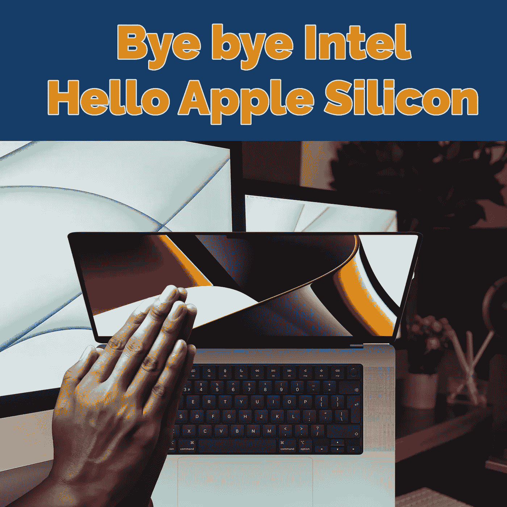
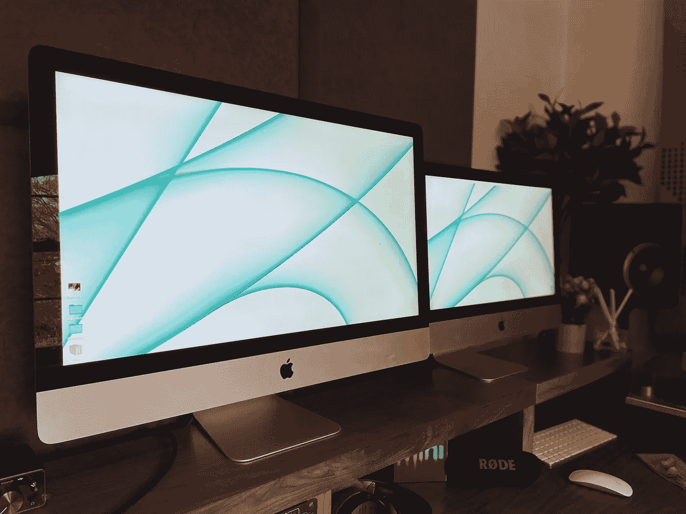
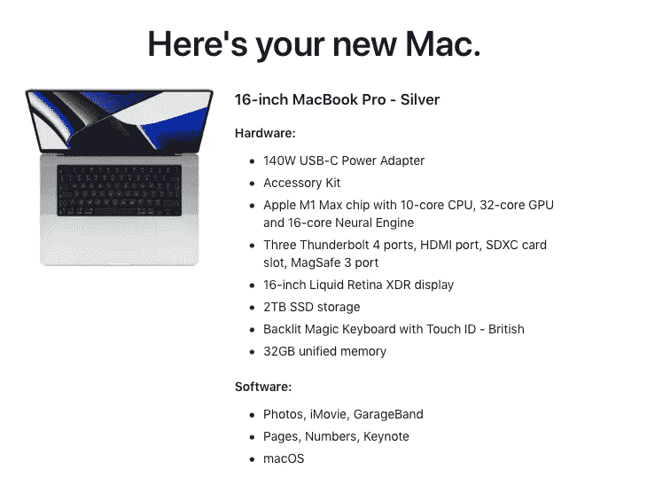
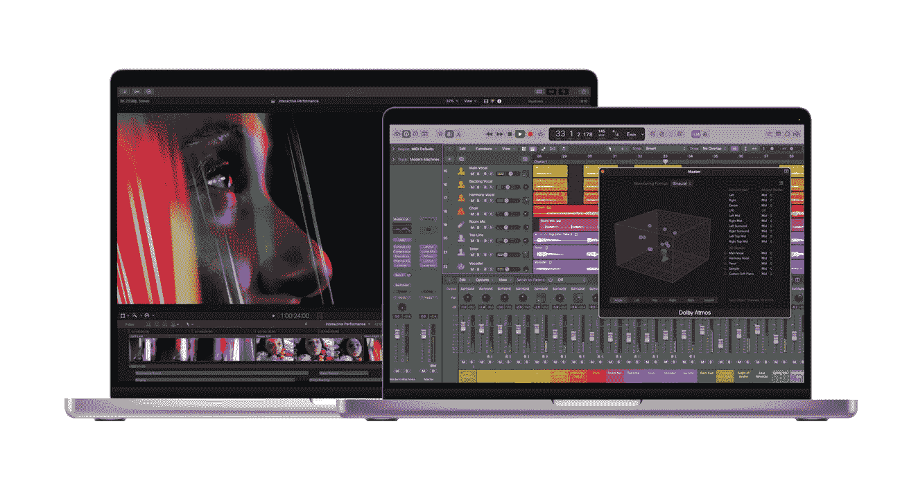
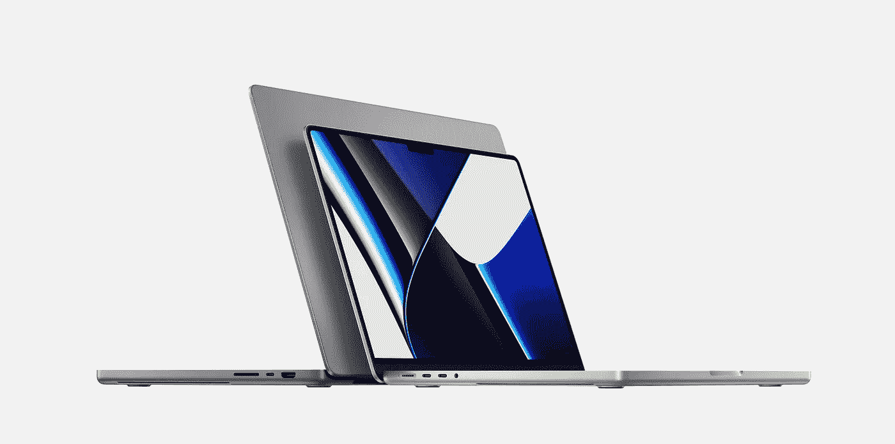

# 为什么我要去麦克斯？

> 原文：<https://medium.com/codex/why-did-i-go-max-e5e27a6ff1b1?source=collection_archive---------4----------------------->

## 不是 M1，不是 M1 专业版，但对我来说是马克斯。为什么？

图片由作者提供

所以，我已经用了十年左右的苹果电脑了。在那段时间里，我的工作量和创作需求都发生了变化和增长。我购买的苹果产品也反映了这一点，从最基本的到更高端的机器。虽然在我的 YouTube 频道和博客上，我经常谈论最新的装备，但我已经很长很长时间没有认真买过东西来充实自己了。也就是说，直到现在。目前，在我的苹果购物车的订单区有两件东西，我希望它们能给我的日常生活带来巨大的变化。这些决定不是轻率做出的，而是经过深思熟虑的。但在这里，我会整理我的想法，以防你发现自己处于类似的位置。

 [## 戴森区——真的吗？

### 这可能是有史以来最精心制作的笑话之一，或者是一个杰出的创新。你决定吧。

medium.com](/codex/the-dyson-zone-for-real-cc26172f523b) 

图片由作者提供

## 当前档位

回想起来，我相信除了 iPhone，我第一次接触苹果是 MacBook Air。随后，是我的第一台 iMac，是 2011 年的 21.5 寸机型。这对我很有用，事实上，我现在还把它放在车库里。我升级了其中的固态硬盘，并帮助发展了我的平面设计业务。接下来是我买过的最好的苹果电脑；一款 27 英寸、规格相当不错的 2015 款，这是我近六年来的主要选择。我还拥有两台 MacBooks 和一台最近的 21.5 英寸 iMac，这是我在 2019 年购买的。除了苹果电脑，我还有一部 iPhone 12 和一部 iPad Mini，它们也或多或少地计入了我的工作日。

图片由作者提供

这台 27 英寸的机器非常出色，这些年来，它和我一起完成了大量的工作。这是一台 5K，4GHz 四核，英特尔 i7 机器，其核心是 R9 镭龙显卡。但在过去的几个月里，我注意到它在苦苦挣扎，特别是当我的工作流程转向 YouTube 内容的视频编辑时。为它辩护(*我非常保护它！*)，我买的时候意图从来就不在剪辑视频。但是当我现在看到这是我未来的一部分时，我知道需要有所改变。

图片由作者提供

## 选择

去年，随着苹果芯片的出现，我开始认真考虑购买 Mac 电脑。我在 YouTube 上看了所有这些评论，展示了这些机器有多快。基本的入门级 M1 MacBook Air 似乎比我的近 4000 英特尔 iMac 快得多。它便宜了大约 3000 英镑，只是一个美化了的笔记本，但数据表明它远远超过了我的老忠实机器。有一段时间，我对新的 24 英寸 iMac 很感兴趣。当然，他们内部有相同的处理器，M1 芯片，只是以桌面形式和更大，更实用的显示器。但我知道，我只是确定，2021 年苹果芯片会带来更多。天哪，我没有错。去年年底，新款 MacBook Pros 在苹果公司今年的最后一次活动中亮相，推出了两种新的芯片选项，即 M1 Pro 和 M1 Max。是的，现在我的兴趣被激起了，很快就会做出选择。我的推理是，不管他们从苹果芯片走向何方，这两个最新选择中的一个对我的要求来说已经足够了。不过，有一个困扰我的问题。尽管我知道电脑对我来说绰绰有余，但它只是一台笔记本电脑。即使是 16 英寸，我想，随着时间的推移，我不会喜欢在更小的屏幕上工作，因为我已经习惯了 27 英寸的 iMac。我无法证明购买一台拥有华丽的 120HZ 刷新率、真实运动、迷你 LED 显示屏的 MacBook 并将其连接到一个大的、低于标准的显示屏上是合理的。那将是亵渎。不过，对我来说幸运的是，苹果公司在今年春天出现了，为我完成了拼图的最后一部分——全新的工作室显示器。

 [## 苹果公司将会推出什么产品？

### 今年有这么多传言，让我们看看营销计划

medium.com](/codex/whats-coming-down-the-apple-pipeline-cb95005e0563) 

图片由作者提供

## 选择什么

事情就要变得严重了。我需要的一切都在那里，我只需要弄清楚选择什么和在什么配置。Mac 工作室是一个简短的想法，但对我来说，它是一个桌面的事实。这很奇怪，因为这些年来，对于繁重的工作，我总是选择台式机而不是笔记本电脑。但是，随着最近的疫情，我的工作方式，像许多人一样，已经发生了变化和发展。现在我把工作分成两部分，办公室和家里各占一半。Mac Studio 对我来说代表了太多的功能，而且缺乏便携性。如果没有便携性的话，拥有 M1 Max 的工作室可能会是其中之一。当然，这也需要显示器来配合它，加上这一点，我或多或少在 MacBook Pro 的钱。我想确保我的购买物经得起未来的考验，我已经从过去几年的错误和购买者的悔恨中吸取了教训。我想要比我认为现在需要的更统一的内存，以及大量的板载存储。我决定使用 32 GB 的统一内存和 2 TB 的存储空间。随着视频编辑成为我工作流程的一部分，我希望在 MacBook 上进行本地编辑时不要回头张望。我总是直接存档，但至少有能力在旅途中进行一些项目，这很有吸引力。即使在连续六年频繁使用之后，我的 iMac 只有 1 TB 的存储空间，仍然只有半满多一点。按照这个标准，2 TB 的存储应该足够了。由于所有的视频作品都已存档，我的图片作品也存储在 Dropbox 上，实际上，我对存储需求相当节俭。尽管如此——多总比少好，因为这将是一笔昂贵的购买，我希望它能持续几年。

所以，我的思想现在已经接近定型了。一台 16 英寸的 MacBook Pro，拥有苹果制造的除专业显示器 XDR 之外最好的显示器，在某些配置上，将是购买的主体。这样，我就可以轻松愉快地坐在家里，在 16 英寸的屏幕上进行编辑，方便携带去拜访客户，然后在办公室，我可以把它们都连接到 27 英寸的工作室显示器上。然后，我可以选择使用双显示器，或者将 MacBook 置于翻盖模式，纯粹在更大的显示器上工作。

 [## 我们对修理权的理解是错误的吗？

### 四个月过去了，几个产品发布之后，它在哪里？

medium.com](/codex/are-we-wrong-about-right-to-repair-a2d8b71fb27e) 

图片由作者提供

## 点菜时间到了

最后，上周，我下了订单。我日复一日地反复研究技术规格，确信自己做出了正确的选择。MacBook 将是 16 英寸的银色，配有 32 GB 的统一内存和 2 TB 的存储空间。工作室显示器是标准配置，没有纳米纹理玻璃或高度可调支架。我从来不觉得在自己或公司上花这么多钱是件容易的事，但我的工作生活质量却在挣扎。现在所有的 Adobe Creative Cloud 应用程序都针对苹果芯片进行了优化，每周至少编辑三个视频，这是改变的时候了。自从上次操作系统更新以来，我注意到 Creative Cloud 出现了更多故障。我的感觉是，他们的应用程序现在实际上更加迎合苹果芯片，他们只是在必要时支持英特尔。这两个项目的交货延迟是一个痛苦。我有大约一个月的时间来等待 MacBook，之后可能还要一个月。如果一定要延迟，我宁愿这样。至少新 Mac 先来了，我把它安装好并开始从中受益。

 [## 为什么我们就不能满足呢？

### 苹果工作室的展示才刚刚开始两周，但我们似乎已经不满足了。

medium.com](/codex/why-cant-we-just-be-satisfied-f70e6490095b) 

图片由苹果公司提供

## 我希望什么？

一个词——速度！随着我的一般工作流变得越来越复杂，我希望看到我花费在等待工作导出上的时间得到大幅改善。Photoshop 和 InDesign 文档现在比我希望的保存或导出时间要长。然后我们来看视频。在我开始处理视频之前，我不知道在 Mac 电脑上进行简单的编辑有多难。渲染和导出对我来说是浪费时间。通常，我的视频大约 10 分钟长，在 4K 拍摄，以 H.264 格式导出。你认为我的 iMac 或当前的英特尔 MacBook 需要多长时间才能导出？大约 35 分钟！而且更多的时候，在上传之前回看视频的时候，会看到几个我想整理的部分，也就是说*又一个*出口，又一个 35 分钟的坐着，等来等去。而且，实际上比这更糟糕，因为当出口时，几乎所有的机器资源都被用于这项任务，这意味着对它进行加工实际上是不可能的。据我所知，我的出口时间可以减少到 5 分钟左右，这将是惊人的。

至于展示，嗯，即使它遇到了一个非常复杂的反应，我是它的绝对目标！对我来说，如果可能的话，它将永远是一个苹果显示器，而工作室显示器出现的正是时候。是的，很遗憾我只能在 50%的时间里使用它，但是，只要它和 iMac 显示器一样好，我就不会介意。坦率地说，摄像头和扬声器并不完全符合苹果公司的承诺，这对我来说并不重要。我几乎不会使用相机，如果曾经使用过的话，我有两个，电动工作室显示器或 HomePod 迷你，所以扬声器也不会让我担心。

 [## iPhone 怎么了？

### 在上周发布了另一款 iPhone 之后，让我们来看看今年晚些时候会有什么

medium.com](/codex/whats-up-with-iphone-307a15caac26) 

图片由苹果公司提供

## 结论

我有一种感觉，我会对我错过的东西感到震惊。我甚至从未使用过 M1 的机器，所以对于我第一次接触苹果芯片的世界是一台 M1 Max，并且来自一台使用了六年的英特尔 Mac，我期待着大事情！同样，我知道，我的工作流程几乎不会触及 M1 最大值，但我宁愿有多年的上升空间，而不是多年的遗憾。希望一个月后，我会坐在我的新 MacBook 上写这篇文章，想知道为什么我花了这么长时间。我觉得等待是值得的。

***做了英特尔这么多年，你试过苹果硅吗？它是什么样的？我很想听听你们的故事，让我确信我做了正确的事情！***

## 在你走之前

*你订阅《灵媒》了吗？*

我只是高端博客网站 Medium 的众多作者之一。它是如此物有所值，你可以在这里加入[https://medium.com/membership](https://medium.com/membership)

*加入我的幕后邮件列表*

[https://www.talkingtechandaudio.com](https://www.talkingtechandaudio.com)

最初发表于 2022 年 4 月 5 日 https://www.talkingtechandaudio.com/blog