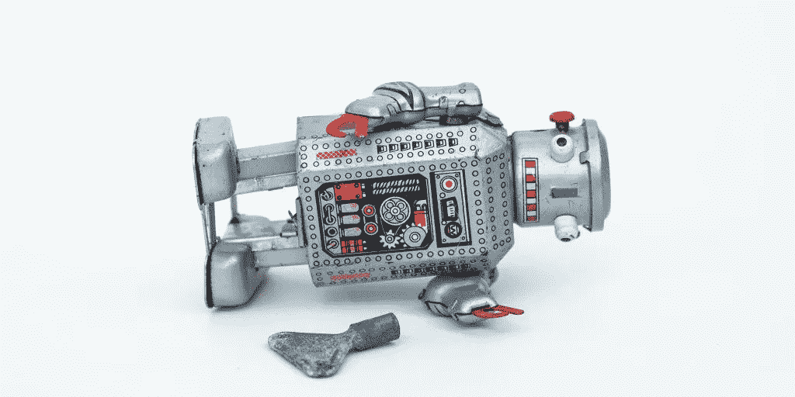

# AI 项目为什么会失败？人工智能项目成功的剧本

> 原文：<https://medium.com/codex/why-do-ai-projects-fail-a-playbook-for-success-in-ai-projects-c4f73a6ce3e0?source=collection_archive---------3----------------------->

任何 ML/AI 计划都会失败。在[麻省理工学院-波士顿咨询公司的研究文章](https://sloanreview.mit.edu/projects/winning-with-ai/)中调查的 10 家公司中有 7 家报告说，迄今为止，人工智能的影响很小或没有影响。在这篇文章中，我们揭示了失败的 ML/AI 项目背后的主要问题。这种方法是不科学的，是从第一手经验和参考书目中得出的。

我们希望读者可以将这篇文章作为成功的人工智能项目的剧本。

# 失败得快但失败得好

[不是所有的失败都是不好的](https://hbr.org/tip/2015/09/know-how-to-tell-a-good-failure-from-a-bad-one)。有些失败是积极的，因为它们让我们学习和提高。对于一个人工智能项目，我们接受好的失败，并希望尽可能减少坏的失败。当我们创新和承担风险时，一个好的失败就发生了:一个想法在快速 PoC 后被拒绝，或者用新的模型/数据进行实验并没有带来改进。另一方面，由于粗心的决策或缺乏准备，会发生严重的失败:PoC 成功，但模型没有部署到 prod 中，或者模型部署了但没有使用，没有任何影响。

在文章的其余部分，我们将描述与人工智能项目中糟糕的失败相关的主要因素，并解释我们如何避免它们。

# 什么影响？

我们总是对新技术感到兴奋，这些新技术可能会分散我们对本质的注意力:影响。一个常见的错误是试图解决一个没有意义或者不符合业务优先级和用户需求的问题。应该重点回答这个问题:**如果我们解决了这个问题，我们为客户增加了什么价值？因此，人工智能项目从一开始就与用户密切合作是很重要的。**

# 太大太快

这是一个常见的错误，并不仅限于机器学习项目，也适用于产品开发:我们走得太大太快。如果你试图同时做所有的事情，你可能会把许多好主意变成一个蹩脚的产品。将一个好主意变成一个好产品已经很难了。把 10 个想法变成一个好产品是不现实的。从核心(必须)开始，集中精力。

# 我们需要人工智能吗？

如果问题定义明确，并且对您的业务有意义，那么下一个问题是**我真的需要 ML/AI 来解决这个问题吗？** 你需要确定你的案例需要 AI。如果你可以用一个不需要训练的基线模型达到 95%的价值，你真的想——能负担得起——支付一个复杂的人工智能模型的成本来获得额外的 5%吗？当足够好就能完成工作时，就去做吧。

# 你有正确的数据吗？

一旦你清楚地定义了你想要解决的问题，下一个问题就是**我有解决这个问题的正确数据吗？**

*   如果是，你可以走了。
*   如果不是，获取所需数据的成本是多少？
*   如果您还不知道，建立一个概念验证来验证您的假设。

我们通常倾向于低估数据采集的成本，但建立一个训练数据集(通过准确标记监督问题的数据点)需要时间和成本。根据数据类型和要解决的问题，所需的训练样本数量从几十个数据点到几百万个数据点不等。根据你对成本的估计，附加值还值得吗？

# 垃圾进，垃圾出

即使您的第一印象是您有数据，您也必须确保数据质量足以完成手头的预测任务。自然地，只要信号幅度比噪声幅度更重要，ML 算法就能够处理噪声。然而，如果数据从根本上来说是有偏差的或者有严重的噪声，那么就不会有奇迹发生，你的 ML 算法将会学习偏差并重现它。

# 锤子在找钉子

你刚刚阅读了《麦肯锡季刊》的一篇文章，文章称人工智能和深度学习代表了商业的战略机遇。现在你得了*闪亮的东西*病，你想将深度学习应用于你的公司可能面临的任何问题。如你所料，这种方法满足了自我，制作了非常好的幻灯片，但是产生了糟糕的结果和商业影响。

在应对新挑战时，你应该选择适合你想要解决的问题的配置的正确的模型系列——由手头数据的大小、维度和类型等因素定义。

# 失败的人工智能集成

为了实现预期的业务价值，成功地从概念验证过渡到生产服务至关重要。许多人工智能项目未能计划和进行这种转变，因为人工智能集成到一个操作系统中是一项困难的任务，其难度往往被低估。主要原因之一是我们经常观察到的数据科学和软件工程之间的脱节。当人工智能算法在象牙塔中开发时，开发算法的团队不会考虑现实世界的部署，而部署和操作算法的团队将它们视为黑盒。

因此，重要的是通过(1)从第一天开始规划集成和(2)拥有一个混合团队，数据科学家和软件工程师合作建立、集成、测试、部署和发布人工智能功能来弥合这一差距。

# 结论

在这篇文章中，我们确定了人工智能项目中(坏的)失败背后的主要因素。一个成功的人工智能项目的秘诀是

1.  确定具有实际商业或社会影响的项目
2.  从核心开始，集中精力
3.  开发和操作人工智能模型的成本很高。确定你需要人工智能
4.  确保你有正确的数据或准确估计数据采集的成本
5.  不要让炒作左右你的决定:为你的用例和数据选择正确的人工智能模型
6.  建立一个由数据科学家和软件工程师组成的混合团队，从第一天开始就计划集成