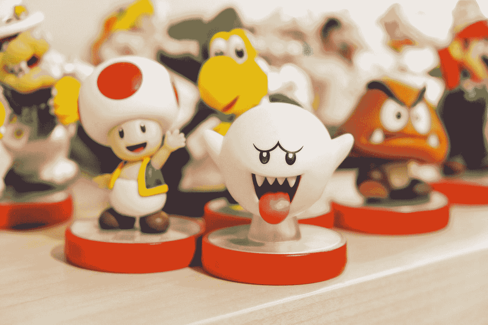

# 程序员为什么热爱游戏？

> 原文：<https://medium.com/codex/why-do-programmers-love-gaming-7af9db104740?source=collection_archive---------10----------------------->

## 但是这种刻板印象是真的吗？

瑞安·昆塔尔在 [Unsplash](https://unsplash.com?utm_source=medium&utm_medium=referral) 上拍摄的照片

从数学上来说，程序员群体和游戏玩家群体有很大的交集，至少人们是这么认为的。作为揭示你的职业是程序员或者甚至是计算机科学学生的结果，你很可能会被问到这个问题，至少一次——“你也喜欢玩吗…