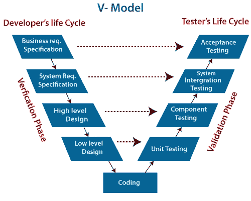

# 软件架构师为什么要学习业务语言？

> 原文：<https://medium.com/codex/why-do-software-architects-learn-the-business-language-292f958979b0?source=collection_archive---------20----------------------->

作为一名架构师，您可能会不时地想知道为什么软件架构师必须学习一门业务语言，以及为什么业务人员不更多地学习技术方面的东西。第一个问题从这开始；软件架构师应该了解业务方面的什么？

这个问题有很多正确的答案，但我想尽量简短。当我开始在日常工作中做一些事情时，我总是问**为什么**。它让我以商业导向的方式分析、评估和解决问题。它帮助你节省时间、精力和注意力。“[五个为什么](https://en.wikipedia.org/wiki/Five_whys#:~:text=Five%20whys%20(or%205%20whys,basis%20of%20the%20next%20question.)”是最流行的技巧之一，可以清楚地了解你问题的根源。然而，作为一名架构师，在您的工作生活中哪里可以使用这种技术呢？答案是**要求**。另一方面，你知道谁在日常生活中做得最好吗？答对了，孩子们！:)

请求是一种不饱和的需求，来自客户、业务目标、标准，甚至法规。然而，我们不能说所有的要求都应被视为要求。这是另一个故事，但是写出好的需求真的比你想象的要难。在这个场景中，我们可能会假设我们的需求具有良好的特性。同样，不要认为它们在项目生命周期中必须处理**不止一次**。

如果有必要的话，它们必须被不断地引出、整合、分析、确认和验证，并且你可能会作为一个架构师参与到每一个步骤中来以支持其他人。是的，没有定义需求工程过程，每个项目都有预算和时间上的风险。

作为一名架构师，您有一个关键的角色，那就是理解涉众的需求，并追踪它们到系统或子系统的需求中，无论在技术上是否可行。以这种方式，很容易用问题“我们正在开发*产品权利*吗？”来解决系统的验证问题。敏捷文化允许你在每一次冲刺中问自己这个问题。并用它来追踪。

需求可追溯性是软件架构师在不同层次描述和遵循需求生命周期的必备技能之一。在 V-Model 架构中，有两种跟踪方式；横向和纵向。

**水平追踪**是通过测试用例在需求和它的实现之间建立双向联系。

**垂直跟踪**将输出双向连接到其后续输出。

v 型

出于上述原因，您可能认为软件架构师可能需要一个需求跟踪清单。让我们逐一迭代。

对于每个利益相关者，需求必须以**数量和质量**的方式简单明了地定义。否则，在项目结束时，可能会将“*正确的产品*”问题作为失败回答给风险承担者。

产品负责人/经理必须根据业务影响对需求进行**优先级排序**。如果不是，请在您的架构设计阶段进行澄清。否则，你可能会带来意想不到的解决方案，面对不满意的客户。

询问或讨论需求的技术或架构风险**。澄清客户是否真的需要。如果没有，说服你的管理层用适当的理由拒绝他们。**

总是想知道需求和商业案例之间有什么关系。如果没有，请管理层澄清。没有商业案例，就没有发展。

计算他们你需要处理多少需求。如果太多，与管理层讨论是否必须全部完成。尝试说服管理层对其进行重组以降低风险。过多的需求会带来风险。

**审查**必要时冗余的要求，或为每个利益相关者修改这些要求。也不要忘记你不是需求的所有者，你只是在这个过程中支持他们。但是，你需要的只是沟通。

因此，作为一名软件架构师，您可能需要理解、阐明、分析，并且必须为需求做许多其他事情。要在所有这些方面取得成功，你需要一个强大的工具，我们称之为“*沟通*”。出于这个原因，你需要学习哪种语言是管理语言。否则，如果你不能理解他们需要什么，你就不能翻译他们对你的团队说的话。所以，如果你想作为一名架构师生存下去，就要在技术和管理两方面都给予支持！

请通过评论或其他任何地方留下你的想法和经历！