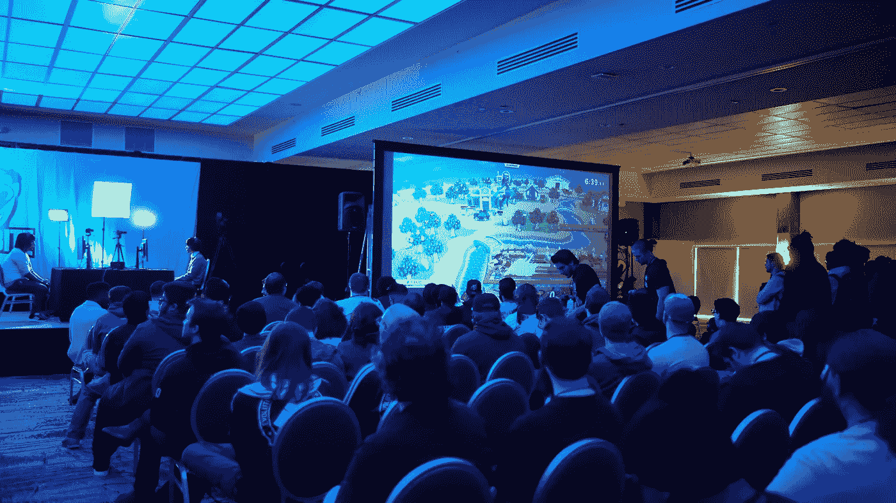
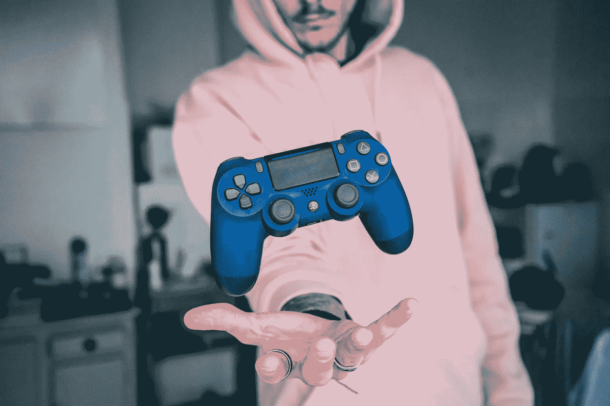
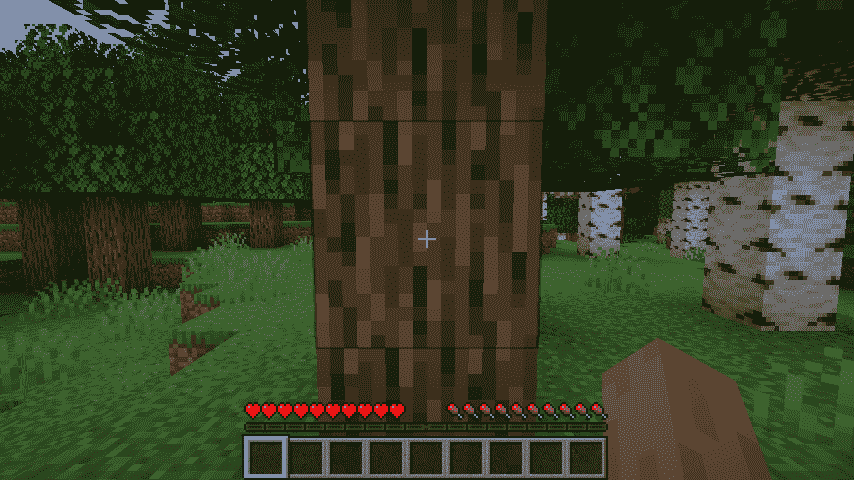
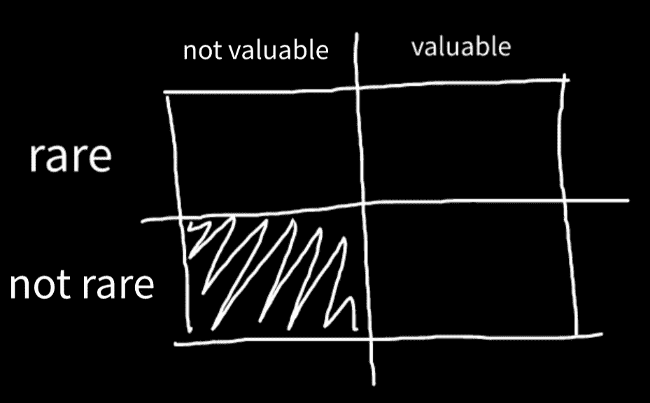
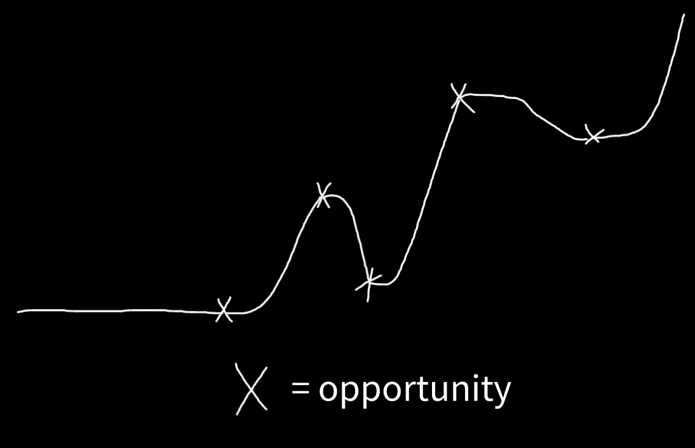
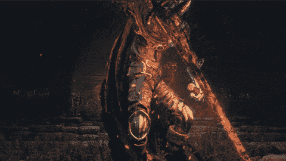
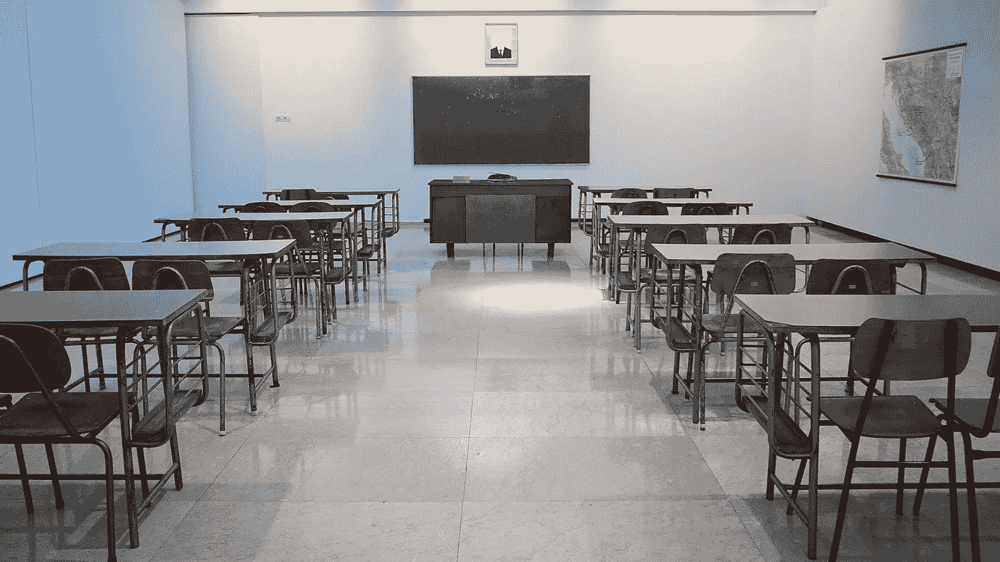
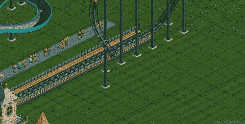
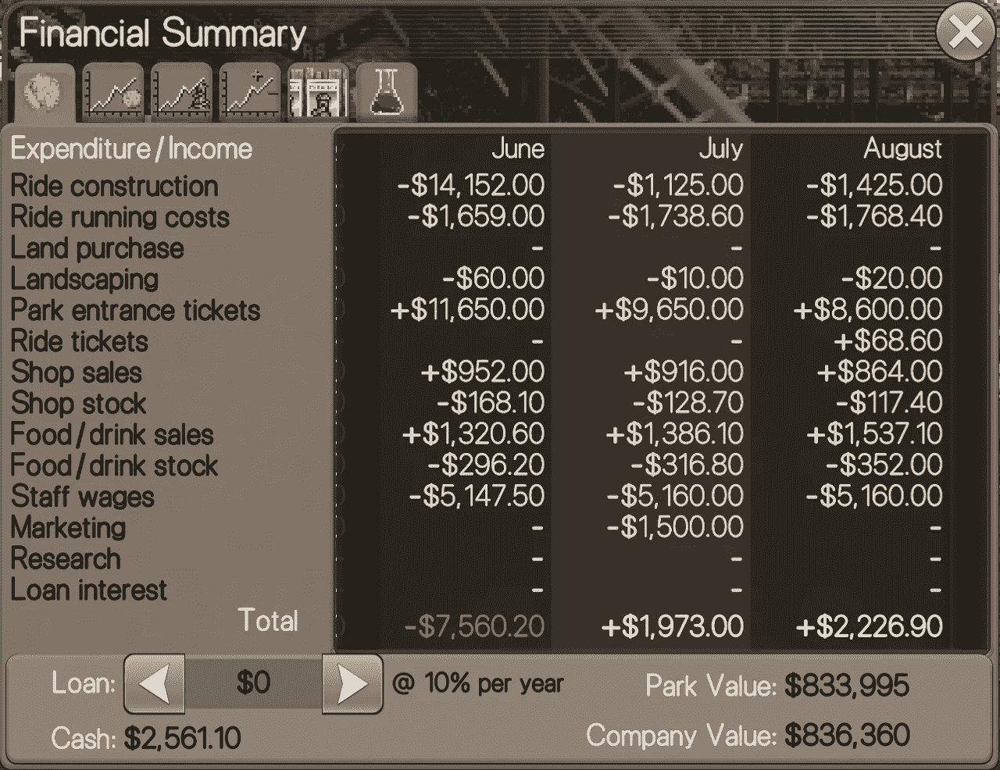
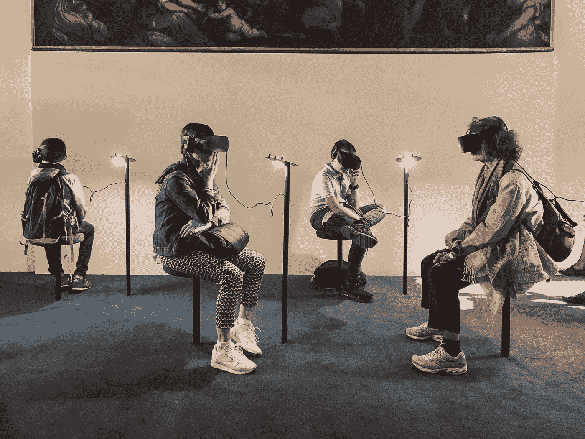

# 避免像学校一样学习的致命错误。

> 原文：<https://medium.com/codex/why-do-video-games-teach-better-than-schools-b47ee7161261?source=collection_archive---------8----------------------->

照片由[茎表](https://unsplash.com/@stemlist?utm_source=unsplash&utm_medium=referral&utm_content=creditCopyText)在 [Unsplash](https://unsplash.com/s/photos/video-games-classroom?utm_source=unsplash&utm_medium=referral&utm_content=creditCopyText) 上拍摄

在整个美国，学生被不公正地允许在没有完成课程要求的情况下升到下一年级。

另一方面，成绩好的学生也不能决定跳级。

> 为什么一个群体在教育上落后了，而另一个群体却没有获得更多成功的空间？

具有讽刺意味的是，两项联邦政策试图解决这两个问题，但都以惨败告终。“[不让一个孩子掉队行动](https://www2.ed.gov/nclb/landing.jhtml)”和“[每个学生成功行动](https://www2.ed.gov/nclb/landing.jhtml)”。

学校未能为学生模拟真实的学习过程。相反，每个人都落在后面，没有人成功。

学生最终毕业，并作为年轻人进入知识经济。许多人感到没有动力，没有准备，没有方向。这给早期的成功制造了障碍。

**不是你的错，是系统的错。但是，幸运的是，有一种方法可以解决你多年来糟糕的学习经历。**

电子游戏。是的，[游戏玩家选对了爱好](https://madmaddox.medium.com/why-playing-video-games-is-better-hobby-than-most-b5dd392dc56f)。

> 电子游戏反映了真实的学习环境:你的行为产生了你的学习材料。

像 [Elon Musk 这样的精英学习者也同意这一点](https://madmaddox.medium.com/how-to-gamify-learning-like-elon-musk-a-formula-for-enhanced-learning-ffebd3504ef3),他说:

> "*一般来说，你希望教育尽可能接近一款好的电子游戏。*

老师、家长，甚至其他学生都警告说电子游戏是“浪费时间”。现在我们有一个亿万富翁在说相反的话。

发生了什么事？

让我们来看看学校是如何未能让孩子们为真实世界做好准备的，以及视频游戏是如何比学校更能让孩子们了解真实世界是如何运作的。

# 依赖性:学校不允许孩子像电子游戏一样“拥有”他们的教育

Florian Gagnepain 在 [Unsplash](https://unsplash.com/s/photos/controller?utm_source=unsplash&utm_medium=referral&utm_content=creditCopyText) 上的照片

[**教育所有权是一件大事。**](https://discoverpraxis.com/17565/maddox-locher/)

当学生没有被给予学习的前座时，他们无法自己“学会如何学习”。

对权威人物指导的依赖出现了，所有曾经存在的好奇心消失了。*学习变成了老鼠赛跑。*

学校把学习变成了一场没有激情的分数游戏，因为教材是以自上而下的方式教授的，而不是自下而上的方式。

*   **自上而下**:学生*被告知*他们*有什么东西*要学。
*   **自下而上**:学生*获得*资源*获得*学习。

电子游戏改变了游戏，因为它们让你拥有了自己的学习经历。从基础开始，向上。

尽管视频游戏中的信息不同，但基本原理是相同的:**学习所有权会产生独特的、适应性强的、成功的路径**。

《我的世界》有一个完美的自下而上的学习方法。你的学习是自我规划的。

《我的世界》在教球员如何从最基础的水平“升级”他们的学习经验方面做得很好。

《我的世界》为你提供了一个简单的框架:

> 知识+行动=结果

你通常做的第一件事就是“打树”。这是《我的世界》最基本的概念。其次，你制作工具。第三，你开采区块。

最终，你开始建造结构！然后你开始想如何处理你的积木和物品仓库。可能性是无限的！就像现实生活一样。

这种学习的“发现方法”意味着你自己去把这些点联系起来！或者，学校的老师会告诉你你将会学到什么，而不是仅仅给你工具让你自己去发现。

这些方法的区别在于“清晰路径”和“未知路径”的区别。

通过可视化值显示图像

> "如果你面前的道路是清晰的，你可能在别人的道路上."——约瑟夫·坎贝尔。

通过“发现方法”学习可以让你*思考*它们是如何联系的，而不是被*告知*它们是如何联系的，从而加强你对概念的理解。

发现式学习也提供了一种接触困难概念的低冲击方式。学习变得有趣。

> 现在想象你没有自己的学习道路。

**当你*不拥有*你的学习轨迹时，你的人生轨迹就像上图一样清晰。**

但是，有一个清晰的路径意味着我有安全舒适的生活，对不对？**不，原因如下。**

当你学习跟随别人的道路时，你正在创造对它的依赖。

猜猜当这条路不再可取时会发生什么？你会被一个更好的系统取代。

> “可预测的路径”+通用技能=不确定的结果

你因为不适应而陷入困境:

当你的“不稀罕”技能变得不那么有价值或者被技术取代时，你就失业了。让自己适应未来。你需要拥有你的教育。

由于新技术、行业崩溃、裁员和 COVID 地毯拉，许多道路已经被摧毁。

当你拥有你的学习时，你知道如何利用机会。不确定路径的起伏不必吓到你。

当你拥有自己的学习时，生活的不确定性会像电子游戏一样让你兴奋，因为当你看到机会时，你知道何时以及如何利用它。

系统不能利用你。

# 学校压力很大，电子游戏很有趣

学生因成绩而有压力。

评分系统给许多学生带来了巨大的压力，因为他们觉得他们必须好好表现，否则就会“不及格”。

学校不会这么说，但是，错误和失败是有区别的。

> 失败就是无所事事。错误是学习的机会。

学校不鼓励犯错，这是最基本的学习层次。

为什么他们不鼓励犯错？

**是因为成绩是服从而不是学习的信号。**

> "除了你对经理的服从之外，成绩不能衡量任何东西."—约翰·泰勒·盖托

“有学习动力”的孩子实际上表现紧张，因为糟糕的成绩对他们的未来有影响。他们是有毒的完美主义者。

他们还能怎么想？

他们被告知分数关系到他们的一生。

**电子游戏不一样。**

通过引人入胜的游戏积极鼓励错误。如果游戏越来越有趣，你为什么要放弃呢？

人们玩电子游戏几个小时，因为他们沉浸在故事、目标或他们行动的有趣结果中。

视频游戏中的学习水平和速度更高，因为它们为孩子们吸收和应用信息提供了一个低影响、无压力的环境。

> 电子游戏把学习从一项乏味的任务变成了你甚至没有意识到自己正在做的事情。

这一点非常重要，因为学习在鼓励自由选择的环境中蓬勃发展。这些选择不可避免地教会了你一些东西。

在视频*为什么你不能做出人生中任何重要的决定中，*一位治疗师概述了*知道你不知道*什么是正确决定的重要性。

在现实生活中，没有办法知道你的决定是好是坏。**什么都不做是最糟糕的。**

电子游戏解决了这个问题。

在电子游戏世界里，你可以测试新的想法，一次又一次地死去，人们仍然继续玩。为什么？

在一些视频游戏中，比如《我的世界》，环境相对来说没有压力，到处都有一些挑战。

> 最重要的是，你不必害怕做出错误的选择，因为你总能反弹。

另一方面，在视频游戏中，像黑暗灵魂，一个以难度著称的游戏，人们继续玩*是因为挑战的*。虽然黑暗之魂这样的游戏很难，但是*人一直玩*。

黑暗灵魂的 GIF

学校很难，因为你被迫成为一个完美主义者。你没有任何从错误中恢复的余地。

你也没有得到足够的挑战，即使你完成了挑战，比任何人都更好或更快，*你们都会得到* ***同样的文凭*** 。

那不是激励。真令人沮丧。

# 电子游戏:沉浸式学习和金融知识

最好的学习本来就是沉浸式的。

人类是优秀的模式识别者，最好的学习方法是让自己沉浸在尽可能丰富的经历中。你可以更好地定位模式，更具体地建立基础。

伊万·阿列克西奇在 [Unsplash](https://unsplash.com/s/photos/classroom?utm_source=unsplash&utm_medium=referral&utm_content=creditCopyText) 拍摄的照片

教室是功能性和理论性的。你会得到其他人在实际工作中发现的信息。 ***没有浸泡。***

电子游戏改变了这一点。你不再谈论和写你可能如何做某事，而是沉浸在直接互动中学习。

> 当你沉浸在一个好的电子游戏中时，整个世界都缩小了，你的注意力集中在某个目标上。

以过山车大亨游戏为例。

删除部分过山车轨道会怎么样

过山车大亨的主要目标是设计和管理一个盈利的游乐园。这比你想象的要难。有很多活动部件。

虽然难，但却极具沉浸感。在公园里走来走去的小人每个人都有自己的想法、零花钱和对游乐设施的看法。

每辆过山车都可以定制到让乘客恶心的精确速度。你可以建造一个过山车，造成*咳嗽*伤亡。

过山车大亨采用了枯燥的话题，如物理和金融，并以一种身临其境和*互动的方式展示了它们的应用。*

你可以通过建造杯垫来了解速度的力量，也可以学习如何从供求关系中获利。

一个虚构的游乐园的财务摘要

以上是过山车大亨内部一个公园的“财务总结”。一眼就能看出这个游戏比初看起来要复杂。

这个游戏是为孩子们设计的，比大多数学校更好地教授金融知识。

学生们最好玩过山车大亨游戏，而不是参加学校的金融扫盲班。(如果学校有)

令人惊讶的是，[这个家伙通过过山车大亨学会了金融知识。](https://ichthyoid.writeas.com/how-rollercoaster-tycoon-taught-me-financial-literacy)

电子游戏还有希望。对学校来说就不是这样了。

# 未来将会游戏化

照片由 [Lucrezia Carnelos](https://unsplash.com/@ciabattespugnose?utm_source=unsplash&utm_medium=referral&utm_content=creditCopyText) 在 [Unsplash](https://unsplash.com/s/photos/virtual?utm_source=unsplash&utm_medium=referral&utm_content=creditCopyText) 上拍摄

COVID 迅速推进了不可避免的发展:广泛采用的在线教育。

Lizardman (Mark Zuckerberg)承诺开发他所谓的“[元宇宙](https://dailyidea.substack.com/p/the-problem-with-facebook-owning?r=gcr06&utm_campaign=post&utm_medium=web)”，从而引领了虚拟现实和增强现实学习技术。

大学正在经历申请人数的减少，更多的人辍学。

[创意笔记正在升级](https://dailyidea.substack.com/p/is-it-possible-to-automate-creativity?r=gcr06&utm_campaign=post&utm_medium=web)。

所有这些都表明学习的未来正在发生变化。变得更好。

你可以拥有自己的教育，沉浸在有趣的模拟中，并取得真正的进步。没有令人紧张的成绩和虚假的进步。

游戏是学习的未来。

想了解更多关于教育的未来，如何将学习游戏化，以及如何一次一个想法掌控自己的生活？

在 Medium 和 [Twitter](https://twitter.com/The__Maddox) 和[上关注我，注意事项](https://noteworthynote.substack.com/p/coming-soon)。