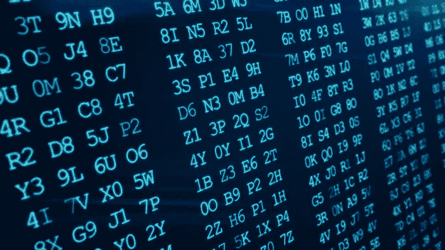

# 为什么我们需要十六进制数字系统？

> 原文：<https://medium.com/codex/why-do-we-need-the-hexadecimal-number-system-c1fc04728608?source=collection_archive---------0----------------------->

你们可能都遇到过这个问题，为什么我们不能简单地使用我们传统的人类可以理解的十进制数字系统，而不是那些复杂的数字系统，如二进制，八进制，十六进制？

> 例如，十进制数 **512** 被表示为
> 
> **200** 在十六进制数字系统中，
> 
> **1000** 在八进制数系统中，
> 
> **0010 0000 0000** 二进制数系统。

这显然说不通，对吗？那么，我们为什么还需要它们呢？

此外，您可能听说过十六进制是人类可读的，而不是十进制。

好，我们来分解一下。

我们都知道，如果没有协议，计算机就无法理解任何形式的数字系统。它只知道 2 个不同的数字。不是 0 就是 1。它被称为二进制。

在硬件级，电流流动(表示为 1)或不流动(表示为 0)。是的，计算机是如此愚蠢。但是人类可以理解 10 个不同的数字(0，1，2，3，4，5，6，7，8，9)。

因此，在计算机出现的时候，科学家们如此痴迷于解决我们如何才能让计算机理解人类可读数字的问题。

起初，他们想到了解决办法，通过改变通过电线(系统总线)的功率，他们能够使计算机理解不同的数字。

**例如**，

1 瓦特代表数字 0

2 瓦特来代表数字 1

诸如此类…

> 你可能已经注意到这种方法有很多缺点。

*   首先，在处理和存储的每一级，我们需要将不同的幂转换成不同的数字。
*   我们需要考虑的不仅仅是 10 位数。我们有不同的符号，比如，(% >“。26 个英文字母。也有小写字母。此外，有大量的语言具有不同数量的字符。为了满足所有这些需求，我们需要为每个角色赋予不同的能力。这对机器来说也很难。
*   由于这些大量的不同能力的可能性，我们需要限制两个连续字符之间的能力差异。在如此小的尺度差异中，导线的电阻和导线的长度可以改变通过它们的电流。

> 但是 Bharath，我们有解决问题方法，对吗？

*   只要降低电流，提高电压就可以解决这个问题。但是频繁改变电压会导致电压波动，这对电子元件非常不利。否则，我们可以在每个存储和处理层添加一个转换器。这听起来很务实😂😂😂。

**然后在某个时候，人们认为为了表示一个大的十进制数，他们只是使用了现有十进制数的组合。**

这种想法产生了组合二进制数以得到大数的想法。但是如何将它们结合起来呢？

那部分也来自传统的数制。在十进制数字 1，2，3，4，5，6，7，8，9 之后，我们开始组合数字，得到 10，11，12…

像这样，在 0 和 1 之后的二进制中，我们开始组合 2 个数字(位)得到代表 2 的 10，代表 3 的 11。然后我们将 3 位 100 组合成 4 位，依此类推…

现在一切都很好。我们可以通过组合二进制数字让计算机理解每一个数字。

好吧，这个的问题是我们需要让计算机明白什么时候去寻找下一个字符。举个例子，

对于数字 1024，二进制数是 010000000000

对于数字 1，二进制数是 1。

这里两个数字有不同的位数。因此，计算机无法理解何时寻找第二个数字。

为了解决这个问题，数字系统应运而生。

> 现在来谈真正的问题。为什么我们需要十六进制数字系统？

这里的主要目标是要有一组或多或少与人类可以理解的十进制数字系统相匹配的位。

也就是我们需要组合多少个二进制数字来形成满足人类需求的数字系统。

先说一个**单比特**。显然，它既可以代表 **0，也可以代表**1。这对我们来说还不够。

好了，让我们转到**两位**。它可以代表

*   **0(00)**
*   **1(01)**
*   **2(10)**
*   **3(11)**

这对我们来说还不够，因为我们做更复杂的数学运算，需要比这些更多的数字。

然后我们移动到**三位**。它可以代表

*   **0(000)**
*   **1(001)**
*   **二(010)**
*   **3(011)**
*   **4(100)**
*   **5(101)**
*   **6(110)**
*   **7(111)**

这比有 2 位更好。它也只遗漏了 2 个十进制数字(8 和 9)。我们能够应付 8 号和 9 号的短缺。因此，它演变为八进制数字系统，因为它可以用 3 个二进制数字来表示 8 个十进制数字。这更好，但并不完美，因此我们移动到四位。

让我们看看一个**四位**数制能做什么

*   **0(0000)**
*   **1(0001)**
*   **2(0010)**
*   **3(0011)**
*   **4(0100)**
*   **5(0101)**
*   **6(0110)**
*   **7(0111)**
*   **8(1000)**
*   **9(1001)**
*   **10(1010) = > A**
*   **11(1011) = > B**
*   **12(1100) = > C**
*   **13(1101) = > D**
*   **14(1110) = > E**
*   **15(1111) = > F**

它能满足我们的需要。然而，它也代表我们不需要的数字。我们可以忽略从 a 到 f 的额外数字，对吗？

其实这些多出来的数字还是有一些好处的。

为了得到这个，我们需要了解使用十进制比二进制有什么优势？

显然，我们可以用更少的位数来表示一个大数。

举个例子，

为了用二进制表示 **1024，我们需要 11 位数字。(10000000000)**

同理，为了用八进制表示 **999，我们需要 4 位数。**(1747 年)

但是十六进制的数字 **1024 是 400** 。而十六进制的数字 **999 是 3E7。**最大限度地减少了我们需要使用的位数。这减少了计算时间。

因此，十六进制数字系统在任何地方都被广泛使用。

我们甚至可以达到四位数以上，但这些是人类无法阅读的。所以我们坚持使用十六进制数字系统。

> 现在你可能会问 Bharath，数字是可以的。但是对于字母和特殊字符呢？

这就是不同字符编码标准的由来。例如，ASCII、Unicode 等…

> 附加说明:
> 
> 量子位(qubit)可以同时代表不同的状态。这就是所谓的**量子叠加**。即 4 个量子位可以代表相同的 16 种组合，但同时代表**和**。这意味着它可以一次比较所有可能的状态。听起来很惊人，对吧？让我们在接下来的文章中详细了解一下。谢谢！

返回；