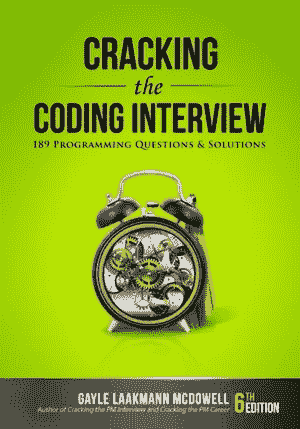

# 破解编码面试——你为什么需要阅读(解决)这本书

> 原文：<https://medium.com/codex/why-do-you-need-to-read-the-cracking-the-coding-interview-book-326a68c3aefb?source=collection_archive---------2----------------------->

## 好书可以改变你的生活

凯文·Ku 在 [Unsplash](https://unsplash.com/) 上的照片

# 生活是如何引导我找到这本书的

我开始阅读《T4:破解编码面试》——盖尔·拉克曼·麦克道尔的书——受到谷歌技术指导项目的启发，我作为学员参加了该项目。在这次指导之前，我认为登陆谷歌是一件与众不同的事情，只有编程超人才能做到。然而，在这次指导后，我意识到进入 FAANG 公司不仅仅是真实的，你需要做的只是开始工作，一步一步地学习，为长期工作做好准备，不要期望立即成功。事实上，我最终以 SDE 实习生的身份登陆亚马逊，我很高兴在我的生活中有谷歌技术指导项目的经历。但是这篇文章是关于这本书，而不是指导计划。因此，在指导计划期间，我的导师建议我开始学习算法和数据结构，其中一个可能的方法是阅读这本书。

# 为什么

大多数人开始读这本书是因为他们渴望开始在 FAANG 公司工作。当然，这是一个好的动机，但不是唯一合理的动机。这本书可以**总体上向你展示编码面试世界**，不仅从编码的角度，还从行为的角度。但是除了面试之外，**它还能教会你如何进行分析性思考**。大多数人认为他们不能学会如何思考，但他们可以。他们所需要做的只是从简单的问题开始，然后，随着时间的推移，发展到更复杂的问题。这本书可以告诉你如何进入编码问题，从什么开始，你的目标是什么，你如何能做得更好，以及你应该如何思考。

# 书的内容

## 非技术部分

本书的作者 Gayle L. McDowell 在前 8 节中从编码采访的更一般的方面开始。她描述了整个面试过程，讲述了基于什么样的候选人被选中，什么更重要或更不重要，以及你在面试中应该如何表现。作者还讲述了在选定公司(微软、亚马逊、谷歌、苹果、脸书、Palantir)的面试情况。她建议在面试前做些什么，包括一些关于获得合适经验和写简历的话。Gayle L. McDowell 教授如何处理行为问题，并带领你进入大 O 符号。然后，她讲述了如何进入技术问题，描述了问题解决方案的主要阶段应该是什么样子，以及在面试过程中可能出现的不同情况下应该怎么做。作者在非技术部分的最后给出了处理工作邀请的技巧。

## 技术部分

这是你应该花大部分时间阅读这本书的部分。Gayle L. McDowell 将这一部分分成几章，每一章选择一个特定的主题(如链表或位操作)。在每一章的开始，她给出一些关于主题的理论，然后在每一章的结尾，她给出一组与所选主题相关的 T2 编码问题。

特别的是，作者为每个问题准备了 1-5 个**提示**，所以如果你觉得卡住了，你可以尝试使用她的热门话题。更重要的是，如果你觉得提示对你来说不够，那么你可以分析她的**解决方案**，这些都有详细的描述。对于每一个问题，通常都有几种解决方案，从最简单的开始，到最优的结束。所以在对准备好的解决方案进行分析后，你应该能够实施自己的解决方案(但不要欺骗自己，也不要抄袭别人的解决方案；当然你可以从其他解决方案中得到启发，但是你应该确定你完全理解这个解决方案中发生了什么；当然，您应该自己编写代码)。

学习的过程是非常有组织的，因为一个任务的所有提示都放在不同的页面上，所以你实际上不能，甚至无意中，阅读更多你应该阅读的内容；要读另一本书，你应该找另一页，这样可以做更多有意识的动作。问题解答也放在书末，让你在任务描述前不能随便看解答。

这本书以高级主题和代码库结尾。

如果你对算法一无所知，这本书对你来说是不够的。如果你在大学里学过计算机科学基础、算法和数据结构，那么现在是开始读这本书的好时机。然而，如果不了解一些基础知识，你可能需要额外的资源。

# 怎么读

非技术性的部分，你可以像任何普通的书一样阅读。但是技术部分不一样。要“读”它，你应该有足够的时间，而不是被某些东西所束缚。我把“阅读”用引号括起来，因为你大部分时间不是花在阅读上，而是花在解决问题上。你应该有一些东西来帮助你思考和创造你的解决方案，可以是一张纸或一台电脑。总的来说，纸总是一个好东西，因为你不受限制，你可以写和画你脑海中的任何东西，没有任何疑问*如何*写，只是专注于*写什么*。在没有编译器的情况下在纸上编码也是一个很好的实践，因为你将无法在大多数面试中运行你的代码。

所以，总的来说，整个过程是这样的:你阅读问题，你试图解决它。如果你感到停滞不前，那么你就去寻找提示，如果你仍然停滞不前，那么你就去寻找解决方案(但是在那之后，你自己再创造解决方案！).另一方面，如果你顺利地完成了任务，那么无论如何你都应该找到一个解决方案，并与你的进行比较，以确定它是否正确，并了解你如何能做得更好。

# 摘要

总而言之，你应该读这本书，因为:

*   它会教你如何分析思考，如何解决问题
*   它会向你展示整个面试过程
*   它会教你如何在面试中表现，在面试之前和之后
*   它会帮助你进入一家著名的公司😉

记住，如果你真的想要，一切皆有可能。祝你好运！😊

另外，你也可以看看本书中我自己对一些问题的解决方案🙂⭐️.

# 一些资源

*   本书[官方网站](https://www.crackingthecodinginterview.com/)
*   亚马逊[的书](https://www.amazon.com/Cracking-Coding-Interview-Programming-Questions/dp/0984782850)

