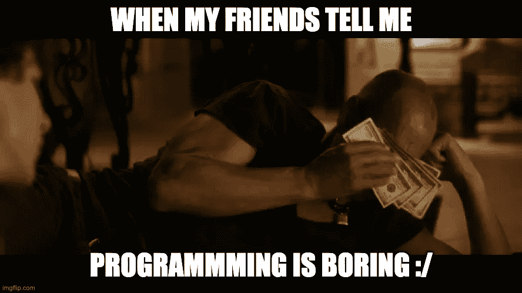

# 为什么 Roblox 要向单个开发者支付 120 万美元？

> 原文：<https://medium.com/codex/why-does-roblox-pay-1-2-million-to-a-single-developer-62f1de432456?source=collection_archive---------0----------------------->

## 《2021 年年终薪酬报告》披露了开发商难以置信的薪酬

现在每个人都想成为开发者，因为公司支付了很多钱。**但是** [**大多数人在意识到真的很难**的时候，都会掉](https://www.reddit.com/r/learnprogramming/comments/s6n3u6/dont_worry_about_dev_saturation_there_is_a_huge/) **。**

作者创造的模因。