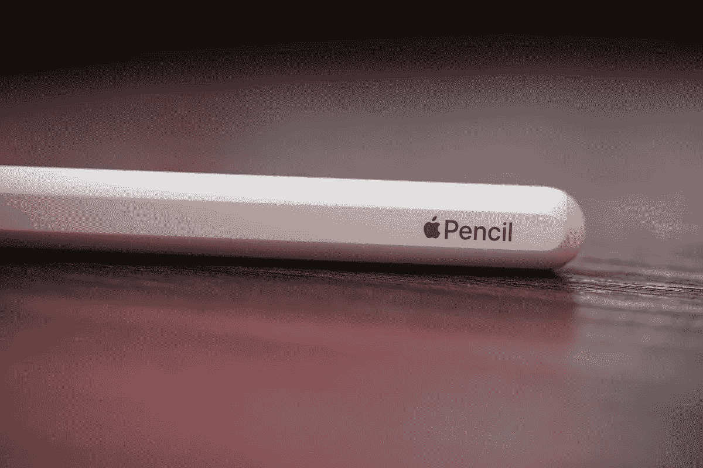
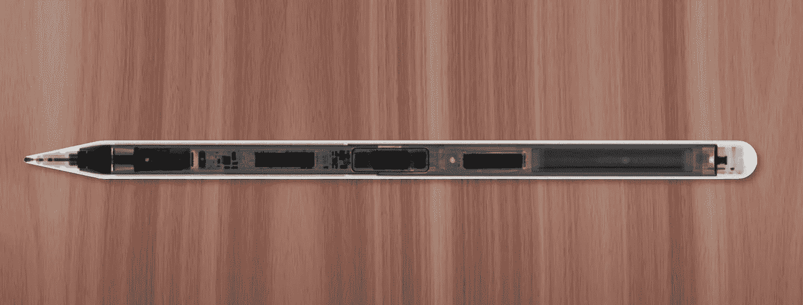
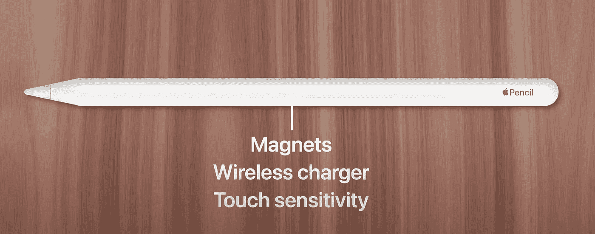
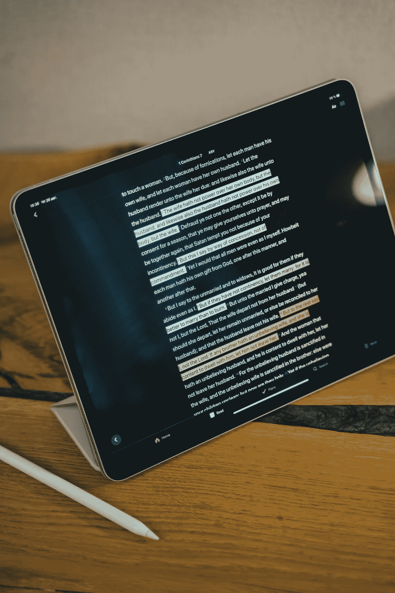

# Apple Pencil 为什么要 129 美元？(以及其他相关事实)

> 原文：<https://medium.com/codex/why-does-the-apple-pencil-cost-129-and-other-facts-about-it-b227942ddcda?source=collection_archive---------9----------------------->

版权所有—[https://de.wikipedia.org/wiki/Apple_Pencil](https://de.wikipedia.org/wiki/Apple_Pencil)

有些人想知道为什么一支简单的 tab 铅笔要那么贵。如果你对苹果产品不够热情，这可能是个好问题。在这篇文章中，我将解释为什么这个小玩意值 129 美元。

# 苹果铅笔里面有什么？

你有没有问过自己:这个东西是怎么运作的？答案很简单，但是硬件真的很复杂。为了正常工作，苹果公司不得不为这款简单的笔添加无线充电端口、蓝牙连接和强大的磁铁。

这是这支笔的三个特别之处。听起来很容易，不是吗？没那么容易。试想一下背后的**是什么。**

苹果不得不在一个非常简单小巧的白色铅笔盒后面放很多东西。太棒了。

# 苹果铅笔和 iPad 软件

苹果公司将 iPad 软件开发成行业领先的技术，保证了用手写笔在平板电脑上绘图或书写的延迟非常非常低。

这就是为什么我两年来一直在我的 iPad 上写作——它完美地处理了我所有的工作——学校笔记、生殖设计、Adobe Photoshop 作品等等。

这不是很棒吗？我没有使用鼠标或触控板，而是使用一支简单的铅笔来支持我的日常工作。

另一方面，这支铅笔的另一个优点是电池。只需与平板电脑配对充电几分钟，它就可以给你 30 分钟的书写和使用时间。是不是很酷？工作 30 分钟充电几分钟？

# 这不是很棒吗？

让我知道你对这些小玩意的看法。感谢阅读我的文章！[来源](https://youtu.be/wlRfHlMhMRU)