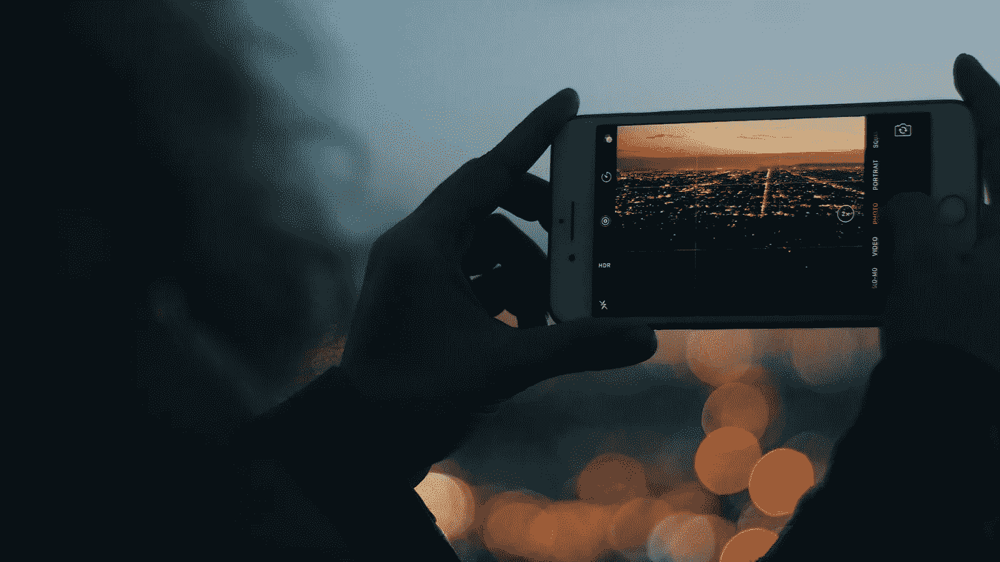

# 为什么 iPhone 现在这么便宜？

> 原文：<https://medium.com/codex/why-does-the-iphone-now-so-cheap-1b068eaa348f?source=collection_archive---------22----------------------->

## 现在每个人都可以拥有 iPhone 了

雅各布·戈拉杰克在 [Unsplash](https://unsplash.com/photos/i24tGGbc9GE) 上的照片

*我没有讽刺，这也不是玩笑。iPhone 旗舰产品 iPhone 12 Pro Max 不是目前市场上最贵的智能手机，甚至也不是前三名之一。*

过去，iPhones 与富人和精英阶层联系在一起，因为它们以高价提供优质产品。人们购买…