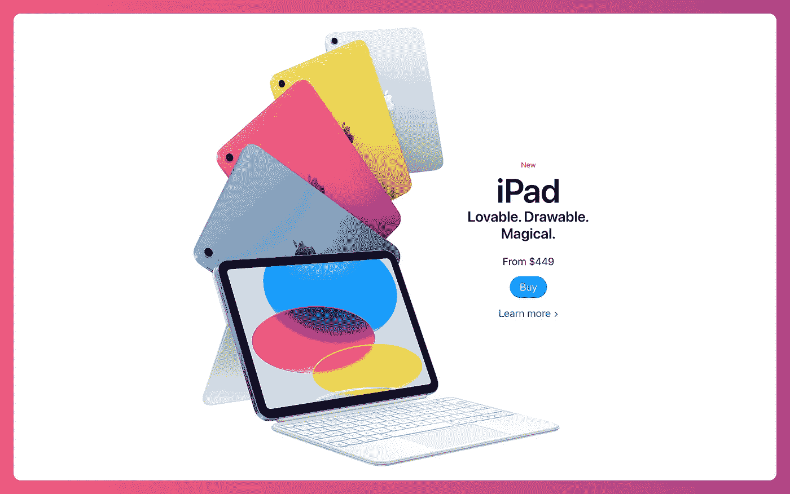

# 为什么第二代 Apple Pencil 不能在 iPad 上使用？

> 原文：<https://medium.com/codex/why-doesnt-the-second-gen-apple-pencil-work-with-the-ipad-fa063e9f3c?source=collection_archive---------2----------------------->

## 这是苹果最奇怪的决定之一…除非这实际上是一个聪明的举动。

信用苹果

2022 年，第十代 iPad 到目前为止争议不断，退一步说。一方面，新 iPad 是苹果廉价平板电脑的完美升级，但另一方面，我不得不怀疑他们在想什么。