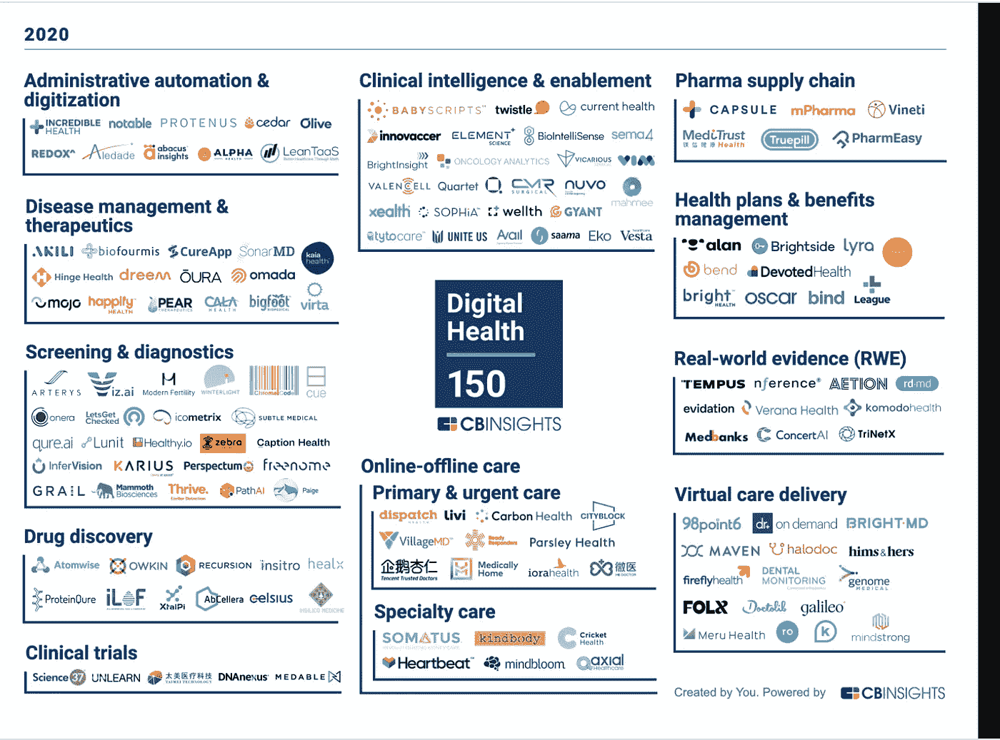

# 为什么每个数字健康创业公司都应该雇佣隐私专家

> 原文：<https://medium.com/codex/why-every-digital-health-startup-should-hire-a-privacy-expert-d0cb51f31879?source=collection_archive---------6----------------------->

## 这里有一个激进的想法:在当前的隐私时代，隐私产品经理是必须的。尤其是在数字健康领域。

图片由 jcomp 提供—【www.freepik.com 

数字健康初创公司正在改变医疗保健的未来。如果你正在阅读这篇文章，你可能是今天全球 18 个国家超过 8000 家医疗保健初创公司中的一员，这些公司正在开发突破性的产品，帮助改善医疗保健的成果、质量和可及性。

来源:[数字健康 150:改变医疗保健未来的数字健康创业公司](https://www.cbinsights.com/research/report/digital-health-startups-redefining-healthcare/)

医疗创新有巨大的潜力。但这也是最难颠覆的行业之一。它有一个复杂的利益相关者网络(服务提供商、临床医生、支付者、患者、研究人员等)。).它以深度碎片化和数据孤岛而闻名。这是一个高度管制的部门。

显然，获得正确的技术和产品是最重要的。同样重要的是找出商业化的途径，找到适合市场的产品，获得监管机构的批准，并雇佣一个优秀的团队。

但许多成长中的数字健康公司似乎在其领导团队中缺乏一个重要的——也是新兴的——角色:隐私专家。我说的“T8”并不是指法律或安全领域的专家(尽管你可能也需要这些)。更多的把它当成一个**隐私产品经理。**

## **什么是隐私产品经理？**

隐私产品经理监督组织内部如何遵守(或不遵守)隐私的整个生命周期。这个角色类似于传统的产品经理，以及最近更专业的“数据产品经理”和“人工智能产品经理”，这在硅谷很常见。

**我们的想法是，不要将隐私视为风险因素或合规负担，而是将其视为一种产品。**

隐私产品经理基本上是一个组织内的隐私专家，通常在隐私法律法规、产品管理和技术方面具有丰富的综合背景。

隐私项目经理的主要职能是**平衡产品战略、治理以及任何隐私和道德相关事项的实施，并促进所有相关利益方**之间的对话，包括高管/领导团队、工程师、分析师、产品团队、营销团队、监管机构、外部合作伙伴和客户/用户。

正如传统上所说，项目经理代表产品开发生命周期中用户的声音一样，**隐私项目经理代表最终用户的信任期望**，他们的工作是确保隐私和道德等价值观在您的组织中得到切实贯彻，并嵌入到您的产品中。他们也是你公司的**内部和外部隐私布道者**。这比仅仅提供法律和监管建议要宽泛得多，尽管这显然是附加值的一部分。

## **打造隐私优先产品是数字医疗关键的 5 个理由**

隐私是一个远远超出合规性的紧急问题——它跨越了[软件开发生命周期](https://medium.ethyca.com/devtools-for-data-privacy-step-2-imagining-the-benefits-facb3dc2bff5)、[工程](https://en.wikipedia.org/wiki/Privacy_engineering#:~:text=Privacy%20engineering%20is%20an%20emerging,provide%20acceptable%20levels%20of%20privacy.&text=In%20the%20rest%20of%20the,privacy%20and%20data%20protection%20laws.)、[产品设计](https://www.theguardian.com/technology/2021/may/19/privacy-by-design-google-to-give-people-more-power-over-their-personal-data)、[数据流](https://www.privacycompliancehub.com/gdpr-resources/practical-privacy-how-to-map-your-data-flows/)、[分析](https://www.sciencedirect.com/science/article/pii/S0148296319303078)、[营销](https://www.cmo.com.au/article/670510/5-things-marketers-should-know-about-data-privacy-2020/)和技术[架构](https://www.infoq.com/articles/data-driven-privacy-architecture/)。**简而言之，隐私是一个基本要素，需要考虑到产品设计和商业化道路的每个方面，尤其是在数字健康领域。原因如下:**

1.  **医疗数据是一场高风险的游戏**

我们生活在“[数据隐私时代](https://techcrunch.com/2021/09/29/the-death-of-identity-knowing-your-customer-in-the-age-of-data-privacy/)”。[世界上最大的品牌](https://wfanet.org/knowledge/item/2020/06/01/WFA-launches-worlds-first-guide-on-data-ethics-for-brands)正在超越作为风险因素的隐私，并将隐私和数据伦理视为对品牌至关重要的 USP。这一点在数字健康领域最为重要，在这个领域，公司正在个人数据市场进行[交易。](https://www.forbes.com/sites/forbestechcouncil/2021/06/01/commercializing-digital-health-trading-on-a-dynamic-data-marketplace/?sh=4953da316f5c)

鉴于临床数据的敏感性，数字医疗是一个高风险的游戏。不道德或未经授权的数据共享、医疗人工智能模型中的预测错误或数据泄露的后果可能是可怕的。

**与其他科技公司不同，Digital health 不能快速行动和打破常规。**

像脸书在医疗技术领域的[剑桥分析数据丑闻](https://en.wikipedia.org/wiki/Facebook%E2%80%93Cambridge_Analytica_data_scandal)这样的笨拙失误将是毁灭性的，并可能以非常真实的方式直接伤害人们(并导致巨额监管罚款和法律责任索赔)。

**2。信任将是数字健康产品的关键特征**

[谷歌](https://www.thinkwithgoogle.com/intl/en-aunz/future-of-marketing/privacy-and-trust/privacy-sandbox/)、[苹果](https://appleinsider.com/articles/21/10/23/google-and-facebook-worked-to-beat-safaris-privacy-tools)和[脸书](https://about.fb.com/news/2021/04/our-privacy-progress/)从将个人数据货币化，到十年前谴责隐私过时，再到将大量现金和资源投入到闪亮的新隐私议程，已经走了一个完整的圈子。

这一切都是由于消费者在数据控制、透明度和道德方面的隐私期望发生了重大变化。[数字信任](https://www.pwc.com.au/assurance/digital-trust/au-journey-to-digital-trust.pdf)正在成为董事会的优先事项——在隐私、数据伦理、安全性和可靠性方面领先的数字企业有望成为未来的巨头。

**3。监管审批&医疗采购将取决于隐私**

2021 年 4 月[,澳大利亚治疗用品管理局(TGA)发布了针对上市前和上市后医疗设备(包括 SaMDs 和人工智能驱动设备)的修订版网络安全指南](https://www.tga.gov.au/book/export/html/874778),建议**医疗保健提供商的采购团队询问有关开发商隐私和安全协议的详细问题**,包括如何记录和存储设备数据；是否使用第三方云服务，如果是，他们的隐私和安全政策是什么；数据是否存储在岸上；如果发生数据泄露事件，开发人员将如何应对。

在美国， [FDA 新提出的“软件预认证计划”](https://www.fda.gov/medical-devices/digital-health-center-excellence/digital-health-software-precertification-pre-cert-program)和[“基于人工智能/机器学习(AI/ML)的软件作为医疗设备(SaMD)行动计划，](https://www.fda.gov/news-events/press-announcements/fda-releases-artificial-intelligencemachine-learning-action-plan)”都强调了 FDA 对开发商安全和质量标准的评估现在将包括安全、隐私和数据保护系统、流程和控制。

此外， [FTC 最近关于数字健康应用程序开发者、联网设备和其他健康产品的政策声明](https://www.hklaw.com/en/insights/publications/2021/09/important-ftc-rules-for-health-apps-outside-of-hipaa)旨在保护用户的隐私，现在要求开发者现在遵守健康违规通知规则，无论他们是否受 HIPAA 隐私和安全规则的保护。

**4。隐私合规是数字健康的关键**

近年来，60 多个国家出台了一系列新的隐私法规，其动机是在数字时代保护消费者数据的需要，并受到欧盟一般数据保护法规(GDPR)及其带来的巨额罚款的启发。

GDPR 对任何收集、储存和使用健康信息的人强加了一系列严格的义务(定义非常宽泛)，包括从一开始就将隐私设计嵌入到你的产品中的义务。

例如，澳大利亚政府正在努力引入广泛的隐私法改革，这将使澳大利亚过时的隐私法与 GDPR 保持一致，并对违规行为施加更高的惩罚，这将直接影响数字健康产业。

但是还有一个复杂的网络**新的全球法律、法规和标准即将出现**，它们将管理人工智能公司如何使用数据[将对全球医疗科技行业产生巨大影响](https://www.simmons-simmons.com/en/publications/ckoim7ji91fsf0a45mjw4q7at/eu-artificial-intelligence-act-perspectives-in-healthcare)。

**5。获得高质量数据至关重要**

医疗人工智能产品的好坏取决于为其模型提供燃料的数据。它们需要与医院、实验室和临床医生进行密切的长期合作，在处理患者数据时，他们要遵守严格的法律、法规和道德义务。

为了促进与医疗保健利益相关者的合作，无论是数据访问还是产品评估和验证(例如最近初创公司 Rhino Health 与五大洲 20 家医院的跨辖区合作**)，您需要将** **强大的隐私技术和实践深深嵌入到您的产品或平台的架构中**(除了安全性之外)。

无论您的产品是否有助于流程/服务交付自动化、诊断和治疗、临床试验、疾病管理或虚拟护理交付，您都可能会有多个敏感数据接触点。**你的商业伙伴不仅想知道你的产品是否可靠，他们还希望它是保密的、合乎道德的和安全的。**

## **隐私专家能为你的数字健康创业公司做些什么？**

拥有防弹隐私实践不仅仅有助于与监管机构打交道和勾选合规框。这也有很好的商业意义。隐私专家可以:

1.  **将隐私&道德规范融入产品开发&设计生命周期，**通过设计原则确保您遵守隐私，在模型训练、测试和验证期间以及产品投入生产后，通过持续监控，潜在偏差得到适当控制。
2.  **运营隐私** —他们将制定清晰的标准程序、政策和系统，将隐私纳入您的数据收集、开发和设计流程，处理用户删除或转移个人数据的请求，并为这些未来需求准备您的基础设施环境。
3.  **推动增长** —透明度和道德已经成为一种竞争优势，有助于建立对您产品的信任。特别是在医疗人工智能方面，临床医生和患者都希望了解模型是如何达到其预测的，或者为什么建议特定的治疗或行动。这可能会影响采用、声誉、行业合作、数据访问和市场渗透。
4.  **帮助融资/投资**——风投尽职调查关注数据隐私，尤其是在医疗科技领域。这可能会影响你未来的估值和进入新市场的能力。说到[私募股权投资 medtech](https://www.mckinsey.com/industries/private-equity-and-principal-investors/our-insights/private-equity-opportunities-in-healthcare-tech) (针对更成熟的公司)，PE 公司会把你如何获取和重新包装专有数据作为可扩展性的关键指标之一。数据隐私法规、数据共享需要患者同意、知识产权、数据质量，或者仅仅是缺乏客户参与，往往会阻碍公司实现显著增长。

## **聘请隐私专家担任初创公司领导角色的 3 个技巧**

寻找具有以下特征的人:

*   **广泛多样的技能组合** —考虑到隐私在企业中的多个接触点以及与多学科团队合作的需要，您的隐私专家精通所有相关司法管辖区的相关法律法规非常重要。但他们还需要对数据和产品原理、技术、商业框架和医疗保健行业前景有扎实的理解。
*   **创业经历**——任何曾经在创业公司工作或创办过创业公司的人(或看过 [HBO 的硅谷](https://www.hbo.com/silicon-valley))都会知道，中途造飞机是创业生活的一个普遍特征。坚实的企业背景是有用的，但适应性、足智多谋以及应对快速增长业务的快节奏和不可预测性也是有用的。
*   **多元化背景** —众所周知，多元化和包容性非常重要。但是，当构建人工智能产品时，多样性确保偏见得到控制，并且您的产品是用各种观点和方法构建的。如果产品旨在由特定用户群/特定患者(如女性)使用或为其带来益处，这一点尤为重要。

医疗人工智能公司正在做重要的转型工作，这将使整个社会受益。至关重要的是，他们要为关键的市场和监管变化做好准备，打造隐私第一的产品，从而为自己的成功做好准备。