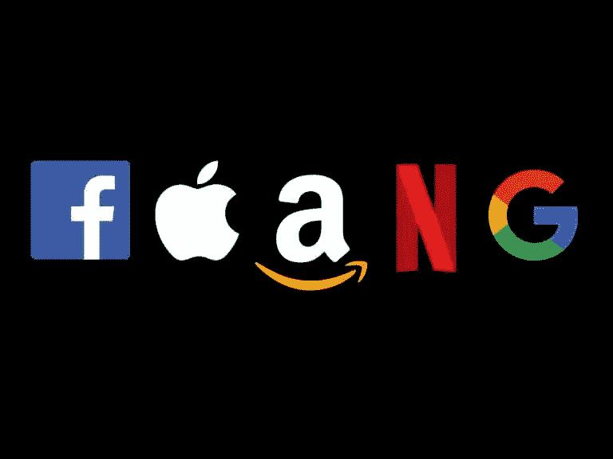

# 为什么 FAANG 可能不利于你的职业生涯？

> 原文：<https://medium.com/codex/why-faang-might-not-be-good-for-your-career-a5a092573c08?source=collection_archive---------6----------------------->

***FAANG***……脸书、苹果、亚马逊、网飞、谷歌……还有微软(我认为现在是他们中最好的)。这些公司是每个软件工程师职业生涯的梦想；尤其是如果他们处于职业生涯的早期阶段。但是真的值得吗？

首先，我们应该理解为什么这些大型科技公司如此受青睐。答案很简单:他们是…