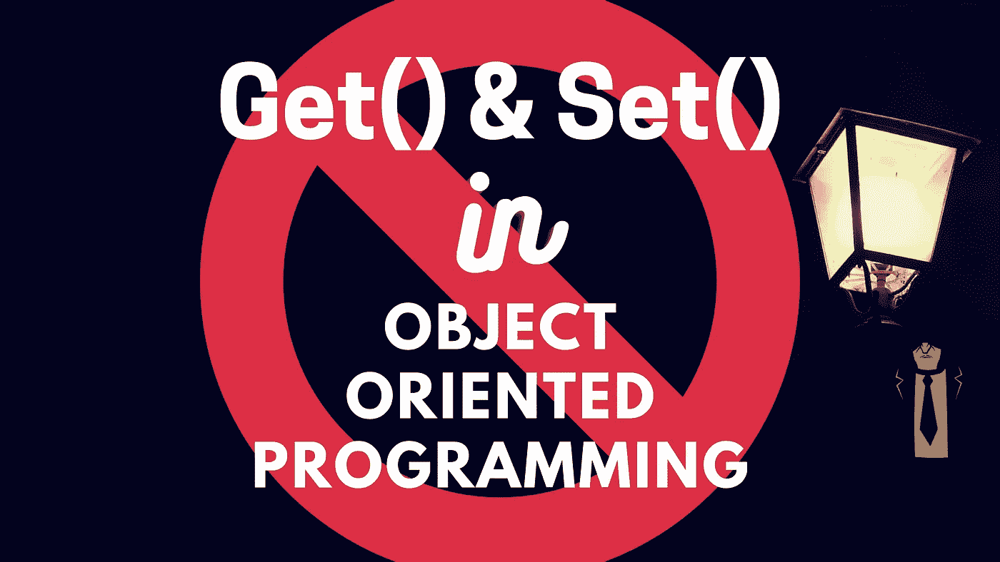

# 为什么 Getters & Setters 不是 OOP，而是使用这种技术

> 原文：<https://medium.com/codex/why-getters-setters-arent-oop-use-this-technic-instead-665c05c310e4?source=collection_archive---------0----------------------->

## Yegor Bugayenko 的打印机概念如何最终实现正确的 OOP 封装

[作者](http://www.arnoldcode.com)与【Canva.com】和[制作的图片](https://www.canva.com/)

Getters 和 Setters 是常见的做法，但从根本上违背了 OOP。

[Allen Holub](https://en.wikipedia.org/wiki/Allen_Holub) [描述了](https://www.infoworld.com/article/2073723/why-getter-and-setter-methods-are-evil.html)getter 和 setters 如何让你的代码在可维护性方面变得糟糕。他还指出，这种整体模式…