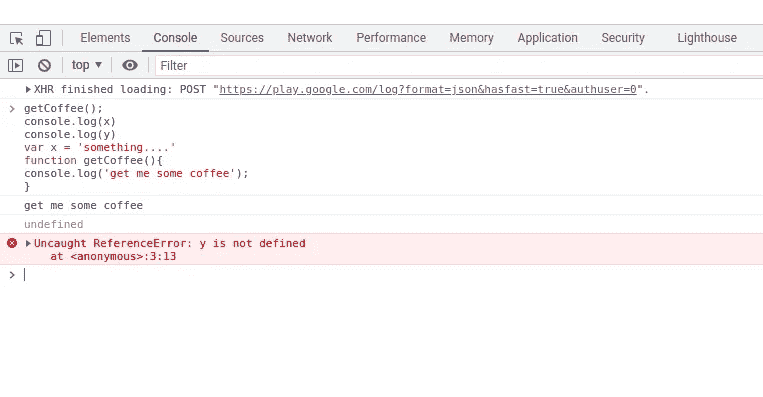

# 为什么吊装:Javascript。

> 原文：<https://medium.com/codex/why-hoisting-javascript-4d7c882b1e99?source=collection_archive---------4----------------------->


照片由[王思然·哈德森](https://unsplash.com/@hudsoncrafted)T2【Unsplash】拍摄

*不！没有抬起来，只有回忆。*

一段时间以来，我一直在研究什么是吊装，经过一些研究，我发现并不是所有关于这个特殊概念的资源都是 100%清楚的。这就是为什么我花时间以一种简单易懂的方式写这篇文章。

欢迎每个人阅读这篇文章，但是当然，你应该对 Javascript 的基础知识有很深的了解。好了，我们终于可以深入了解起重是怎么一回事了。

# 大问题:什么是吊装？


埃文·丹尼斯 [Unsplash](https://unsplash.com/photos/i--IN3cvEjg) 拍摄的照片

*提升是 javascript 中的一种现象，函数或变量甚至在初始化之前就可以被访问或调用。*

让我们检查一下这个代码示例，这样更直观:

```
getCoffee();console.log(x)console.log(y)
var x = 'something....'function getCoffee(){
console.log('get me some coffee');
} 
```

我们注意到“getCoffee”函数甚至在创建之前就被调用了，嗯，我们应该预料到一个你可能会想到的错误，但是这里发生了一些非常奇怪的事情。如果我们将下面的代码复制到我们的开发工具中，我们会发现有一些事情正在发生。



当我们在浏览器中运行代码时，我们会得到这个结果，我希望您关注三件事:第一个结果是从函数“getCoffee()”中得到的，未定义的结果是从控制台日志记录 x 中得到的，最后一个未捕获的引用错误:说 y 未定义是从控制台日志记录 y 中得到的。

让我们假设我们至少理解了“getCoffee()”函数，那么从控制台日志记录 x 返回的 undefined 呢，我们为什么不也得到结果并打印出来呢？我会回答这个问题，但首先我想让你知道这是由 javascript 中的提升引起的，提升可以有两种形式，即:**部分提升**和**完全提升。**

他们到底有什么区别？**部分提升**在创建阶段，将其变量的值设置为未定义。当我们检查窗口对象时，我们可以清楚地看到这一点。在下面的截图中，您应该已经看到变量 **x** 被设置为未定义。它得到了分配的内存，但是没有赋值，所以它自动将这个值设置为 undefined。注意，这发生在变量(var)中，但不适用于 ES6 变量，即 let 和 const。


在**完全提升时，**函数也获得分配的内存，但其值已定义，我们返回完整的函数。当检查窗口对象时，我们还会发现函数“getCoffee”存在，它返回完整的函数，就像在我们的代码编辑器中编写的一样。花点时间看看下面的截图，更清楚地了解背景中发生的事情。


Less，我忘了，你还记得抛出 ReferenceError 的 console . log(y)error:y 没有定义？我们得到这个错误是因为在我们的代码中没有名为 **y** 的变量，所以我们得到一个 referenceError，需要注意的是“未定义”不同于“未定义”。是的，它们是不同的，我们可以清楚地看到，“未定义”意味着变量 y 不存在或不存在，而未定义仅仅意味着变量存在但其值未设置。

哦天啊！那太多了，去休息一下，然后你可以继续...欢迎回来！那么幕后到底发生了什么呢？

# 在幕后

当提升发生时，后台有很多事情在进行，变量和函数在创建阶段获得分配的内存，对于变量，它们在函数被定义时获得一个特殊的值 undefined。如果提升必须发生，javascript 引擎会寻找两个特定的关键字，它们是**变量**和**函数声明**。如果这些关键字不存在，我们会得到一个 referenceError。

```
(function cook(){ 
  console.log('cooking....')
})
// if we try to call the cook() function we will get Uncaught ReferenceError: cook is not defined 
```

我们用一个括号把函数声明包起来，这样做是为了隐藏函数不被提升。因为 Javascript 引擎没有找到 function 关键字，所以会抛出一个错误。

## 提升是否发生在所有功能中？

嗯，不，它不会发生，原因是这样的，在调用函数的三种不同方式中，这些不同的方式是**函数表达式**、**函数声明**和**箭头函数**，只有**函数声明**会被提升。

```
// function expressionconsole.log(playSong())var playSong = function(){ console.log('playing jason derulo')}If we try to call the function we will get an error, this is because we can only call the playSong() function after its defined
```

它们都被部分提升，这意味着它们没有被定义为一个值。但棘手的是，只有当我们调用 console.log(playSong)和**而不是**函数时，我们才能得到这种行为

```
console.log(playSong)var playSong = function(){ console.log('playing jason derulo')}
this way we can get the exact behavior as the var variable.
```

最后，对于 arrow 函数，我们得到了与函数表达式相同的行为。所以没必要再重复一遍。

# 吊装是一种好的做法吗？

让我们来看看这段代码

```
read()function read(){
 console.log('I am reading some novel')
}function read(){
 console.log('I am done reading the novel')
}function read(){
 console.log('I am confused')
}
```

哪个函数被返回？在 javascript 的执行阶段，javascript 引擎从下到上读取代码，并为编写的代码分配内存，如果我们有与上面相同的函数，它将只为最后一个函数分配内存，不管它找到相同的函数多少次。这里最大的问题是除了最后一个函数之外的其他函数总是会被覆盖，这意味着我们将无法运行其他函数。写好程序的最佳实践之一是**可预测性**，当你使用提升时，你将永远无法预测你的代码。在我看来，你不应该写不可预测的程序。所以我要说避免吊装。

# 总结

哇，我们终于完成了。

让我们试着回顾一下我们到目前为止所学的一切，在提升过程中，内存被分配给函数或变量，它们被赋值，提升可以有完全和部分两种形式，所有在 var 中声明的变量都是部分提升的，而函数声明是完全提升的。javascript 引擎寻找两个关键字:function 和 var，最后，您应该尽量避免提升，因为它会覆盖您的代码，并使您的程序难以预测。就这样，伙计们。一如既往，请随时发送您的反馈和您认为我可以改进的地方。干杯，编码快乐。

> *灵感来源于 Javascript:由* [*安德烈*](https://www.linkedin.com/in/andreineagoie/) *的创始人* [*零到精熟*](https://zerotomastery.io) *。*