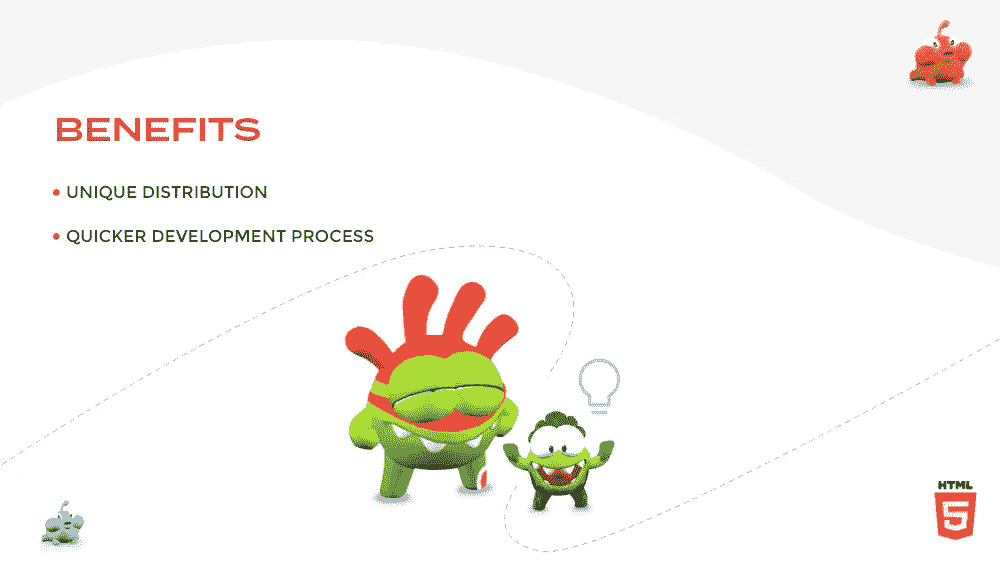

# 为什么 HTML5 是在线游戏的未来:概述！

> 原文：<https://medium.com/codex/why-html5-is-the-future-of-online-gaming-an-overview-f9c129ca5518?source=collection_archive---------5----------------------->

HTML5 是在线游戏的未来

HTML5 游戏创作不再是一个新奇的概念。它已经可以构建需要额外资源的复杂游戏。它在成为最常用的 web 技术方面取得了显著的进步。这类游戏在最优秀的游戏开发者和游戏开发服务中日益流行，强调了其漫长的旅程。HTML5 还有几个关卡是个人必须要学的。每个玩家都有一个特定的目的，关于他们想如何参与游戏。这是一个更广泛的分析，为什么 HTML5 游戏创作在游戏业务中越来越受欢迎。

让我们先关注一些 Javascript 框架和顶级的 HTML5 游戏框架，然后再来看一些备受关注的 HTML5 游戏开发特性。这些框架已经成为 HTML5 在创建惊人的游戏解决方案方面的最佳盟友，包括比特币扑克、纸牌游戏、休闲和 [***超休闲游戏***](https://www.quytech.com/blog/how-to-make-successful-hyper-casual-games/) 以及其他游戏的开发。对于 HTML5，有各种开源的游戏引擎和框架。

# HTML5 游戏开发统计

关于 HTML5 的统计数据

HTML5 已经存在一段时间了。游戏创作者使用的最流行和最广泛的技术之一。因此，为什么不应该呢？一个游戏开发者不可能要求比 HTML5 更多的设备，它提供离线资产存储，2D 和 3D 图形，音频 API，以及与所有浏览器的兼容性。

您可能不熟悉本节介绍的所有事实或统计数据。HTML5 游戏创作的成功正是得益于这些元素。以下是选择创建 HTML5 游戏的几个原因:

*   **提供跨平台支持**

HTML5 对开发者的主要好处是它的跨平台兼容性。您可以设计适应不同需求的游戏，包括屏幕尺寸、长宽比和分辨率。使用 HTML5 制作的游戏可以在浏览器以及其他操作系统上运行，包括 iOS、Android 和 Windows。

这意味着您可以在 Android 或 iPhone 设备上使用浏览器访问同一款游戏。简单来说，HTML5 实现了跨浏览器、跨平台应用的开发。这意味着只要编写一次代码，游戏就可以部署到任何地方。

你不仅可以节省大量的时间和工作，还可以节省金钱。你不会需要为各种平台制作截然不同的游戏，这就是原因。

*   **让促销变得容易**

更大的受众是 HTML5 游戏创作的目标。其原因是基于 HTML5 的游戏受到许多操作系统上运行的浏览器的支持。这意味着，每当一个游戏创作者制作了一个新的游戏，他可能会第一次通过一个简单的网站营销所有的特性。

即使分发 HTML5 游戏也是一项简单的任务。可以共享游戏玩家经常访问的网站的 URL，并且完成任务。有几个网站专门关注 HTML5 游戏。

*   **使用 WebGL &画布**

HTML5 使用 WebGL 和 Canvas 的主要技术来构建复杂的基于浏览器的游戏。游戏设计师可能会在画布上绘制形状，然后将它们转换成 3D 视觉效果。这种现成的照片可以立即上传到收藏。

网络图形库，也称为 WebGL，将游戏创作者从对插件的需求中解放出来。由于使用了 WebGL，开发人员可以简单地在互联网浏览器中集成 2D 和 3D 数据。作为游戏开发者，您可以同时使用 WebGL 和 Canvas 来创建具有高级图形的网页游戏。

WebGL 和 Canvas，简单来说，可以提升游戏体验。

*   **能应对新兴市场**

我把发展中国家或人口称为新兴市场。由于他们的进步，技术将会传播得更广。将会有更多的设备、操作系统和需求。

此外，为不同的设备制作不同的游戏听起来很吓人。不过用 HTML5 游戏开发就简单了。它提供代码重用，这有助于创作者在许多平台上发布他们的游戏。

*   **社交媒体连接**

“无店铺”游戏对社会最有益的方面是它如何链接到社交媒体。由于这些社交媒体网站已经像野火一样传播材料，任何张贴在那里的 HTML5 游戏肯定会获得巨大的人气。由于为社交媒体平台设计游戏比为个人移动平台的应用商店设计游戏更简单，这将有助于增加推广和分享的受众。

与基于 Flash 的游戏相比，基于 HTML5 的游戏更容易获得，因为它们可以更好地与社交网络平台和各种设备配合使用。作为一项技术，HTML5 已经为新的增长方式铺平了道路，并激励企业开发产品和 [**游戏开发公司**](https://www.quytech.com/game-development-company.php) 与以往不同。

# HTML5 游戏开发的好处

HTML5 中的游戏开发

HTML5 的优势已经广为人知，但我还是重申一下你为什么要做 HTML5 游戏。如果你的游戏是专门为 iOS 设计的，用 Objective-C 创建它弊大于利。然而，如果你想设计一个能在各种设备上运行的游戏，HTML5 是个不错的选择。

*   **独特分布**

到目前为止，大多数 HTML5 游戏都是使用与 Flash 和原生移动游戏应用程序开发相同的技术创建的。这很有道理，但是它忽略了使用网络作为平台的真正优势。

采用复制以前成功的东西的心态是如此简单，然而它扼杀了创新。试图完全复制在 iOS、Android 和 Flash 上有效的东西是我陷入的一个陷阱。

虽然在某种程度上复制以前的成功很重要，但开放网络是一个独特的游戏平台，只有在尝试新事物时才能发展。

HTML5 游戏的交付通常被视为一个缺点，但这仅仅是因为我们一直在将其与原生移动游戏进行比较，在原生移动游戏中，市场是购买游戏的唯一途径。HTML5 游戏提供了一个非常有效的连接。

链接不应该仅限于游戏的主页，因为它们可以很容易地在网上和移动设备上共享。利用当前的技术来进入你的游戏，做一些更刺激的事情，比如跳到某一点，试着超越一个朋友，或者和那个朋友玩一个实时游戏！

了解是什么让网站成为病毒，然后使用同样的策略让你的游戏成为病毒。

*   **更快的开发进程**

不需要等待编译；游戏一结束就可能推出更新和故障排除。

# HTML5 游戏引擎和框架

游戏引擎到底是什么？那么，游戏引擎就是游戏的框架或者是用来制作游戏的软件开发环境。游戏开发者钟爱 HTML5 游戏开发的另一个原因是游戏引擎。

一些耗时的任务由 HTML5 游戏引擎处理，也简化了游戏制作流程。以这种方式，开发者创建完全工作的 HTML5 游戏所需的时间减少了。游戏框架和引擎负责:

*   声音
*   物理学
*   地图
*   动画片
*   更多

赌场、狙击手、谜题和仿真游戏都需要上述组件。

如果你打算创建 HTML5 游戏，请考虑以下游戏引擎

*   **相位器**

可以使用 Phaser 游戏引擎来创建和编译游戏，以便在各种平台上使用。一个名为 Phaser 的跨平台游戏引擎通过支持大量插件，可以直接创建 HTML5 游戏。用 Phaser 制作的众多知名游戏有《潜艇突进》、《精灵快跑》和《海湾岛》。

*   **玩画布 WebGL 游戏引擎**

为了在桌面或移动浏览器上显示 3D 内容，如游戏，PlayCanvas 采用了 HTML5 和 WebGL。这个游戏引擎是开源的，所以任何人都可以对它进行改进。

如果想用 WebGL 和 HTML5 Canvas 创作 3D 游戏，PlayCanvas 是一个需要。它提供了出色的移动优化，非常强大，并加速了游戏创作。使用 PlayCanvas 开发了各种游戏，包括 Robostorm、Master Archer、Blast Arena 和 Swoop。

# 结束了！

总之，创建一个 HTML5 游戏有许多合乎道德的方法，每个方法的技术方面都有丰富的知识。为了这篇博客，我对 HTML5 游戏制作做了更广泛的介绍。

HTML5 也用了很久了。全球游戏开发者中最受欢迎和最常用的技术之一。HTML5 拥有游戏开发者可能需要的所有工具，包括离线资源存储、2D 和 3D 图形、音频 API 以及与所有浏览器的互操作性。

使用 HTML5 进行游戏创作有无数种可能性。上述符合当代趋势的统计数据和福利升级将使其更加经得起未来考验。

此外，如果您正在为您的移动应用程序开发寻求解决方案，您也可以在这方面寻找 [**Unity 游戏开发公司**](https://www.quytech.com/game-development/unity-game-development.php) 。

> **相关文章:** [**如何打造像 Roblox 这样的角色扮演游戏平台？**](https://www.quytech.com/blog/how-to-create-rpg-like-roblox/)