# 为什么是 HTTP/3？

> 原文：<https://medium.com/codex/why-http3-cacb2aa45938?source=collection_archive---------6----------------------->

为了理解我们为什么需要 HTTP/3，让我们花些时间首先理解一些基本的网络术语，然后了解整个互联网在 HTTP 协议上是如何发展的

在电线上，传输的是互联网数据包。它是由不同网络协议添加的数据+元数据的结构化信息。

网络协议形成一个堆栈来处理不同方面的工作。在 IP 数据包中，每个协议都添加自己的元数据(称为报头),以插入安全传输和传递这些数据包所需的信息。

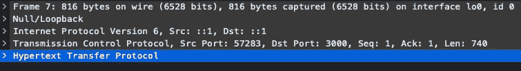

分组有效载荷

让我们一点一点地理解几个重要的协议

# 互联网协议:

> *IP (* [*互联网协议*](https://datatracker.ietf.org/doc/html/rfc791) *)是网络层协议****(***[***第三层***](https://images.app.goo.gl/XK2GxHqUV1hCUe7C9)***)****用来在两台机器之间传输数据。互联网协议在其报头中添加源和客户端 ip 地址，这样当任一端接收到数据包时，ip 协议负责决定是接受还是丢弃数据包。*

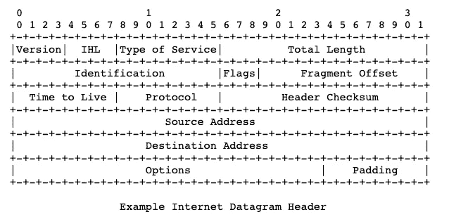

[IP 协议头](https://datatracker.ietf.org/doc/html/rfc791)

如果需要通过小型分组网络传输，因特网协议还提供长数据报(也称为数据或消息)的重组。

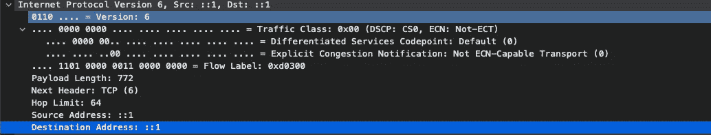

IP 协议还有更多，请访问[https://datatracker.ietf.org/doc/html/rfc791](https://datatracker.ietf.org/doc/html/rfc791)了解更多信息和报头字段的每个功能。

互联网协议不可靠，不能保证数据包的传送以及数据包被接收的顺序。所以这是高层协议的工作。

# 传输层协议:

有了 IP 报头，我们就可以知道哪台计算机向我们发送了 internet 数据包，哪台计算机应该接收该数据包，但我们不知道在某个端口上运行的哪个应用程序发送了该数据包，以及哪个应用程序将在客户端或服务器端接收该数据包。

为此，我们使用 TCP 和 UDP 协议。TCP 也被认为是一种可靠的协议，除了添加源端口和目的端口，它还执行许多其他功能。

## 传输控制协议:

> *TCP 是传输层****(***[***第 4 层***](https://images.app.goo.gl/XK2GxHqUV1hCUe7C9)***)****的协议。它允许不同端点上的两台机器可靠地交换数据。把它想象成一个邮递员，他会保证把我们的信息从主机送到目的地，没有任何丢包*

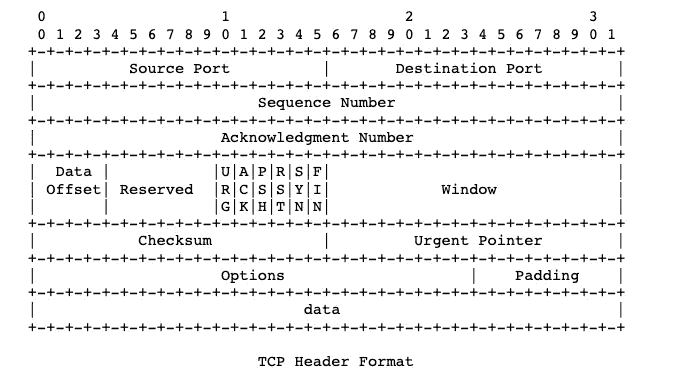

TCP 是一种基于连接的协议，在由 4 元组标识的 3 次握手期间创建。这个 4 元组也被称为套接字

*   源 IP 地址
*   源端口
*   客户端 IP 地址
*   客户端端口

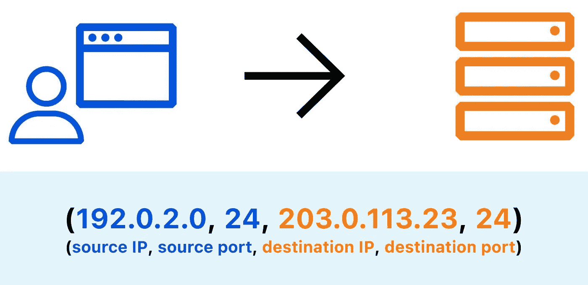

## TCP 协议的工作原理:

*   创建新连接时，TCP 首先开始与服务器进行 3 次握手

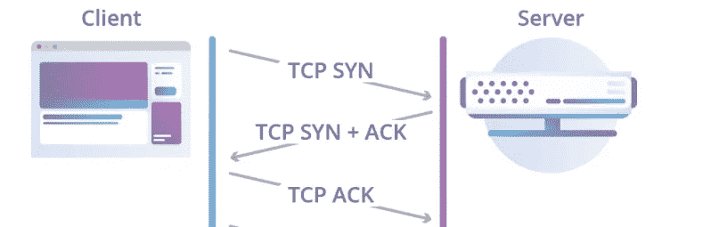

在此过程中，客户端和服务器彼此共享初始序列号。

客户端和服务器使用序列号和确认号来计算发送和接收的字节数。序列号可以随机选择，这只是一种方式，表示我开始计算以这个号码发送的数据。

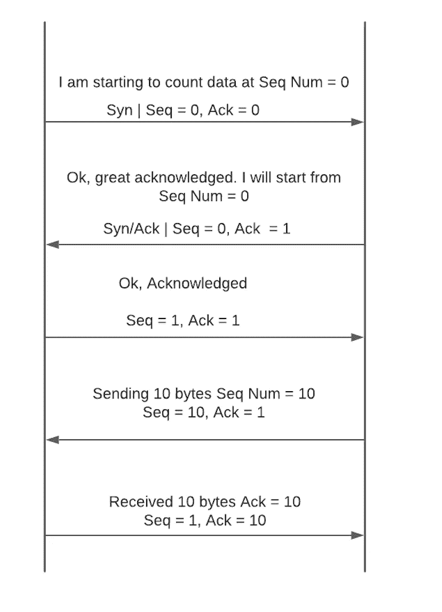

这是由于序列号和确认号，如果数据包丢失，TCP 可以重新传输数据，并能够以合理的方式对数据进行排序。但是这是有代价的，所有这些开销使得 TCP 很慢。这就是为什么创建一个新的 TCP 连接和通过 TCP 传输数据是缓慢的。

## 用户数据报协议:

UDP 协议是一种无连接协议，也不保证 IP 数据包的传递和顺序，因为它缺乏 TCP 提供的功能，使其比 TCP 更快。UDP 协议添加的元数据的大小较小，这为我们提供了较小数据包消耗较少带宽的优势。

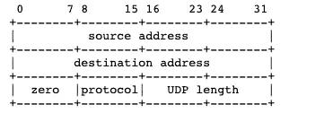

UDP 报头

## 超文本传输协议:

> HTTP(超文本传输协议)是应用层 **(** [**第 7 层**](https://medium.com/r?url=https%3A%2F%2Fimages.app.goo.gl%2FXK2GxHqUV1hCUe7C9) **)** 协议，互联网上的两台机器客户端和服务器使用该协议相互通信。把它想象成语法，它塑造了用来交流的语言。

## Http 的历史:

HTTP 协议是在 20 世纪 90 年代引入的。这是一个建立在 TCP/IP 协议之上的协议。

## HTTP 1/1.1:

HTTP 1/1.1 使用基于文本的协议，即使当它发送数据时，它只是发送原始字节，而不是它们的文本编码。但是让 HTTP 成为文本协议的是数据的交换方式。

在 HTTP/1.1 之前，我们使用基于文本的协议，但在 HTTP/2 中，我们切换到基于二进制的协议，从而减少了数据包的大小，消耗了更少的带宽。

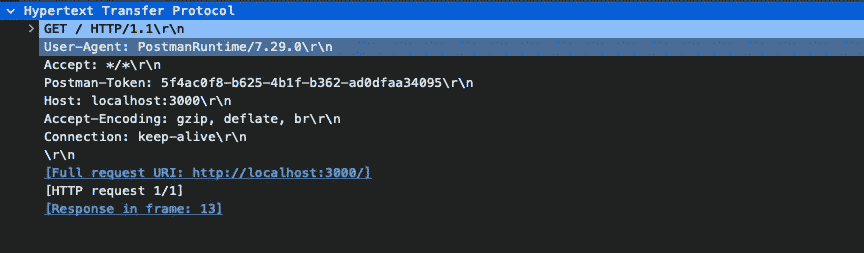

**基于不同黑白文本和二进制的协议**

基于二进制的协议面向数据结构，基于文本的协议面向文本(也称为字符串)

例如:

假设我想发送一个 32 位的整数值:1000000000，即 10⁹

在二进制中，只有 4 个字节。然而，如果我做的是纯文本协议，我必须发送:1，0，0，0，0，0，0，0，0。那是 10 个字节。

2.在 HTTP/1 中，一旦请求得到满足，TCP 连接就会关闭，正如我们所知道的，创建一个新的 TCP 连接和关闭一个新的 TCP 连接是很昂贵的，如果我们多次发送和接收数据，就会招致巨大的损失。

因此，在 Http/1.1 中，引入了一个新的报头 **keep-alive** 来使连接在一段时间内保持打开，这允许客户端重用 TCP 连接，从而消除了初始连接建立的开销以及跨多个请求的缓慢启动

## HTTP 2:

HTTP 2 协议于 2015 年推出。它仍然是建立在 TCP/IP 协议之上的*协议。*

1.  使用基于二进制的协议来询问如何交换数据会导致执行更小的数据足迹。

2.尽管 **keep-alive** 报头允许我们为多个请求重用同一个 TCP/IP 连接，但我们仍然只在这个连接上执行一个请求/响应周期，这导致了 HTTP/2(又名 SPDY)的引入，它是由 Google 开发的，引入了 HTTP 流的概念。一种抽象，允许 HTTP 实现将不同的 HTTP 交换并发复用到同一个 TCP 连接上。

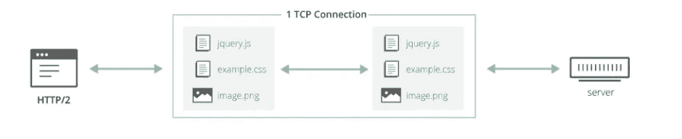

HTTP/2 解决了这个问题，即单个 TCP 连接的低效使用，因为多个请求/响应现在可以同时在同一连接上传输。

然而，所有的请求和响应都同样受到数据包丢失的影响。即使丢失的数据只涉及单个请求。这是因为虽然应用层的 HTTP/2 可以在不同的流上隔离不同的 HTTP 交换，但是 TCP 仍然不知道这种抽象，它看到的只是没有特定含义的字节流。

TCP 是一种可靠的协议，它保证数据包的顺序和传递，因此当 TCP 发现携带这些字节的数据包丢失时，它会重新传输丢失的数据包，从而导致属于完全独立的请求的数据包的传递延迟，在这些请求中没有数据包丢失。这个问题被称为“行首阻塞”。

## HTTP 3:

进入了一个叫做 QUIC 的新协议，它是由 google 引入的。早在 2013 年，也就是 HTTP/2 协议发布的两年前，谷歌就尝试了这种协议，并在 QUIC 上部署了 HTTP/2。

QUIC 是建立在 UDP 之上的一种新的传输层协议。HTTP/3 现在使用 QUIC 作为它的传输层。

*   由于握手比 TCP 上 TLS 更快，所以新 QUIC 连接的创建更快。

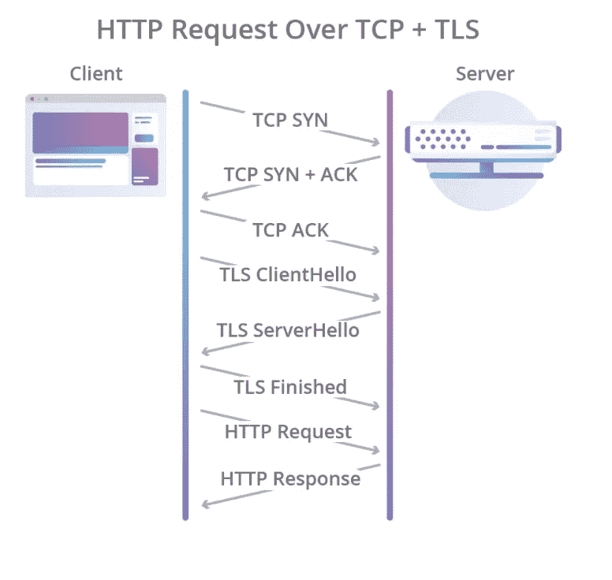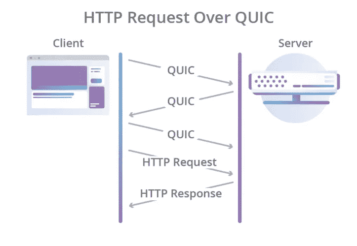

*   QUIC 借助并行流解决了头部阻塞问题
*   QUIC 在传输层提供流，因此任何建立在 QUIC 之上的应用级协议都将免费获得并行流，无论是 HTTP、WS、GRPC、FTP、SMTP。以前，流作为一项功能位于 HTTP/2 的应用层。 **HTTP/2 是 TCP 上的二进制多路复用，而 HTTP/3 是多路复用 QUIC 上的二进制多路复用**

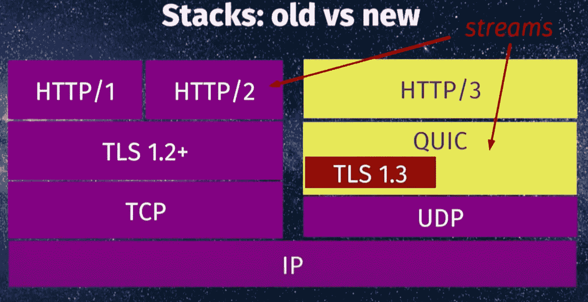

谢谢你跟随了这么久。让我在评论中知道这篇文章的任何改进。