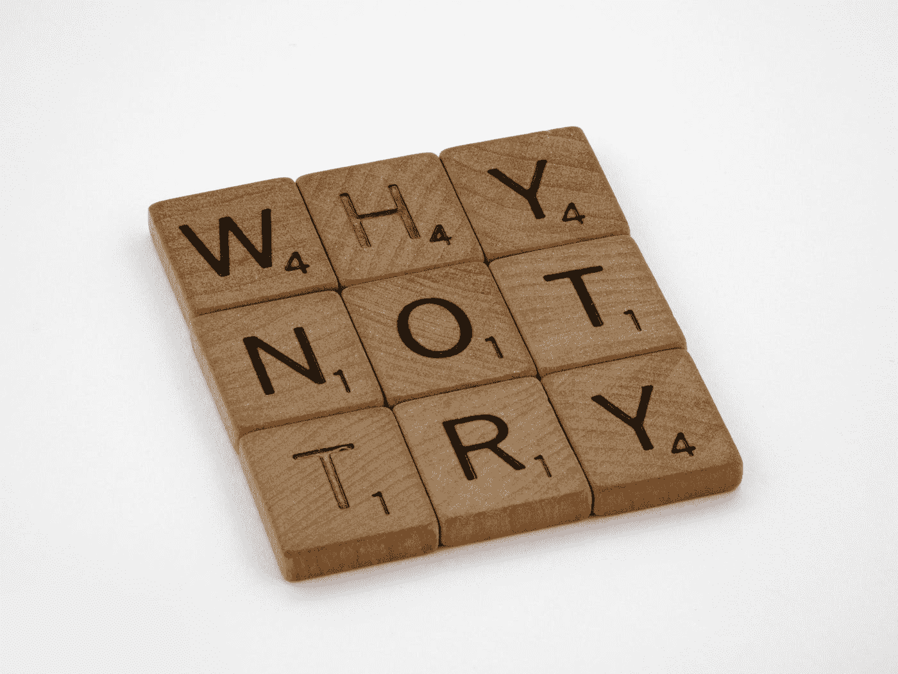

# 为什么我不喜欢测试

> 原文：<https://medium.com/codex/why-i-disliked-tdd-96c7a7dfff1e?source=collection_archive---------8----------------------->

## 几年前我非常沮丧，每个人都在谈论测试、TDD 等等。这对我毫无意义。我的观点就是这样改变的。

布雷特·乔丹在 [Unsplash](https://unsplash.com?utm_source=medium&utm_medium=referral) 上的照片

**TDD 和 testing 有什么值得如此炒作的？**也许你和十年前的我一样，认为测试和 TDD 比回报更昂贵。我记得去了很多聚会…