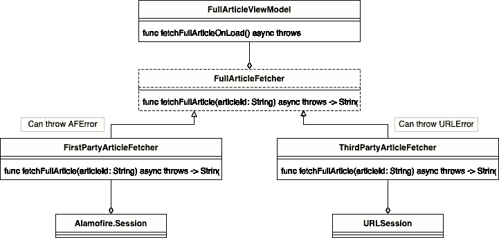

# 为什么我不喜欢斯威夫特的“投”

> 原文：<https://medium.com/codex/why-i-dont-like-swift-s-throws-ec7bb672cd1e?source=collection_archive---------8----------------------->

以及为什么您仍然应该使用结果。

# 投掷函数的主要问题是

Swift 有一系列表示失败的机制:抛出函数、断言和结果类型。

我向你保证，抛出函数是不好的，因为它们阻止我们创建健壮的、可维护的系统，因为当抛出函数起作用时，根本不可能执行编译器辅助的依赖注入。

# 讨论一个示例系统

出于讨论的目的，我认为有一个示例系统是值得的。我们的系统将是苹果新闻应用的过度简化版本。

## 以下是要求

1.  用户得到一个文章列表，他们可以点击打开并查看完整的文章。
2.  文章可以来自各种不同的来源，但在我们的例子中，我们将简化这两个只有两个:第一和第三方，1P 和 3P 的简称。这两种文章类型有独立的后端。
3.  打开一篇文章后，一个新的屏幕会显示文章的全部内容
4.  文章可能需要订阅才能完整查看。如果用户没有订阅，则屏幕上会显示一条错误消息，旁边是获取订阅的选项。
5.  如果用户没有订阅，对于需要订阅的文章，1P 后端将返回 403 错误
6.  如果用户没有订阅，对于需要订阅的文章，3P 后端将返回 401 错误
7.  如果加载文章时出现互联网连接故障，应该向用户显示一条消息，要求检查他们的互联网连接
8.  任何其他类型的错误(如服务器返回 500)都应该向用户显示未知的错误消息。

## 潜在的高级设计

我特别想关注用例 2-8。为处理这些需求而实施的虚拟系统由 4 个主要组件组成:

*   一个 FullArticleViewModel，负责管理 UI
*   一个 FullArticleFetcher 协议，它抽象了下载文章的工作。它由 FullArticleViewModel 使用
*   一个 firstparticlefetcher full articlefetcher 的具体实现:由团队 A 维护并处理获取第一方文章。它使用 Alamofire 作为其支持网络层
*   FullArticleFetcher 的第三方具体实现:由团队 B 维护，处理获取第三方文章。它使用 URLSession 作为其支持网络层。

这里使用的两个网络堆栈是我们不希望在生产应用程序中看到的。也就是说，如果你没有在你工作过的至少一个应用程序中看到类似的东西，如果不是更糟的话，我会非常羡慕你。

## V1 实施

让我们快速回顾一下这个系统可能出现的一些错误:

我们将手动挥动网络代码并查看管理代码，因为这不是本文的重点。因此，让我们看看我们的视图模型现在必须处理的逻辑，以解决可能的错误:

呀。以上有几个问题。

首先，我们的核心业务逻辑需要意识到 Fetcher 类中的具体实现细节可能引发的所有可能的错误。这不仅使 catch 调用看起来很可怕，而且还引入了维护风险。重构具体的提取器或引入新的提取器可能会导致引发新的/不同的错误，catch all 子句无法正确处理这些错误。这是对依赖性反转原则(DIP)的微妙违反，该原则规定:

> 实体必须依赖于抽象，而不是具体。它声明高级模块不能依赖于低级模块，但是它们应该依赖于抽象。

## V2，精简错误

解决这个问题的第一步是引入一个新的错误类型，它属于 ViewModel。它列出了 ViewModel 期望处理的所有可处理的情况:

这允许我们重构 catch 子句，只处理 FullArticleFetchError，并将错误转换转移到具体的实现中。我们可以进一步记录 FullArticleFetcher 协议，声明实现只需要抛出 FullArticleFetchError。

## V3，定义一个强的 DI 契约

然而，上述实现仍然依赖于软契约。如果开发具体实现类的开发人员不注意，他们可能会忽略界面中的建议。

我们需要一种方法让协议定义可以处理什么样的错误。不幸的是，swift 不支持类型化抛出。那么，如果我们返回结果类型，而不是使用抛出，会怎么样呢？

下面是版本 3:

因为我们现在使用结果，所以让我们一起去掉 do/try catch:

现在我们有了。我们的业务逻辑现在得到了控制，并且保证提取器总是符合它们的接口。

# 这不是一个新的拍摄

这种优势在 Swift 的[**error handling rational . rst**](https://github.com/apple/swift/blob/main/docs/ErrorHandlingRationale.rst)中被叫了出来:

> 标记的、静态强制类型化传播的另一个小优点是:它有利于某些类型的重构。具体来说，当重构使一个操作产生错误时，这些属性的缺失会使重构更加危险，并增加意外引入 bug 的几率。如果传播是非类型化的，或者类型化不是静态执行的，编译器根本不会帮助您找到需要错误检查代码的调用点。即使使用静态类型的传播，如果没有在调用位置专门标记传播，编译器也不会警告您从可以处理或隐式传播错误的上下文中进行的调用。但是如果这些都是真的，编译器会强迫你单独查看所有现有的调用点。

但是我觉得上面的文件掩盖了这个优势的重要性。希望把上面的例子放在一起有助于说明这一点，因为这是一个非常简单的例子。生产系统会复杂得多。

我觉得很奇怪，斯威夫特去了无类型的投掷方向。该文档涵盖了类型化传播的一些缺点，但它们似乎是针对积极的函数重用的相对较小的问题。我认为这些缺点中的一些可以被解决，并且在系统设计层面上影响较小。

在 swift 社区中有一个关于 [**类型投掷**](https://forums.swift.org/t/typed-throws/39660/182) 的公开提议，要求类型投掷，在那里可以找到许多其他好的论点。

就我个人而言，我认为合并流中结果类型和强类型错误的存在正好显示了如果采纳该建议，可以获得多大的兼容性。

## 还有哪些反论点？

该提议中的一个线程链接到了 artima——检查异常的麻烦( ),这是 Kotlin 缺少“类型化抛出”背后的基本原理。然而，我认为这个决定更像是对 Java 异常的本能反应，在 Java 异常中，一个函数可以声明一系列不同的异常。事实上，[**exceptual Java**](https://accu.org/journals/overload/10/48/griffiths_406/)中描述的方法是一个很好的例子，说明了如何通过强制每个函数抛出一种错误类型来缓解这个问题。

# 结论

我希望这篇文章有助于阐明我所认为的 swift 中更好的错误处理实践。不管你同意还是不同意我的观点，我都很乐意通过喜欢这篇文章或者评论来听听你的想法。