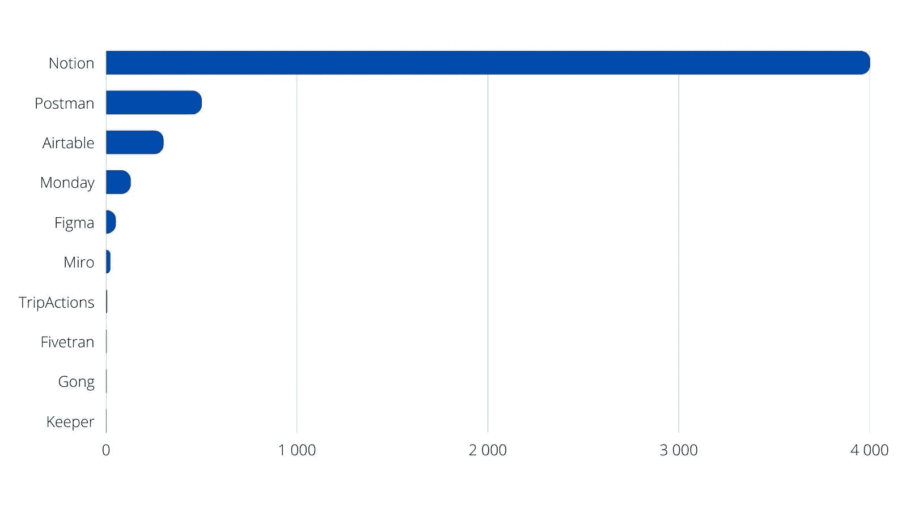

# 为什么我不信任 Okta 的 2022 年增长最快的应用程序列表

> 原文：<https://medium.com/codex/why-i-dont-trust-okta-s-fastest-growing-apps-2022-list-3e5f855685e3?source=collection_archive---------3----------------------->

## 分解“2022 年工作中的企业”的数字。

这就是现实。作者使用 [Canva](https://canva.com) 创建的图表。

我想你现在已经看过很多次**2022**增长最快的应用图表了。自从一月份发布以来，它就一直在 [Linkedin](https://www.linkedin.com/posts/richardsvahn_digital-product-growth-activity-6937852217727062017-r6FM?utm_source=linkedin_share&utm_medium=ios_app) 和 [Twitter](https://twitter.com/meisenberg/status/1486688588347559944?s=21&t=2zzrk3q-2khznG9H0jVePA) 和 [Medium](https://blog.curiosity.ai/ten-fastest-growing-apps-in-2022-including-some-you-dont-know-c177e46cc5f1) 上传播。(你试过 Linkedin 上搜索查询*增长最快的应用 2022* 吗？它产生了数百个帖子…