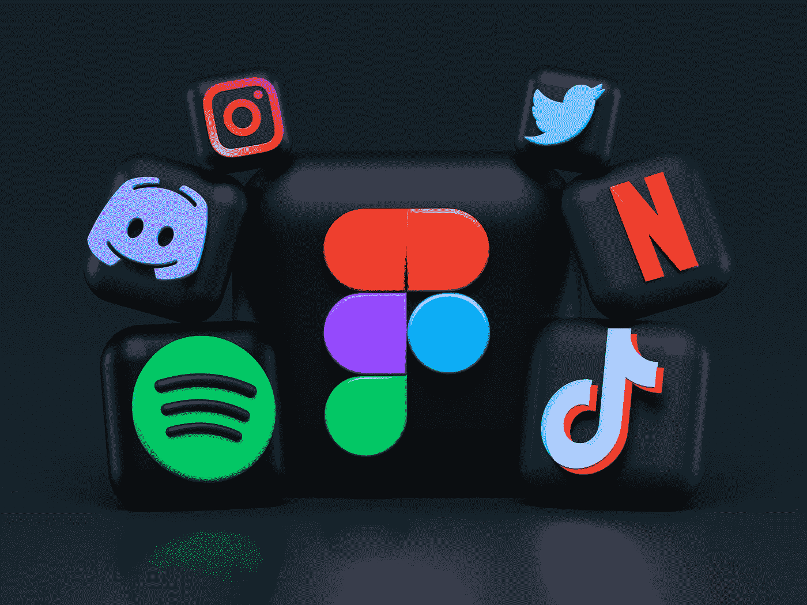

# 为什么我喜欢使用付费应用

> 原文：<https://medium.com/codex/why-i-like-using-paid-apps-f0e46dd45be4?source=collection_archive---------9----------------------->

亚历山大·沙托夫在 [Unsplash](https://unsplash.com?utm_source=medium&utm_medium=referral) 上拍摄的照片

> 天下没有免费的午餐。

在过去的几年里，我们已经非常习惯于免费的应用和服务。

想想你每天使用的一些最流行的应用程序:谷歌搜索、谷歌驱动、谷歌文档、脸书、Messenger、WhatsApp、YouTube、Instagram、抖音。

所有这些应用程序有什么共同点？**他们是自由的。你不用花一分钱去使用它们。**