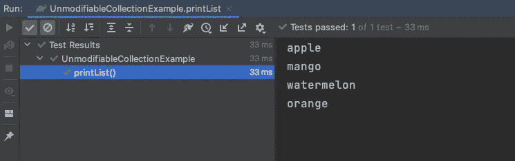

# 为什么我更喜欢番石榴的不变集合而不是 Java 的不变集合？

> 原文：<https://medium.com/codex/why-i-prefer-guavas-immutablecollection-over-java-s-unmodifiablecollection-d9f546122402?source=collection_archive---------6----------------------->

照片由[大卫·拉古萨](https://unsplash.com/@davideragusa?utm_source=unsplash&utm_medium=referral&utm_content=creditCopyText)在 [Unsplash](https://unsplash.com/s/photos/strings?utm_source=unsplash&utm_medium=referral&utm_content=creditCopyText) 上拍摄

有时，我们会遇到需要在 Java 中创建不可修改的集合的情况。创建此类集合最流行的方法是

*   使用 Java 的内部包装方法(`java.util.Collections#unmodifiableX`)
*   使用谷歌的番石榴库(`com.google.common.collect.ImmutableX`)

*大多数时候，番石榴库是我默认的选择，在这篇文章中，我将解释为什么。*

*原因只有一个——Java 的不可修改集合具有误导性，容易出错。如果在没有真正理解它们的行为的情况下使用它们，它们将隐藏错误。*

# *Java . util . collections #不可修改列表*

*让我们看看下面的例子。*

*在上面的代码中，我们创建了一个水果列表。然后，我们将水果列表传递给`Collections.unmodifiableList()`助手方法，该方法返回另一个不可修改的列表。在第 10 行，我们试图通过添加一个新的水果来修改列表。当我们运行这段代码时，我们得到`java.lang.UnsupportedOperationException`*

*不是意料之中的吗？绝对是。这就是误导。这给了我们错误的信心，以为我们得到了一个永远不会改变的不可变列表。*

*让我们稍微修改一下上面的代码。*

*在这个例子中，我首先获得了一个不可修改的列表，然后修改了原始列表。当我打印`unmodifiableFruits`列表时，输出是这样的—*

**

*这不是很奇怪吗？你不是期望列表是不可变的吗？我做到了。*

*那么，怎么回事？`java.util.Collections#unmodifiableList`方法只返回一个包装器，对所有可以修改列表的操作抛出`UnsupportedOperationException`。但是，它不会创建原始列表的防御性副本。因此，如果您在代码中引用了原始列表，并且如果该列表被意外修改，您将会看到意外的行为，并且很难找到错误的原因。这就是我所说的‘误导’。*

*来自`java.util.Collections`类的所有其他`unmodifiableX`方法也是如此。也许这些方法的目的不是返回不可变的集合，但是，如果不知道它们的行为，在代码中使用它们是非常危险的。*

# *芭乐永恒的拯救系列*

*让我们修改前面的代码，使用 Guava 的 ImmutableList 类来获得一个真正的不可变列表。*

*这里，在第 8 行，我使用了`com.google.common.collect.ImmutableList#copyOf`方法从我原来的可变列表中获得一个不可变列表。返回的列表是原始列表的防御性副本。如果原始列表发生任何变化，防御副本不会产生任何影响。此外，像`List#add`这样的赋值方法会抛出`UnsupportedOperationException`，因此列表根本无法修改。这是鼓舞人心的。*

*番石榴有像样的文件。这里我会推荐大家看一下[。](https://github.com/google/guava/wiki/ImmutableCollectionsExplained)*

# *一句警告*

*你可能已经注意到，我在第一段的大部分时间里都强调了'***'***'。你可能会问为什么我不一直使用 Guava 的不可变集合。这是一个公平的问题。*

*Guava 不可变集合不支持`null`元素。看起来这是他们有意识的决定。在他们的文件中，他们提到—*

> *每个 Guava 不可变集合实现*都拒绝空值。*我们对谷歌的内部代码库进行了详尽的研究，研究表明`null`元素在集合中被允许出现的时间约为 5%,而其他 95%的情况下最好通过在 nulls 上快速失败来实现。如果需要使用空值，可以考虑在允许空值的集合实现上使用`Collections.unmodifiableList`和它的朋友。*

*如果原来的可变列表有`null`元素，`ImmutableList#copyOf`会抛出一个`NullPointerException`。只有当你绝对确定你的收藏没有`null`元素时，才使用番石榴。*

*此外，创建防御性副本的成本略高。因此，与 Java 不可修改的集合包装器相比，创建这些不可修改的集合将花费更多的时间。如果您的应用程序是性能关键型的，您可能希望避免使用 Guava 库。*

*感谢阅读。如果你已经走了这么远，希望你已经找到了一些有用的东西。别忘了鼓掌，跟着学。*