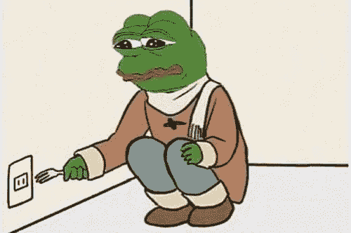

# 为什么我花了 4 年时间学习原本需要几周时间的编程概念(初学者路线图)

> 原文：<https://medium.com/codex/why-i-spent-4-years-learning-programming-concepts-that-would-have-taken-a-couple-of-weeks-a-295051b2ac9d?source=collection_archive---------5----------------------->

好吧，我还是现在就放个免责声明吧。不，我没有花 4 年的时间天天写代码。我只是花了比应该花的时间更长的时间，如果我能回到过去，我肯定会比最初做得更不同。

我 12 岁就开始了我的编码之旅(你们可能认为这对一个程序员来说太老了，但我生活在一个‘倒退’的国家，所以对我来说太年轻了:])。我现在 17 岁了，老实对网上的朋友说，和 4 年前相比，我真的没有提高多少，这真的很可悲。这是我还是以前那个耻辱的原因，我正在努力改正(等待掌声停止)。我很乐意与你分享我的经验，希望你能学到一些东西，对你的编程之旅有所帮助。

我希望我能讲述一个关于我如何开始编程之旅的惊人故事，但是我不能。我是通过我哥哥进入编程领域的，他就在那个领域，因为我只是一个没有方向的傻孩子，所以我也想进入那个领域。我问我哥我该学什么编程语言，Python 他回答。我哥哥主要专攻 Javascript 及其框架，当时没有任何 python 方面的经验。所以他为什么向我推荐它将永远是个谜。作为一个 12 岁的程序员，自学 python 2.7 绝对是一场苦战。我不得不自己研究我不了解的技术，没有任何人的帮助，甚至包括我在 youtube 上的朋友，因为我不知道如何充分利用当时可用的所有技术教程，如 Brad Traversy 和 FreeCodeCamp。这是艰难的，我仍然记得我第一次成功地在我的系统上安装 python 2.7 并让它打印“hello world”，我真的很高兴。我觉得自己像个天才，向所有的朋友吹嘘自己的成就，感觉自己势不可挡(我辞职了几个月，疯狂地看动漫:])。

我一直在学习 python。现在回想起来，都是我哥哥的错，我才这么糟糕，哈哈。我不知道我在做什么，他所知道的就是取笑一个 12 岁的孩子，因为他不知道什么是多态:[(这是一种继承形式，在 double-op 中，它允许你传递一个子类作为方法，本质上使你的代码更可重用或其他)。后来我终于找到了一本书，它对我帮助很大，是迈克·德温的《python 绝对初学者》，这是一本非常好的书，我仍然经常把它作为参考。我真的很擅长 python，就像真的很擅长，但是我不知道如何利用我当时所拥有的知识，所以我只是盲目地学习一些东西，因为我没有方向或目的感。我学到的大部分东西都不再伴随着我了。我对 web 开发行业非常不情愿，因为我不认为它是“真正的编程”，我承认这是错误的。在某个特定的时刻，我变得非常慌乱，决定放弃并追寻我曾经有过的成为国际象棋特级大师的梦想，但那是以后的事了:)。

我真希望我当时能像现在这样有更强的紧迫感。我会申请导师，甚至是无薪实习，来了解编程行业实际上是如何运作的。我现在的编程路线图有点像这样:Python→GUI→Html→CSS→bootstrap→Materialize→Java→py game→Django→Web screwing→Web hosting→JavaScript→Rest Api→react。我希望掌握母语并获得更多的工作经验。我选择不去关注所有的负面因素，而是专注于现在，因为正如一位智者曾经说过的那样，“过去是历史，未来是神秘的，但现在是一份礼物，这就是为什么它被称为现在”(最受欢迎的功夫熊猫)