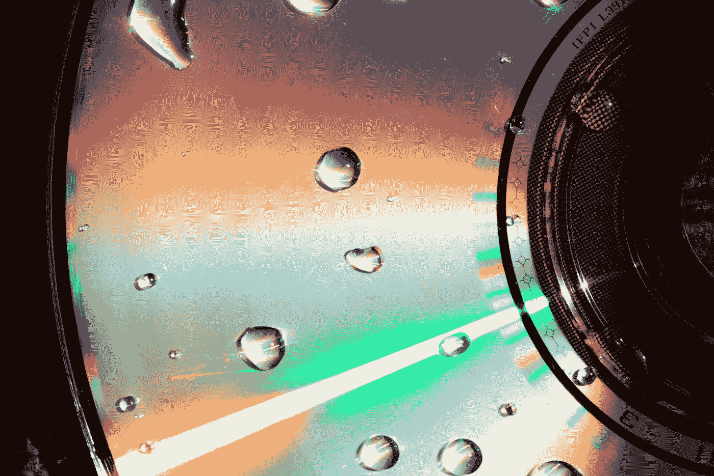

# 为什么我还在蓝光光盘上备份？

> 原文：<https://medium.com/codex/why-i-still-backup-on-blu-ray-disks-9ee20616c1a5?source=collection_archive---------3----------------------->

## [法典](http://medium.com/codex)

## 以及为什么备份解决方案远非完美

由[vini cius“amnx”Amano](https://unsplash.com/@viniciusamano?utm_source=medium&utm_medium=referral)在 [Unsplash](https://unsplash.com?utm_source=medium&utm_medium=referral) 上拍摄

说到备份解决方案，这可能是最让我担心的话题。有选项可用，不代表有足够多的好选项。

让我们谈谈可用的备份选项:

*   *硬盘*