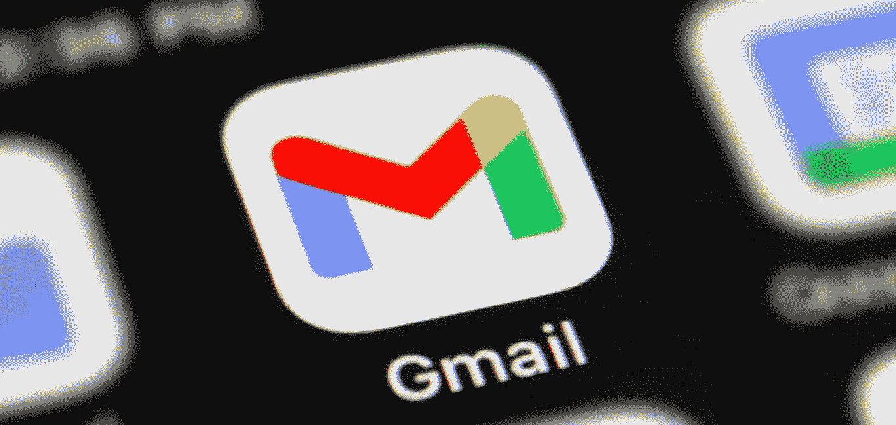
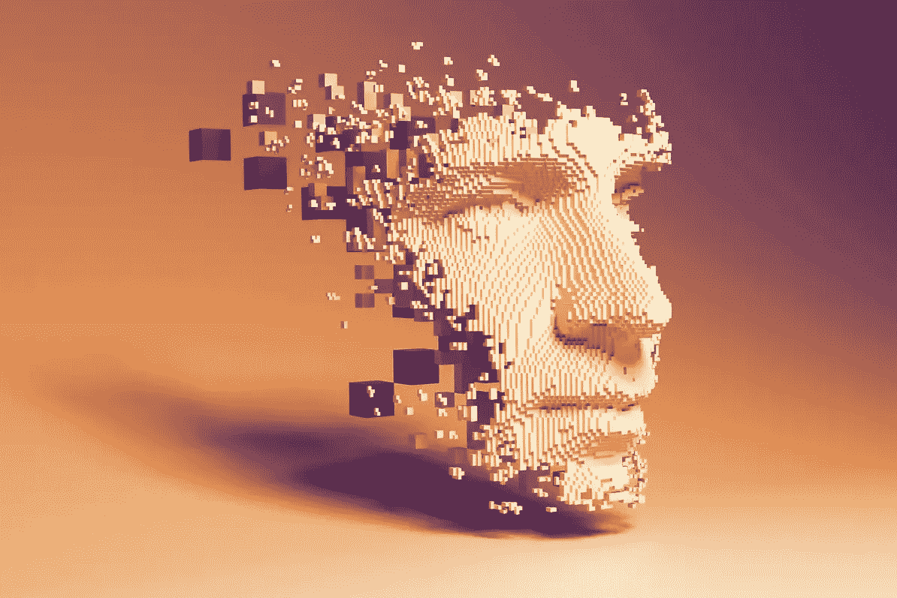
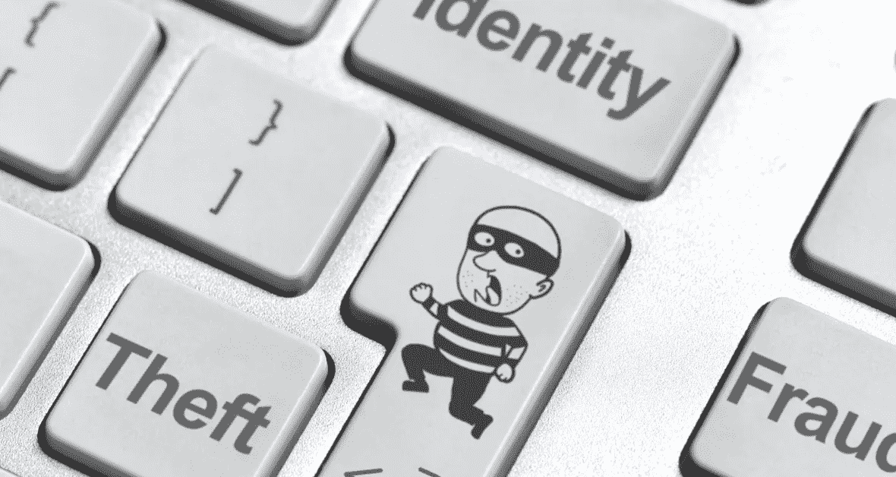

# 为什么我停止使用 Gmail——为什么你也应该停止使用

> 原文：<https://medium.com/codex/why-i-stopped-using-gmail-and-why-should-you-too-c542341ef8f1?source=collection_archive---------0----------------------->

## 谷歌，身份和安全

信贷— TechCrunch

大家都用 Gmail 吧？我用它，你用它，这取决于你是否为你的祖母创建了一个脸书个人资料，你可能也为她创建了一个 Gmail 地址。

所有这些都很好，听起来也不错——但问题是 Gmail 几年前就不再仅仅是一个联系渠道了。它与你的身份紧密相连，如今不仅仅是在互联网上。

鸣谢——马克西姆·特卡琴科/盖蒂图片社

想想所有的应用程序、网站等等。您使用的，以及您使用 Gmail 地址的。你的 Youtube 账户，Google Play，脸书，Tiktok，甚至可能是 Medium。

一切都链接到你的 Gmail 地址，你可以把它作为单点登录选项，或者至少作为你的 2FA 方法。

很久以前，Gmail 就成为了我们身份的一部分。毫不夸张地说，如果有人在这一刻把它从我们身边拿走，我们将无法发挥作用。

现在无法访问您的 Gmail 地址对您来说并不容易。你实际上并没有丢失你的电子邮件，而是丢失了你日常生活所依赖的所有应用程序。

这一切可能会以多种方式偏离正轨，尤其是如果你想想谷歌是如何因为安全风险而变得越来越具有保护性和防御性的。更高的安全性——您被锁在门外的可能性更大。但这是一个悖论，因为你实际上需要更多的安全性来阻止其他人进入你的 Gmail——*阅读* **身份**。

信贷-投资媒体

这些安全风险本身就是一个巨大的问题——黑客不会针对你在超级新的酷应用程序上的个人资料或你的银行账户——但他们只需获得你的电子邮件就能搞定一切。

我并不是建议你应该使用 Outlook 或雅虎。我建议我们作为整个互联网社区，以及作为用户和企业的所有人——重新思考我们如何在网络上识别身份，以及我们实际上有多依赖单一的沟通渠道；*邮件*。

另一个问题是——所有事情在多大程度上依赖于单个通信渠道。

## 外卖食品

如果你认为你是安全的，只要记住 Gmail 一个人问你多少安全问题，它在一个地方有多少检查，比如 IP 检查，你的生日等等。所有这些都有可能让你失去自我。

想想我们如何使用什么工具，在什么规模下使用。

确保你使用其他方式来识别你的身份，而不仅仅是你的电子邮件渠道。

如果你最终到了这里，我想说，谢谢你看了这篇文章！🎉

—

## 更多来自 B.E .的故事

 [## 如何应对过度工程和过度思考

### 软件——名词 1。告诉计算机如何工作的一组指令。

be-ja.medium.com](https://be-ja.medium.com/a-how-to-on-overengineering-and-overthinking-88a53a7fe435)  [## 你的企业需要一个聊天机器人，现在！

### 什么是聊天机器人，你为什么需要它？

be-ja.medium.com](https://be-ja.medium.com/why-your-company-needs-a-chatbot-1bd9e4bb7c53)  [## 所有高成就者都会做的 4 件事

### 在快节奏的商业和整个软件行业工作了十年之后，这就是…

be-ja.medium.com](https://be-ja.medium.com/4-things-all-overachievers-do-3a3ce0eb69ad)  [## 外行人的加密货币和 DeFi Staking

### 总的来说，随着加密货币、区块链、NFTs 和整个加密空间成为最新的炒作，有人认为…

be-ja.medium.com](https://be-ja.medium.com/laymans-cryptocurrencies-and-defi-staking-446c572bf4c4)