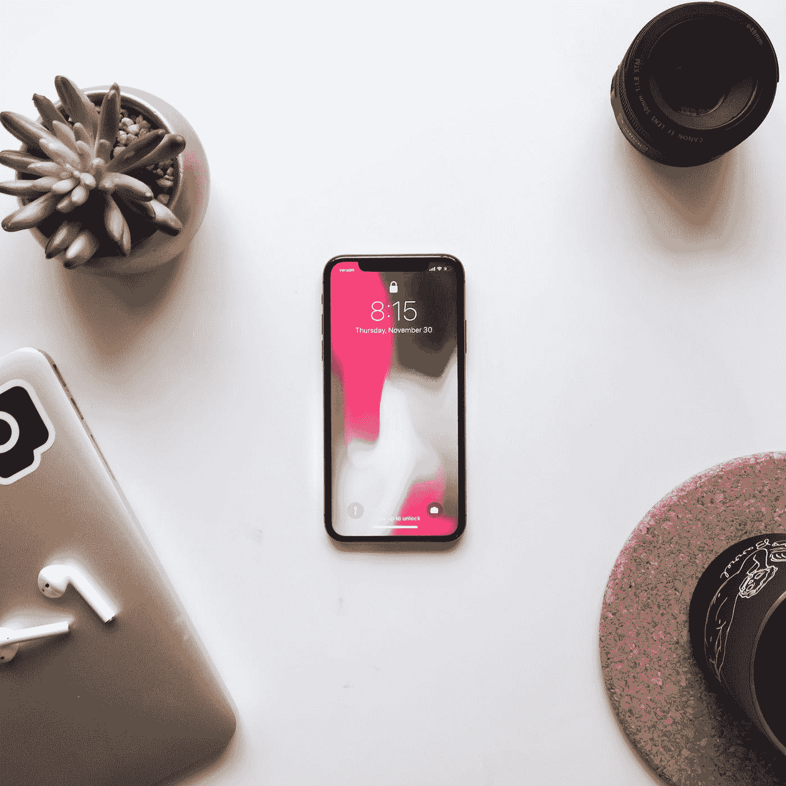

# 为什么我从苹果换到安卓

> 原文：<https://medium.com/codex/why-i-switched-from-apple-to-android-ddc2823f0f05?source=collection_archive---------3----------------------->

本·科尔德在 [Unsplash](https://unsplash.com?utm_source=medium&utm_medium=referral) 上的照片

许多 iPhone 用户甚至无法想象改用 Android。如果是因为他们喜欢 iPhones 的设计，不想改变生态系统，或者只是不想听到“Omg，为什么你的泡泡是绿色的”。但是你使用 android 越多，你就会意识到它有一些主要的好处。

在我开始讨论切换到 Android 的利弊之前，我想提一下，我是一个更倾向于技术的人，因此可能会更容易切换操作系统。第一次启动 Android 时，我立刻意识到苹果的 IOS 和 Android 在视觉上的巨大差异。在我的手机上，默认图标是圆形的，一开始我个人觉得很难看，但我已经习惯了。我意识到的第二件事是你启动应用程序的方式。你不必将所有应用程序都放在主屏幕上，而是将它们都放在一个应用程序抽屉中，并可以选择将放在主屏幕上。

在使用 Android 几天后，我意识到它极大地提高了我的工作效率，让我可以访问更大部分的文件，并在 google play 商店中提供更多的应用程序。我也意识到，毕竟 IOS 和 Android 并没有太大的不同。很多东西，比如通讯录、日历、笔记和信息，都以同样的方式工作，一个主要的不同是，在我看来，苹果的应用程序看起来更好。即使不是默认的应用程序，比如 Whats App，看起来也没有 iPhones 上的好看，但这并不意味着这不能改变。

最近的安卓版本，安卓 12，他们终于不再用糖果命名了。有重大的视觉改进，虽然我仍然认为 iPhones 有更好的设计，但我认为 Android 在改善它们的弱点方面取得了很大的进步。这是我在苹果公司看不到的。苹果一直是一家独特的公司和潮流引领者，但他们最近的方向是不幸的。苹果已经放慢了他们在手机领域的创新步伐，这在 iPhone 13 上得到了体现，坦率地说，这令人失望。苹果公司拒绝改用 USB-C，但却从包装上取下插头，称之为“拯救环境”,这只是让他们慢了下来。USB-C 拥有的许多功能，比如让你能够将显示器、键盘和鼠标连接到你的手机上，并从本质上将其变成一台电脑，这些功能在 lightning cable 中并不存在，因此阻碍了苹果发挥其全部潜力。

总之，Android 和 IOS 都远非完美，需要改进。现在我会继续使用 Android，因为它给了我更多的自由，但我可以清楚地看到苹果卓越的设计和用户体验的吸引力。我相信如果可以的话，每个人都应该尝试一下这两种生态系统，然后自己做出决定，但我希望这篇文章有助于简单概述选择苹果还是安卓。