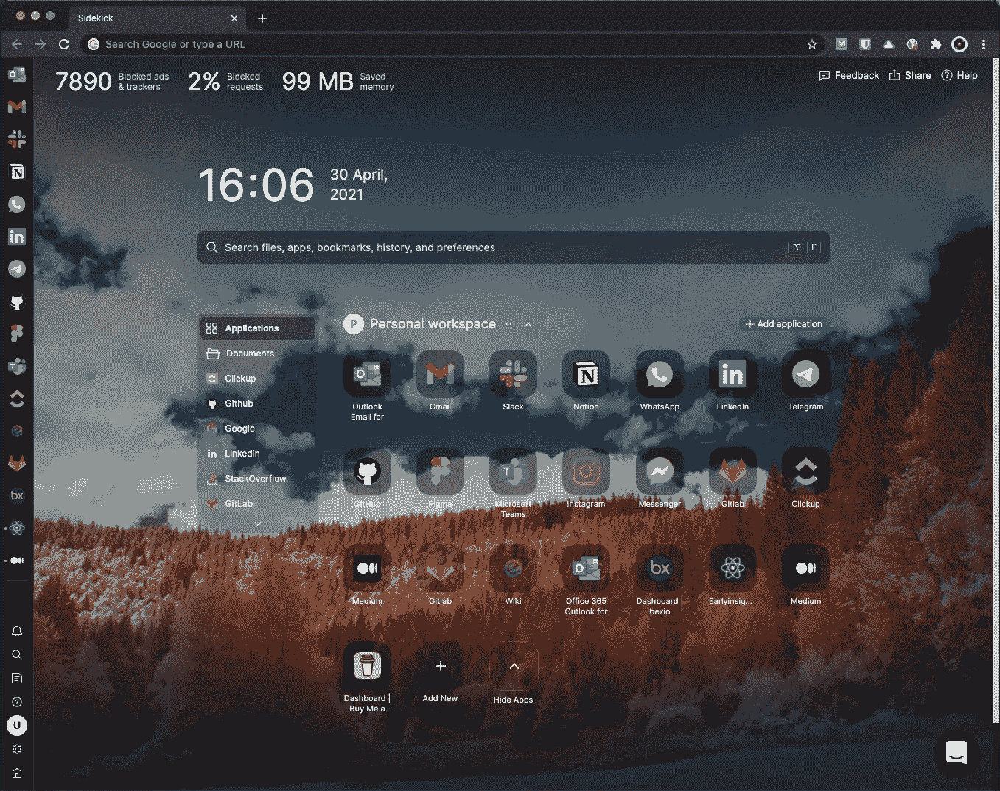

# 为什么我从谷歌 Chrome 切换到 Sidekick 浏览器

> 原文：<https://medium.com/codex/why-i-switched-from-google-chrome-to-sidekick-browser-63979c873897?source=collection_archive---------1----------------------->

[Sidekick 浏览器](https://join.meetsidekick.com/ztgm2)

# TL；速度三角形定位法(dead reckoning)

你是否厌倦了谷歌 Chrome 耗尽你所有的内存，或者让你的电脑风扇像喷气发动机一样转动？您是否会迷失在浏览器中打开的所有标签中？当你关闭浏览器时，你是否总是感到有压力，因为有几个打开的标签页带着你花了几个小时才找到的网站，并且对于你的一些未决任务仍然是需要的？然后…