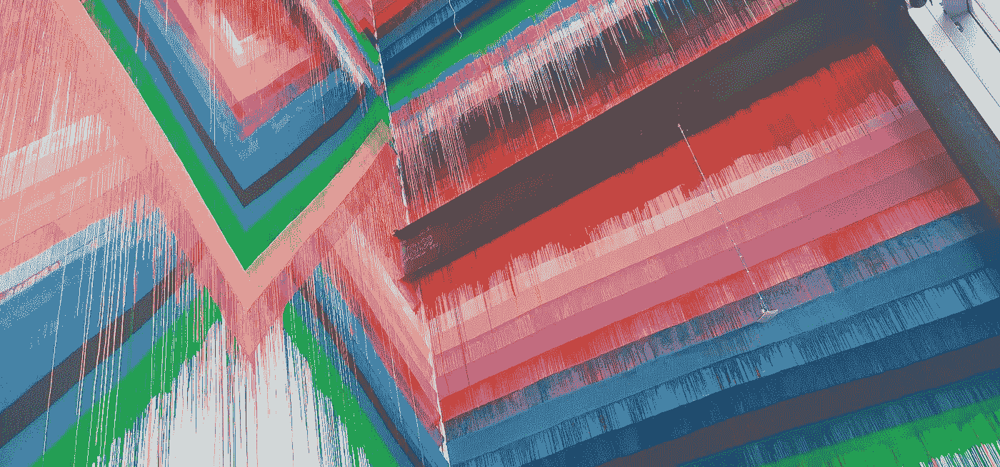

# 为什么我是 React 开发人员

> 原文：<https://medium.com/codex/why-im-a-react-developer-571835b4408b?source=collection_archive---------4----------------------->

不管发生了什么

作者照片。画这幅壁画的 IDK。

我对 React 团队在过去几年中所采取的方向一直非常不满。有些人问我，如果[这个](#3f15)是我的感觉，为什么我还用 React。这是一篇长篇文章，但是对于没有耐心的人来说，这里有 TL；灾难恢复版本:

*   人们付钱让我写 React 代码
*   自从人们开始付钱让我写 React，它就变了