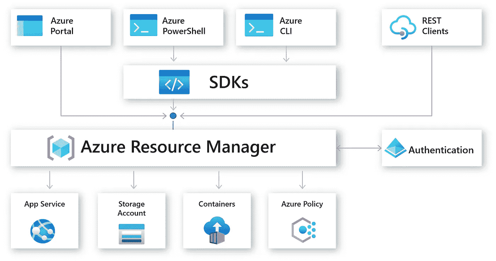
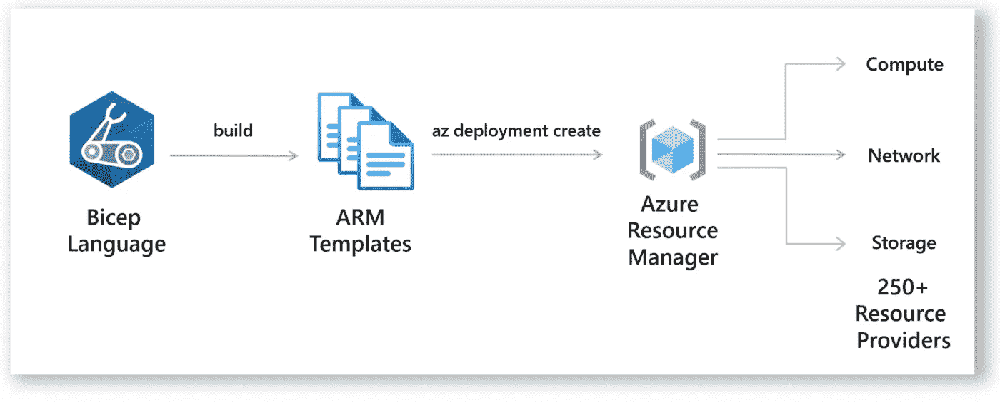
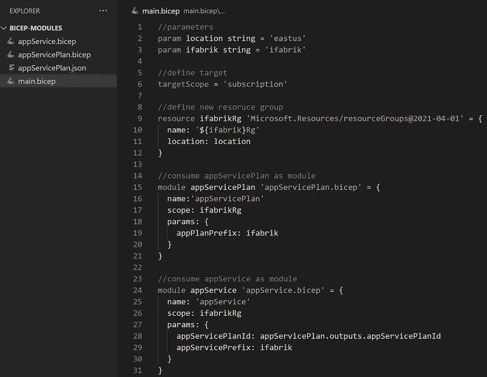
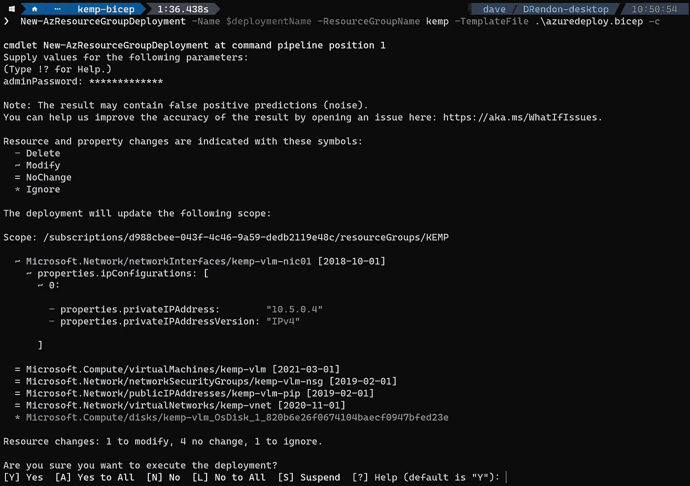

# 💪为什么 Azure Bicep 是您的下一个代码基础设施选择？

> 原文：<https://medium.com/codex/why-is-azure-bicep-your-next-choice-for-infrastructure-as-code-f10a2b924ca7?source=collection_archive---------3----------------------->

作为云工程师，您应该了解 Azure Bicep 对您的环境的影响。

本文将涵盖:

*   为什么二头肌是相关的
*   Bicep 将如何影响您的 Azure 环境
*   不使用二头肌的理由

如果你熟悉使用 Azure 作为代码的基础设施，那么在 JSON 中创作 Azure Resource Manager(ARM)模板会带来一系列挑战。

【2020 年 5 月，在**微软 Build** 大会上，一种用于声明式部署 Azure 资源的新领域特定语言(DSL)被引入，以改善 ARM 创作体验，并减少编写 JSON 代码的痛苦，除非你真的想这样做。

在我们深入探讨 Bicep 与您作为云工程师的关系之前，让我们回顾一些基线，以便更好地理解 Bicep 与您的关系。

# Azure 资源管理器

这一切都始于 Azure 资源管理器。可以把 Azure 资源管理器看作是 Azure 中通过 API 提供的所有特定于服务的控制平面操作的前门。

事实上，Azure 资源管理器是 Azure 中的底层服务层，它将帮助您在 Azure 中部署和管理资源。

您可以利用一些工具和语言，如 Azure CLI、Azure PowerShell、SDK 或 Azure 门户和第三方解决方案，与 Azure 资源管理器进行通信，并在 Azure 中创建、删除或更新审计和标记资源。



Azure 资源管理器

简而言之，Azure 资源管理器将以代码的形式为你提供所有与基础设施相关的能力，你可以执行两种类型的操作:控制平面操作和数据平面操作。

—控制平面操作与您在订阅中管理资源的方式相关。

—数据平面操作允许您访问给定资源公开的特定功能。

这是这些操作类型的一个示例:您可以利用控制平面操作来调配虚拟机，并使用数据平面操作对虚拟机进行 RDP。

您可以创建脚本来为 Azure 提供资源，或者通过 ARM 模板为您的资源使用声明性方法。

# 为什么 Azure 二头肌相关？

ARM 模板可以包含您的部署的基础架构和配置的定义。

缺点是 ARM 模板是基于 JSON 的，虽然在处理更复杂的环境时，您可以采用声明式方法来提供资源，但是管理它们可能会有点麻烦。

然后 Bicep 就派上了用场，因为它为您提供了更简单的语法。ARM 模板不会消失；Bicep 是新的领域特定语言(DSL ),用于以声明方式部署 Azure 资源，位于 ARM 模板之上。

当您创建一个新的 Bicep 模板并部署它时，它将转换成 JSON 文件，然后与 Azure 资源管理器对话，以在 Azure 中部署您的环境。



天蓝色二头肌

这意味着我们将拥有 ARM 模板的所有优点和好处。我们将能够用更简单的语法在 Azure 中为我们的环境创建资源和配置的定义。

# 模块化

Bicep 承诺通过将复杂的模板部署分解成更小的模块文件并在主模板中引用它们来实现真正的模块化。

虽然模块化在 ARM 模板中通过嵌套或链接模板可用，但 Bicep 极大地简化了我们消费模块和调用外部资源的方式。

例如，我们可以有一个创建应用服务计划的 Bicep 模板和另一个创建 web 应用的 Bicep 模板。然后我们可以有一个主二头肌模板，它将前面的两个二头肌模板作为模块使用。

下图显示了如何从主 Bicep 模板调用应用服务计划和 web 应用程序:



蓝色二头肌——模块化

注意 Bicep 是一种 DSL 语言，所以主要意图是方便你部署和配置 Azure 资源；然而，它不会取代任何现有的语言。

您可以使用二头肌操场检查二头肌模板和手臂模板的比较:

👉[https://aka.ms/bicepdemo](https://aka.ms/bicepdemo)

请注意，Bicep 模板大大降低了复杂性，并提供了更全面的语法。

# Bicep 将如何影响您的 Azure 环境

Bicep 被认为是一种 Azure 原生语言，它将帮助您改进 ARM 模板的创作过程，并减少当前的一些棘手问题。

这是否意味着我们必须学习一门新的语言？简单的回答是肯定的，您会发现 Bicep 非常直观，并且提供了从 JSON 的简单过渡。

因此，如果您已经熟悉 ARM-JSON 模板，您将能够通过“ *bicep decompile* ”命令将它们反编译成 Bicep 模板。

```
az bicep decompile --file main.json
```

从个人经验来看，如果将 ARM-JSON 模板反编译成 Bicep 模板，一定要检查变量、参数和资源属性的定义。

要验证您的部署，您可以使用假设功能或使用标志-C 来预览您的部署，如下图所示。



Azure Bicep —确认部署

关于如何将 ARM-JSON 模板反编译成 Bicep 模板的更多细节，可以在以下网址查看:[https://docs . Microsoft . com/en-us/azure/azure-resource-manager/Bicep/decompile？tabs=azure-cli](https://docs.microsoft.com/en-us/azure/azure-resource-manager/bicep/decompile?tabs=azure-cli)

您可以选择使用下面的命令从 Bicep 模板构建 ARM-JSON 模板:

```
bicep build main.bicep --outfile azuredeploy.json
```

上面的命令将把你的二头肌模板转换成 ARM-JSON 模板。

# 不使用二头肌的理由

正如本文前面提到的，Bicep 是一种针对代码部署的基础设施的特定语言。虽然它有一些优势，但它与其他云提供商不兼容。

也就是说，如果您的组织正在利用多个云提供商，Bicep 可能不是不完全支持 Bicep 语言的云提供商的合适工具。

# 结论

考虑到这一点，我鼓励您将 Bicep 作为代码部署尝试用于您的基础设施，并让您自己看到 Bicep 提供的好处和优势。

虽然 Bicep 处于早期阶段，但它支持 Azure 中的各种资源，你可以反编译现有的 ARM 模板，并比较语法和易用性。

事实上，Bicep 的主要目标之一就是让代码一目了然，简单易学。

# 后续步骤

看看微软的学习之路—[https://docs.microsoft.com/en-us/learn/paths/bicep-deploy/](https://docs.microsoft.com/en-us/learn/paths/bicep-deploy/)

查看如何使用 Bicep 部署虚拟机[https://blog . azin sider . net/deploy-Kemp-load master-in-azure-using-Bicep-3b9f 083997 e 9](https://blog.azinsider.net/deploy-kemp-loadmaster-in-azure-using-bicep-3b9f083997e9)

[*在此加入****azin sider****邮箱列表。*](http://eepurl.com/gKmLdf)

*-戴夫·r*