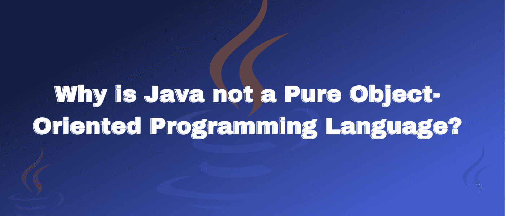

# 为什么 Java 不是纯面向对象的编程语言？

> 原文：<https://medium.com/codex/why-is-java-not-a-pure-object-oriented-programming-language-b5ef9b2b291c?source=collection_archive---------8----------------------->

# 介绍

作为程序员，我们经常和“面向对象编程语言”这个术语打交道。但这是什么呢？OOPs，即面向对象编程是一种编程方法，它围绕数据和定义良好的接口来组织程序。

我们用它来使我们的代码更接近真实世界。一些流行的 OOP 语言包括 Java、C++和 Python。现在问题来了，上面列出的语言真的是 100%面向对象的吗，或者它们包含某些使它们成为部分面向对象编程语言的特性吗？

嗯， [**Java**](https://www.java.com/) 并不是一门完整的面向对象编程语言。现在你可能想知道为什么。在我们深入这个主题之前，我们将首先了解面向对象编程语言的基础。

# 什么是面向对象编程语言？

在 OOP 中，我们更关注数据，即对象。它的基础是建立在现实世界的物体上。对象是现实世界中具有某种状态和行为的实体。它强调数据和安全性，并提供代码的可重用性。使用 OOP，我们可以模拟现实世界中的代码。

在纯面向对象的编程语言中，数据是以对象的形式表示的。它不包含原始数据类型，如整数、字符、浮点、双精度等。对于一门纯粹的或完全面向对象的编程语言，需要满足以下标准

*   多态性
*   遗产
*   包装
*   抽象
*   预定义的类型应该表示为对象
*   用户定义的类型应该表示为对象
*   对对象执行的所有操作都应该通过为这些对象定义的方法来完成。

# Java 如何成为面向对象的编程语言？

在我们了解 Java 为何不是一种纯粹的面向对象编程语言之前，我们将研究使 Java 成为部分面向对象编程语言的事实。

*   **对象**——对象是面向对象程序设计的构建模块。它们是现实世界中具有某种状态和行为的实体。对象通常被称为“类的实例”。
*   继承是 OOPs 的一个属性，其中一个类的成员函数和数据成员可以被另一个类使用。因为 [**继承**](https://docs.oracle.com/javase/tutorial/java/IandI/subclasses.html) 可以实现代码的复用。
    如果我们想要创建一个已经有一些我们想要在另一个类中定义的公共方法的类，我们可以使用已经存在的类作为基类或父类，然后从它继承。
*   封装——封装是将数据和方法绑定在一个单元中的过程。这样做是为了保护数据免受外部干扰，并对程序的其他部分隐藏实现。
    在封装中，类中的数据对其他函数和类是隐藏的。数据不能被其他类访问，只能被声明它的类访问。因此，它也被称为“数据隐藏”。在 Java 中，类构成了 [**封装**](https://en.wikipedia.org/wiki/Encapsulation_(computer_programming)) 的基础。
*   **多态性**——顾名思义，就是多种形式的意思。它是一种创建函数、变量或对象的能力，这些函数、变量或对象有不止一种形式。多态性的概念用“一个接口，多个方法”来表达。
*   **抽象**——哦，同样的概念成立。它是表示基本特性并隐藏实现细节的过程。在 Java 中，class 用于 [**抽象**](https://www.scaler.com/topics/java/abstraction-in-java/) 。因此，它也被称为“抽象数据类型”。

# 为什么 Java 不是纯面向对象的编程语言？

现在你可能想知道 Java 与上述标准有什么不同。Java 满足所有的标准，除了-

*   预定义的类型应该表示为对象
*   对对象执行的所有操作都应该通过为这些对象定义的方法来完成。

因为 Java 有原始数据类型，所以它不满足第一个标准。让我们对此有更深入的了解。

## 原始数据类型

与 Smalltalk 这种纯面向对象的编程语言不同，Java 不支持将预定义类型作为对象。Java 包含原始数据类型，如整数、字符、浮点、双精度。

[**原始数据类型**](https://docs.oracle.com/javase/tutorial/java/nutsandbolts/datatypes.html) 是那些在 java 编程语言中预定义的数据类型。在 Java 编程语言中预定义了总共八种原始数据类型。

原始数据类型的大小不会随着操作系统的改变而改变，因为 Java 编程语言独立于所有的操作系统。

对于面向对象的编程语言，数据应该以对象的形式表示。由于 Java 使用原始数据类型，它不被认为是一种纯粹的面向对象编程语言。

# 包装类

因此，Java 中的包装类用于将原始数据类型转换为对象，并将对象转换为原始数据类型。

将原始数据类型转换为相应包装类的过程称为自动装箱。

例子-字节到字节包装类或字符到字符包装类。

将包装类转换为其对应的原始数据类型的过程称为拆箱。

示例-将字节包装类转换为字节，将字符包装类转换为字符。

自动装箱和取消装箱都是自动过程。

在 Java 中，整型，浮点型等。可以用来代替 int，float 等。

因此，即使在 Java 中使用了包装类，它也不符合面向对象编程语言的标准，因为在内部使用了自动装箱和取消装箱的过程。

因此，即使你创建一个字符包装类而不是 char，并对它进行任何操作，在幕后，Java 将只使用原始类型 char。

# 静态关键字

在面向对象的编程语言中，对象是语言的基础。这些对象通过消息传递进行通信。

一切都是通过消息传递来访问的。但在 Java 中，有 [**静态**](https://www.freecodecamp.org/news/why-static-in-java-what-does-this-keyword-mean/) 变量和方法，不用对象或者不用创建类的对象就可以访问。

这也是 static 关键字让 Java 成为部分面向对象编程语言的一个原因。

由于上述原因，Java 不被认为是一种纯粹的面向对象编程语言。

# 结论

*   面向对象编程是一种围绕数据和明确定义的接口组织程序的编程方法。
*   Java 不被认为是纯粹的面向对象编程语言。
*   主要原因是它支持原始类型值。对于面向对象的编程语言，数据应该以对象的形式表示。由于 Java 使用原始数据类型，它不被认为是一种纯粹的面向对象编程语言。
*   它支持使用 static 关键字。静态变量和方法可以在没有对象或者没有创建类的对象的情况下被访问。
*   它也有一个包装类，但是它在内部使用原始数据类型。因此，即使在 Java 中使用了包装类，它也不符合面向对象编程语言的标准，因为在内部使用了自动装箱和取消装箱的过程。