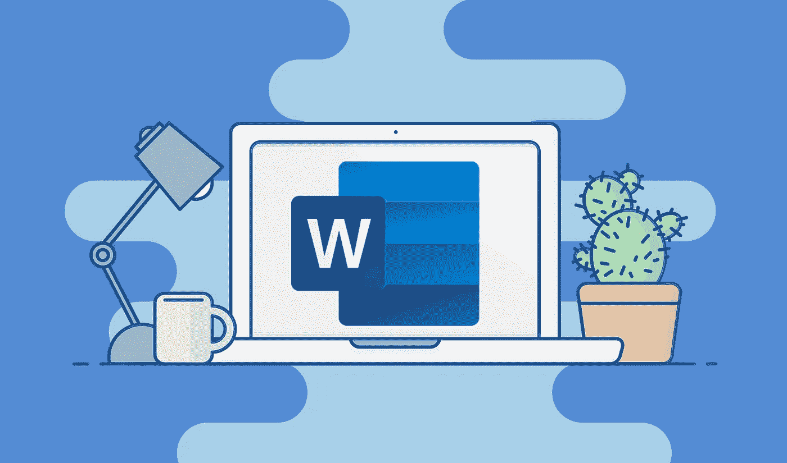

# 为什么微软 Word 这么贵？

> 原文：<https://medium.com/codex/why-is-microsoft-word-so-expensive-e2726d1bf5fb?source=collection_archive---------4----------------------->

## 在一个大多数公司要么免费要么收取少量费用提供产品的时代，文字花费了太多的钱。

不，我不用微软办公软件。我不用 Word、Excel 或 PowerPoint——如果有人还在用的话。事实上，我认为任何真正使用微软 Word、Excel 或其他软件的人…